# Terceira Classe

**A travessia italiana para o Brasil e o naufrágio do *Principessa Mafalda***

João Andrade

1861 · 1927 · hoje

---

> Edição de trabalho. Este exemplar é um rascunho: os capítulos são
> publicados conforme ficam prontos, e o epílogo ainda não existe.

## Créditos

© João José de Andrade Neto

*Terceira Classe* — A travessia italiana para o Brasil e o naufrágio do *Principessa Mafalda*

Todos os direitos reservados. Nenhuma parte desta obra pode ser reproduzida sem autorização escrita do autor.

| | |
|---|---|
| Ano de publicação | a definir |
| Editora | a definir |
| ISBN | a definir |
| Ficha catalográfica (CIP) | a elaborar |
| Preparação, revisão, projeto gráfico e diagramação | a definir |
| Impressão | a definir |

As fotografias e os documentos reproduzidos pertencem ao acervo da família Miotto e Forner, salvo indicação em contrário na relação de créditos de imagem, ao fim do volume.

Foram feitos todos os esforços para identificar e creditar os detentores de direito sobre as imagens e os textos reproduzidos. Onde a procedência não pôde ser estabelecida, isso está dito na própria relação de créditos. O autor se compromete a corrigir, em edições futuras, qualquer omissão ou erro que lhe seja apontado.

As pessoas vivas nomeadas e fotografadas nesta obra autorizaram o uso do nome e da imagem. Onde um documento particular da família trazia dado pessoal de terceiro, o dado foi tarjado, e a tarja está declarada na legenda.

---

Para o meu filho

**João Luca Soares de Andrade**

---

> A cena é lancinante. Lágrimas, lamúrias, desmaios, invocações devotas, promessas. Da amurada do navio os lenços sacodem nervosos as despedidas finais. Addio! Addio! Addio! Os corações se fecham numa saudade funda.
>
> — Serafim Derenzi, 1974

---

## Sumário

**Parte I — A terra que não bastava** · 1861 – 1926

1. Uma casa em Castelcucco
2. A Itália que não existia
3. Forner e Miotto
4. O cartaz
5. O Decreto Prinetti
6. Sante nos Alpes
7. Rosa e Fausto

**Parte II — A travessia** · 1874 – 1927

8. Gênova
9. A terceira classe
10. Duas irmãs embarcam
11. Os que já estavam lá

**Parte III — O navio** · 1908 – 1928

12. 1908
13. A última viagem
14. A noite
15. Os botes
16. 22h10
17. Alhena, Mosella, Empire Star
18. Os 314

**Parte IV — Os que chegaram** · 1927 – hoje

19. 31 de outubro
20. O reencontro
21. Terra vermelha
22. Enrico
23. 1937
24. Virar brasileiro
25. Os que ficaram, cem anos depois
26. A busca
27. A casa

**Epílogo — As três Mafaldas** *(a escrever)*

Agradecimentos · Fontes · Créditos de imagem · Índice onomástico

---

## Nota de método

Este livro trabalha com três materiais, e eles não valem a mesma coisa.

**Documento** é o que está escrito num papel emitido por alguém com autoridade para emiti-lo: um ato de nascimento, uma lista de desembarque, uma carteira de identidade. Quando o livro diz uma data, um número ou um nome, veio daí, e a fonte está na relação ao fim do volume.

**Depoimento** é o que uma pessoa contou. Vale muito e erra sozinho. Toda vez que o livro usa um, ele diz de quem é e por onde passou até chegar aqui.

**Reconstrução** é uma cena montada a partir do procedimento da época, quando o procedimento é conhecido e a cena não foi descrita por ninguém. Ela aparece três vezes neste livro — a prancha em Gênova, o porão às cinco e quinze, a porta da Hospedaria — e nas três o texto avisa antes que é isso que está fazendo.

O que não existe fica em branco.

Quando um documento não foi encontrado, o livro diz que não foi, e diz o que ele resolveria se aparecesse. É o caso da lista de embarque de Gênova de outubro de 1927, do mês em que Fausto Miotto atravessou e do que se passou entre ele e Rosa quando finalmente se acharam.

Nada disso foi preenchido por dedução.

Duas convenções de leitura, que o texto usa o tempo todo.

No registro civil italiano, *di* antes do nome do pai quer dizer pai vivo, e *fu* quer dizer pai morto. Uma linha de três letras num documento de 1940 foi o que provou, neste projeto, que um homem nascido em 1862 ainda estava vivo.

E o mesmo nome aparece escrito de várias maneiras, porque quase todos foram *ouvidos*, não lidos: uma mulher do Vêneto dizia, e um funcionário escrevia. Gina Oliva vira Ginneta, depois Dinetta, depois Ginita. O livro mantém a grafia do documento quando cita o documento, e usa a forma do registro de nascimento no resto.

A tradição oral desta família desceu por três galhos, e eles não contam a mesma coisa.

Dois estão no Brasil e vieram do navio: um guardou o carvão e o não-reconhecimento na frente da Hospedaria, o outro guardou o cozinheiro que desceu ao porão e a menina que achou o pai. O terceiro ficou na Itália e não guardou o navio — guardou como morreram os homens que não embarcaram.

O livro nunca apresenta uma dessas lembranças como consenso da família: atribui cada uma a quem a carrega e registra que as outras linhas não a têm.

Sobre pessoas que não escolheram estar aqui.

Os documentos reproduzidos neste livro são de dois tipos, e eles não pedem a mesma coisa.

O primeiro é registro de arquivo público: a relação do vapor *Alhena*, o livro de matrícula da Hospedaria do Brás. Aqueles nomes já estão publicados, e reproduzi-los é o que a pesquisa histórica faz — é também, no caso daquela gente, o único lugar onde ela ainda existe.

O segundo é papel particular de família, e alguns trazem gente de fora dentro. Aí a régua é outra: o dado pessoal de quem não é da família e não é figura histórica foi tarjado, e a tarja está declarada na legenda. É o caso do médico que atestou o óbito de Enrico Miotto.

As pessoas vivas nomeadas e fotografadas neste livro autorizaram o uso do nome e da imagem.

---

# Parte I — A terra que não bastava

*1861 – 1926*

---

## 1. Uma casa em Castelcucco

> O mundo antes. A vila, as colinas, o ano agrícola, o sino da igreja.

Do ponto em que a estrada entra em Castelcucco dá para ver a montanha inteira.

Ela ocupa o norte do céu e não sobra muito espaço para o resto. Chama-se Monte Grappa, tem mil setecentos e setenta e cinco metros, e durante séculos foi apenas isso: a montanha. O lugar de onde descia o frio, o pasto de verão, a linha entre o mundo conhecido e o que ficava atrás dele.

O vilarejo fica cento e oitenta e nove metros acima do mar, no sopé. Tem oito quilômetros quadrados e pouco, o que significa que uma pessoa atravessa o município inteiro a pé numa manhã e ainda sobra manhã.

O nome vem de *castello* e de *cucco*, que no dialeto quer dizer elevação arredondada. Nos documentos medievais aparece como Castrocucho. Um castelo num morro redondo. O castelo não existe mais.

Os vizinhos são Asolo, Possagno, Monfumo, Cavaso del Tomba e Pieve del Grappa.

Hoje são nomes de guia turístico. Asolo é a cidade nas colinas onde Robert Browning escreveu e onde Eleonora Duse quis ser enterrada. Possagno é onde nasceu Canova, e tem no meio dela um templo branco que o escultor projetou e pagou do próprio bolso.

Nada disso tinha a menor importância para quem morava ali e trabalhava a terra. A beleza da paisagem do Asolano é uma descoberta do século XX. No século XIX aquilo era só a distância que separava uma casa da outra.

Em 1695 um terremoto derrubou duas de cada três casas de Castelcucco e arrebentou a igreja. Reconstruíram. É o tipo de coisa que um lugar pequeno guarda por trezentos anos e continua contando.

Rosa Forner nasceu às oito e quinze da noite de 24 de junho de 1903, em Monfumo, quatro quilômetros dali.

Fausto Miotto nasceu às quatro da manhã de 5 de julho de 1904, em Castelcucco.

Esses horários não vêm de memória de família. Vêm dos registros de nascimento dos dois comuni, atto 31 do ano de 1903 e atto 33 do ano de 1904, que estão hoje em cima da minha mesa em cópia autenticada.

Quatro quilômetros, no Vêneto rural daquela época, não são distância nenhuma e são distância suficiente. Duas paróquias, dois padres, dois livros de batismo. Mas a mesma feira, os mesmos santos, as mesmas festas, e famílias que se cruzavam havia gerações sem precisar de apresentação.

Vinte e três anos depois, casaram-se em Castelcucco.

O que aconteceu entre esses dois nascimentos e aquele casamento é o assunto de todo o resto desta parte do livro.

A terra ali é boa e é pouca, as duas coisas ao mesmo tempo.

O sopé do Grappa é encosta. Trabalha-se em faixas, com vinha, milho, alguma coisa de trigo e o que a horta der. Quem tinha terra tinha pedaços de terra, espalhados, e cada geração dividia os pedaços outra vez entre os filhos, porque era assim que se fazia.

Faça a conta duas ou três vezes e o pedaço deixa de sustentar uma família.

Essa conta fechou no fim do século XIX. Não houve catástrofe, não houve decreto, não houve inimigo. Houve aritmética.

O que se comia era polenta.

Milho de manhã, milho ao meio-dia, milho à noite, variando a consistência. Carne em dia de festa. Vinho da casa, que não era bom, e que era o que havia.

Uma dieta quase só de milho produz uma doença chamada pelagra, que vem da falta de niacina. Aparece primeiro na pele que pega sol, nas mãos e no rosto, escura e rachada. Depois vem a diarreia. Depois a confusão mental. No Vêneto do fim do século XIX a pelagra era endêmica e não havia família que não conhecesse alguém.

Ninguém chamava aquilo de fome. Chamava de vida.

O ano tinha uma forma, e a forma se repetia.

Fevereiro e março para podar a vinha. Abril para plantar o milho. O verão inteiro para carpir, e para subir com o gado quando havia gado para subir. Setembro para a vindima, e a vindima era a única semana do ano em que o trabalho parecia uma festa. Outubro para a colheita do milho e para a debulha, feita à noite, em mutirão, com todo mundo sentado em roda.

Depois o inverno, que era longo e não perdoava, e em que se fazia o que dava para fazer dentro de casa.

Uma criança aprendia esse calendário antes de aprender a ler. Muitas aprendiam esse calendário e não aprendiam a ler.

Miotto e Forner aparecem nos livros daquelas paróquias muito antes de qualquer um desta história nascer. São sobrenomes de gente que ficou parada por séculos.

Na família se conta que Miotto vem de *mio* com o diminutivo do dialeto, alguma coisa como “meu pequeno”, e que Forner vem de *fornaio*, padeiro, aquele que assava o pão da comunidade.

Etimologia de família é sempre um pouco verdade e um pouco poesia, e eu não consegui confirmar nenhuma das duas num dicionário sério. Deixo registrado assim mesmo, porque é o que a família diz de si própria, e o que uma família diz de si própria também é um dado.

Em 24 de outubro de 1917 a frente italiana arrebentou em Caporetto.

Em duas semanas o exército recuou mais de cem quilômetros. E parou onde? No rio Piave, e no Monte Grappa.

Na montanha que se via da janela.

Rosa tinha catorze anos. Fausto tinha treze.

A partir de novembro de 1917 o Grappa deixou de ser uma montanha e virou uma linha de frente.

A primeira batalha foi entre 13 e 26 de novembro. A segunda entre 11 e 21 de dezembro. Os austro-húngaros precisavam tomar aquele maciço para descer na planície e chegar a Veneza. Não tomaram.

O que isso significa lá embaixo, no sopé, é outra coisa: estrada tomada por comboio militar, mula, hospital de campanha, tropa aquartelada em casa de gente, e o barulho. Artilharia de montanha ouvida de baixo não é um estrondo, é um som contínuo, que muda de tom conforme o vento vira.

E havia a pergunta que toda aldeia do sopé fez naquele inverno: vamos ter que sair?

Em Castelcucco a resposta foi, nesta ordem: sim, não, talvez, e por fim sim.

Em novembro de 1917 foi emitida uma ordem de evacuação do comune. Ela foi revogada poucas horas depois.

O vilarejo seguiu habitado e funcionando durante todo o inverno de 1917 para 1918. Há registros de moradores, de atividade civil e de acontecimentos no próprio território ao longo daqueles meses, com a frente a poucos quilômetros de subida.

Em 27 de fevereiro de 1918 Castelcucco reaparece na documentação da Prefettura di Treviso sobre o *sgombero*, o esvaziamento.

Só que o procedimento está definido ali com duas palavras que mudam tudo: *facoltativo e parziale*.

Facultativo e parcial. Podem sair, quem quiser, em parte.

Pense no que uma frase dessas faz dentro de uma casa. Não houve caminhão, não houve autoridade batendo na porta e mandando todo mundo embora. Houve uma ordem cancelada no mesmo dia, um inverno inteiro de incerteza, e depois uma permissão que devolvia a decisão para cada família.

Ficar era arriscar. Sair era largar a casa, os animais e a terra sem saber se haveria para onde voltar.

Existe uma tabela que mede exatamente isso.

Em outubro de 1918, com a guerra ainda em curso, o Ministero per le Terre Liberate fez um *Censimento dei profughi di guerra*: contou os refugiados de guerra por comune de origem. Os números do *distretto di Asolo*, onde ficam Castelcucco e Monfumo, foram publicados em Roma no ano seguinte.

Leia a coluna da porcentagem devagar.

Borso: 3.700 refugiados numa população de 3.733. Noventa e nove por cento.

Paderno d’Asolo, 96,8. Crespano, 87,8. Cavaso: 2.795 pessoas de 3.258, oitenta e cinco vírgula oito por cento. Possagno, 81,7.

Esses são os comuni encostados no maciço. Eles não se esvaziaram um pouco. Eles se esvaziaram.

E então, na mesma tabela, na mesma guerra, no mesmo distrito:

**Castelcucco: 39 refugiados numa população de 1.729. Dois vírgula três por cento.**

Trinta e nove pessoas.

Castelcucco fica a quatro quilômetros de Cavaso.

Oitenta e três pontos percentuais de diferença, em quatro quilômetros. É a distância entre a montanha e o que fica atrás dela, e é também a distância entre uma casa que se esvazia e uma casa que fica.

Visto assim, o *sgombero facoltativo e parziale* de fevereiro de 1918 deixa de ser nota de rodapé burocrática. Ele é esse número. Deram a escolha, e trinta e nove pessoas saíram.

A família de Fausto está entre as que ficaram. Não por coragem: por estarem quatro quilômetros do lado certo de uma montanha.

Duas ressalvas sobre a tabela, porque quem a publicou também as faz.

O censo conta os refugiados por comune de *origem* e não diz para onde cada um foi. E os totais do distretto di Asolo não fecham, por um provável erro de impressão na publicação ministerial que hoje é impossível corrigir.

Os números por comune, porém, são coerentes entre si: em todos os doze, a divisão entre refugiados e população bate com a porcentagem impressa ao lado. É material de trabalho, e eu o uso como tal.

A evacuação mais ampla só veio na primavera de 1918, e aí sim alcançou Castelcucco e outros municípios da retaguarda do Grappa.

Fausto Miotto tinha treze anos em novembro de 1917, quando a ordem foi dada e revogada. Tinha catorze na primavera seguinte, quando ela finalmente veio para valer.

Foi essa a adolescência dele. Não a de quem foge de uma catástrofe num dia, mas a de quem passa um ano e meio esperando para saber se vai ter que ir embora.

Duas precisões, porque elas importam.

A primeira: quase tudo isso é sobre Castelcucco, o vilarejo de Fausto. Rosa morava em Monfumo, quatro quilômetros dali, outro comune, com administração própria e ordens próprias.

A mesma tabela responde por ela, em parte.

Monfumo: 307 refugiados numa população de 1.661. Dezoito vírgula cinco por cento.

Oito vezes a taxa de Castelcucco. Não é Cavaso e não é catástrofe, mas também não são os dois por cento do vilarejo do Fausto. Um em cada cinco saiu.

O que a tabela não diz é quem saiu, quando, nem se os Forner estavam entre eles. Diz só que a vila de Rosa esvaziou bem mais que a vila de Fausto, e que os dois adolescentes desta história passaram o mesmo inverno em dois lugares que responderam de maneira diferente à mesma montanha.

A segunda é sobre o que se costuma dizer. Quase todo relato geral sobre aquele front repete que os civis que viviam colados à linha foram retirados em 1917. É plausível e é compatível com a documentação, mas a ordem específica, com a lista de quais localidades e quais casas, ainda não apareceu.

Então fica assim, e só assim: ordem e revogação em novembro de 1917, sgombero facultativo e parcial em fevereiro de 1918, evacuação ampla na primavera de 1918. O resto é provável, e está esperando documento.

No verão de 1918 os austro-húngaros atacaram o Grappa outra vez e foram parados outra vez.

Em 24 de outubro de 1918, um ano exato depois de Caporetto, o exército italiano subiu a montanha para valer, dentro da ofensiva de Vittorio Veneto. No dia 4 de novembro acabou.

Sante Forner, irmão mais velho de Rosa, nascido em 1893, estava no exército. Voltou com três medalhas, que a família mandou emoldurar e guarda até hoje, num quadro que atravessou um século e nunca atravessou o oceano.

Ele é o assunto do capítulo 6. Aqui ele importa por um motivo só: quando a guerra acabou, Rosa tinha quinze anos e já tinha visto o mundo inteiro subir aquele morro.

Depois da guerra, a terra era a mesma terra.

Continuava pouca, continuava dividida, continuava dando milho. A diferença é que agora havia menos braços para trabalhá-la, mais dívida, e uma geração que tinha descido da montanha sabendo que o mundo era maior e pior do que parecia da janela.

É nesse lugar e nesses anos que a decisão começa a se formar. Não de uma vez, e não em ninguém em particular. Do jeito que essas decisões se formam: um primo que escreveu de longe, um cartaz na praça de Asolo, um vizinho que foi e não voltou e mandou dinheiro.

A estrada que sai de Castelcucco desce para Asolo.

De Asolo se chega à estação. Da estação se vai a Treviso. De Treviso a Veneza, de Veneza a Gênova.

De Gênova se vai embora.

É a mesma estrada que a família fazia para ir à missa.

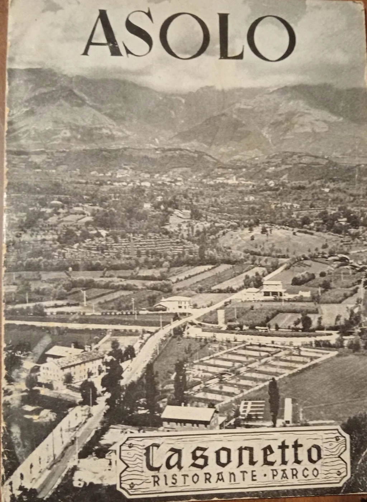

*Asolo vista do alto, na capa de um folheto turístico de época — embaixo, o anúncio do *Casonetto Ristorante-Parco*. É a cidade nas colinas para onde desce a estrada que sai de Castelcucco: de Asolo se pega o trem, e de trem em trem se chega a Gênova.*

## 2. A Itália que não existia

> O Risorgimento, o imposto sobre a moagem e o trigo americano. Por que a encosta deixou de sustentar quem a trabalhava.

O nome mais antigo que consegui alcançar nesta família é Luigi Forner, nascido em 1817.

Antes dele há gente, obviamente. Há sempre gente antes. Mas antes dele os registros somem, e o que sobra é a suposição de que eram camponeses no mesmo pedaço de encosta, fazendo a mesma coisa, com nomes que ninguém anotou.

Luigi nasceu no Vêneto. Só que, em 1817, o lugar onde ele nasceu não era a Itália.

Era o Reino Lombardo-Vêneto, província do Império Austríaco, criado dois anos antes no Congresso de Viena. Luigi Forner nasceu súdito de Francisco I da Áustria. O documento que o batizou não dizia italiano em lugar nenhum.

Em 1817 a palavra Itália descrevia uma península, não um país.

Ali dentro havia o Reino da Sardenha, o Lombardo-Vêneto austríaco, os ducados de Parma, Módena e Toscana, os Estados Pontifícios com o papa como chefe de governo, e o Reino das Duas Sicílias no sul. Cada um com sua moeda, seu peso, sua medida, sua alfândega, sua polícia e suas leis.

Trinta anos depois, em 1847, o chanceler austríaco Metternich escreveria a frase que resume tudo isso com desprezo perfeito: a Itália é uma expressão geográfica.

Ele estava sendo cruel. Não estava errado.

Luigi não falava italiano.

Falava vêneto, que não é sotaque nem corruptela. É outra língua, com gramática própria, e era a única de que ele precisava. O italiano era língua de documento, de padre e de tribunal.

Quanta gente na península falava italiano no momento da unificação é discussão que os linguistas ainda não encerraram. A estimativa mais citada, de Tullio De Mauro, fala em algo perto de dois e meio por cento. Outros trabalhos sobem bastante esse número. O que ninguém contesta é a ordem de grandeza: a esmagadora maioria das pessoas que viraram italianas em 1861 não falava italiano.

Fizeram um país com gente que não conseguia conversar entre si.

Em 1848 a Europa inteira pegou fogo, e Veneza pegou junto: Daniele Manin proclamou a República de São Marcos, que durou dezessete meses e caiu depois de um cerco com bombardeio, fome e cólera. Luigi Forner tinha trinta e um anos, e é improvável que tenha participado de coisa nenhuma. Camponês de encosta em 1848 não fazia revolução, fazia colheita.

Em 1859 veio a Segunda Guerra de Independência, e o Piemonte, com a França do lado, tirou a Lombardia da Áustria.

O Vêneto ficou.

É um detalhe que quase todo resumo de história pula, e que importa muito para esta família: quando a Itália foi sendo montada, pedaço por pedaço, o Vêneto foi deixado para trás duas vezes.

Luigi tinha quarenta e dois anos e continuava austríaco.

Em 17 de março de 1861 foi proclamado o Reino da Itália.

Sem o Vêneto. E sem Roma.

Ou seja: existia oficialmente um país chamado Itália, com rei, bandeira e parlamento, e Luigi Forner não morava nele. Continuava do outro lado de uma fronteira, no mesmo lugar onde tinha nascido, sem ter dado um passo.

No ano seguinte, 1862, nasceu o filho dele, Vincenzo Forner. Também súdito austríaco. Também sem sair do lugar.

O Vêneto virou italiano em 1866, e virou de um jeito que ninguém gosta muito de contar.

Na Terceira Guerra de Independência a Itália perdeu em terra, em Custoza, e perdeu no mar, em Lissa. Só que a Prússia, aliada dela, arrasou a Áustria em Sadowa, e a Áustria teve que ceder de qualquer maneira.

Pela paz de Viena, em 3 de outubro de 1866, o Vêneto foi entregue à França, e a França o repassou à Itália. A província mudou de dono numa mesa, entre três países, e nenhum dos três era o Vêneto.

Em 21 e 22 de outubro de 1866 fizeram um plebiscito para confirmar a anexação.

Os números impressionam, e é preciso ler os dois lados deles. De uma população de dois milhões, quatrocentos e oitenta e cinco mil habitantes, pouco menos de seiscentos e cinquenta mil tinham direito de voto. Deu sim. As fontes divergem um pouco no total, mas todas ficam por volta de seiscentos e quarenta e um mil votos a favor contra algo entre sessenta e nove e setenta contra.

Noventa e nove vírgula noventa e nove por cento.

Também não era voto secreto. A pessoa ia até a mesa e dizia em voz alta, na frente dos vizinhos e das autoridades, se queria ou não ser italiana.

Luigi Forner tinha quarenta e nove anos. Se votou, não sei. Não existe lista.

E aí chegou a conta.

Um Estado novo precisa de duas coisas com urgência: dinheiro e soldados. O Reino da Itália, endividado pelas guerras de unificação, foi buscar as duas no único lugar onde sempre há: no campo.

O Vêneto entrou na Itália como a região mais pobre do país recém-formado. E a primeira coisa que o país recém-formado fez foi cobrar.

Em 7 de julho de 1868 foi promulgada a tassa sul macinato, a taxa sobre a moagem. Entrou em vigor em 1º de janeiro de 1869.

Era um imposto cobrado sobre a quantidade de cereal moído, com contadores mecânicos instalados nas mós dos moinhos.

Pense no que isso significa numa região que come polenta três vezes por dia. Taxaram o ato de transformar milho em comida. Não o lucro, não a venda, não a terra. A moagem. O gesto.

O país inteiro se revoltou e o norte se revoltou mais. Moinhos fecharam, houve quebra-quebra e houve morte. Em 26 de janeiro de 1869 o Senado confirmou o imposto e deu plenos poderes de repressão ao general Raffaele Cadorna.

Guarde esse sobrenome. Ele volta neste livro, em 1917, na pessoa do filho.

A outra cobrança foi em gente.

A unificação trouxe o serviço militar obrigatório, e serviço militar obrigatório numa economia camponesa não é questão patriótica, é questão aritmética. Cada filho convocado é um par de braços que sai da encosta por anos.

Numa terra em que a família só se sustentava porque todos trabalhavam, tirar um filho era tirar a margem inteira.

O macinato foi abolido em 1884, dezesseis anos depois. Tarde demais para a geração que ele quebrou.

No dia 11 de novembro a estrada enchia de carroça.

É o dia de São Martinho, e no campo do norte da Itália era quando venciam os contratos agrários. Quem tinha sido renovado ficava. Quem não tinha carregava o que cabia, colchão, panela, imagem de santo, as crianças em cima, e saía procurar outro pedaço de terra de outro proprietário.

A expressão pegou e sobreviveu à coisa: *fare San Martino*, em italiano, até hoje quer dizer mudar de casa.

Uma vez por ano, num único dia, dava para ver na estrada exatamente quantas famílias tinham perdido o chão.

Não sei em que condição os Forner e os Miotto trabalhavam a terra.

Podiam ser proprietários de um pedaço, podiam ser meeiros, podiam ser diaristas. Os documentos que tenho começam tarde demais e não dizem. Vou descrever o sistema, porque o sistema eu conheço, e deixar claro que não sei em que casa dele essa família morava.

O que dá para afirmar é que ninguém ali era rico. Rico não emigra na terceira classe.

Havia basicamente três lugares onde se podia estar.

Proprietário de um retalho: dono de faixas espalhadas de encosta, somando às vezes menos de um hectare, o suficiente para não morrer e não o suficiente para viver.

Meeiro: trabalhava a terra de outro e entregava metade da colheita. Contrato anual, renovável ou não, com vencimento em São Martinho.

Diarista, o *bracciante*: não tinha terra nenhuma e vendia o dia. Era o último degrau, e era para onde os outros dois desciam.

O movimento entre esses três lugares tinha uma direção só.

A mecânica da queda é sempre a mesma e leva mais ou menos uma década.

Vem um ano ruim: granizo, seca, doença na vinha. A colheita não paga o ano. A família pede emprestado para atravessar o inverno e comprar semente.

No ano seguinte a colheita paga o ano mas não paga o juro. Pede de novo.

No terceiro ou quarto ano vende uma faixa de terra para quitar. Agora tem menos terra, e portanto menos colheita, e portanto menos margem para o próximo ano ruim.

Que vem.

Quem emprestava não era banco. Banco não emprestava a camponês.

Emprestava o proprietário vizinho, o comerciante da vila, o moleiro, o padre às vezes, e gente que fazia disso profissão. Os juros não estavam em nenhuma tabela. Estavam no que o credor achasse que dava para cobrar de alguém que não tinha alternativa.

A terra que saía das mãos de uma família ia parar nas mãos de quem já tinha. É assim que funciona concentração fundiária: não por decreto, por juro.

Aí, na década de 1880, veio uma pancada que não tinha nada a ver com a Itália.

O trigo americano chegou à Europa.

As pradarias dos Estados Unidos entraram em produção em escala industrial, a ferrovia levou o grão até os portos e o navio a vapor atravessou o Atlântico em duas semanas em vez de dois meses. O preço do trigo despencou no continente inteiro.

Para o consumidor urbano foi ótimo. Para o pequeno agricultor europeu, que vendia o pouco que sobrava para pagar imposto e juro, foi a sentença.

Repare no que estava acontecendo ao mesmo tempo, porque é uma das ironias mais perfeitas desta história.

O navio a vapor foi a tecnologia que arruinou o camponês vêneto, porque foi ele que trouxe o grão barato da América.

E foi a mesma tecnologia, muitas vezes literalmente os mesmos navios, que levou o camponês vêneto para a América.

O grão vinha de lá para cá. A gente ia daqui para lá. Nos mesmos porões, em direções opostas.

Faltava a doença.

A pelagra já apareceu no primeiro capítulo deste livro como parte da paisagem: a pele rachada nas mãos e no rosto de quem comia polenta três vezes ao dia. Vale agora dizer de onde ela vinha, porque a explicação é pior do que a doença.

A causa é falta de niacina, a vitamina B3. E é aqui que a história fica insuportável.

O milho tem niacina. Só que no milho ela vem quimicamente presa, numa forma que o intestino humano não consegue absorver.

Existe uma solução, e ela é antiga. Os povos da Mesoamérica, que domesticaram o milho ao longo de milhares de anos, cozinham o grão em água com cal ou com cinza antes de moer. O processo se chama nixtamalização, e ele quebra a ligação e libera a niacina. Sem isso, tortilla mataria mexicano. Com isso, alimenta.

Quando os europeus levaram o milho da América para a Europa, no século XVI, levaram a semente e não levaram a técnica.

Foi isso que aconteceu com o Vêneto.

Adotaram um cereal do Novo Mundo porque ele rendia mais por hectare do que qualquer coisa que tivessem, plantaram, moeram e comeram do jeito que se comia trigo. Deu certo por gerações, enquanto a polenta era uma parte da dieta.

Quando a polenta virou a dieta inteira, porque não sobrava dinheiro para mais nada, a conta chegou.

As regiões mais atingidas pela pelagra na Itália foram a Lombardia, o Vêneto e a Emilia Romagna. Em 1878 o governo mandou fazer um levantamento nacional só sobre ela. Chegaram a existir instituições específicas para internar doentes, os pellagrosari.

Uma população inteira adoeceu de fome comendo, e adoeceu porque tinha atravessado o Atlântico uma vez, três séculos antes, e trazido metade do conhecimento.

A pelagra era uma doença de classe, e isso não é figura de linguagem.

Ninguém que comesse carne, ovo, leite ou pão de trigo com alguma regularidade desenvolvia pelagra. Nenhum proprietário. Nenhum comerciante. Nenhum padre.

Dava em quem comia polenta e mais nada, e quem comia polenta e mais nada era o camponês que entregava metade da colheita e o diarista que não tinha colheita nenhuma.

Dava para olhar as mãos de uma pessoa na feira e saber em que degrau ela estava.

O resultado está nos números da emigração, e os números são brutais.

Entre 1876 e 1900, três regiões produziram mais de quarenta e sete por cento de todos os italianos que deixaram o país. O Vêneto foi a primeira delas, sozinho com dezessete vírgula nove por cento.

E não foi pico passageiro. Até a década de 1940 o Vêneto continuou liderando a estatística de emigração italiana, à frente da Sicília, da Campânia e da Calábria. Somando tudo, calcula-se que três milhões e duzentos mil vênetos foram embora.

A região que mais gente perdeu não foi o sul miserável do imaginário popular. Foi esta, no norte, a que tinha acabado de entrar na Itália.

Não é uma história de vilão. É uma história de engrenagem.

Não houve um decreto expulsando ninguém, não houve exército queimando aldeia, não houve perseguição. Houve uma soma de coisas razoáveis do ponto de vista de quem as decidia, que juntas tornaram impossível continuar.

Foi por isso que quando os cartazes começaram a aparecer nas praças, prometendo terra do outro lado do mar, eles não precisaram convencer ninguém.

Só precisaram avisar que existia saída.

Luigi Forner nasceu em 14 de agosto de 1817, em Monfumo, súdito austríaco.

Virou italiano aos quarenta e nove anos sem sair de casa. O filho dele, Vincenzo, nascido em 6 de agosto de 1862, também nasceu austríaco e virou italiano aos quatro.

A fronteira atravessou os dois enquanto os dois estavam parados.

A história de Luigi Forner parecia terminar aí: o homem que nunca foi a lugar nenhum e a quem o mapa mudou debaixo dos pés.

Não termina.

A genealogia impressa em *Storia di Castelcucco*, o livro de história local que reconstruiu essas linhagens, traz ao lado do nome dele uma anotação de seis palavras:

*emigrato in America dopo il 1891.*

Luigi Forner emigrou. Depois de 1891, quando já tinha passado dos setenta e quatro anos.

Morreu em 11 de novembro de 1905, aos oitenta e oito.

Não sei para onde foi, não sei se sozinho, não sei se voltou, não sei onde está enterrado. A frase não diz. América, naquele vocabulário, tanto pode ser o Brasil quanto a Argentina, os Estados Unidos ou o Canadá.

Sei que ele fez alguma coisa que não cabe na versão fácil desta família.

O homem mais velho de que temos notícia, nascido antes de a Itália existir, camponês de uma encosta de oito quilômetros quadrados, atravessou o Atlântico depois dos setenta.

Trinta e seis anos antes da neta.

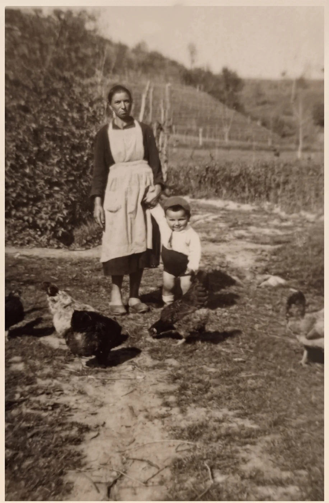

*Fotografia do acervo da família, sem data e sem identificação. Ao fundo, a encosta plantada em faixas — a mesma paisagem descrita neste capítulo, e a mesma economia: pouca terra, dividida, trabalhada de cima a baixo.*

## 3. Forner e Miotto

> Luigi Forner, 1817. Vincenzo, Santa Pandolfo e os dez filhos. Duas casas a quatro quilômetros.

Uma certidão de batismo do Vêneto do século XIX cabe em duas linhas.

Data. Nome da criança. Nome do pai. Nome da mãe. Padrinho e madrinha. Assinatura do pároco, ou a cruz de quem não sabia assinar.

Não tem profissão, não tem endereço, não tem causa de nada. Não diz se a casa era de pedra ou de pau, se havia comida naquele inverno, se a criança era esperada ou era a oitava.

Levei anos para entender que a informação não está nos nomes. Está no intervalo entre eles.

O nome mais antigo com data é Luigi Forner, nascido em 14 de agosto de 1817, em Monfumo, e morto em 11 de novembro de 1905.

Oitenta e oito anos. Naquele lugar e naquele século, é quase inverossímil.

Atrás dele estão os pais, Domenico Forner e Maria Vial, sem datas. Dali para trás é escuro.

De Domenico e Maria até João Luca, nascido em 2012, são oito gerações documentadas, e sete delas nunca souberam que a oitava existiria.

Luigi casou-se com Elisabetta Forner.

Leia de novo. Os dois têm o mesmo sobrenome.

Isso não é escândalo e não é descuido de escrivão. É demografia.

Numa vila de algumas centenas de habitantes, cercada de montanha, onde ninguém se mudava e o casamento acontecia dentro da paróquia, primos casavam com primos e sobrenomes se repetiam nos dois lados do altar com uma regularidade que hoje causa espanto e naquela época não causava nenhum.

O sobrenome Forner ocupa páginas inteiras dos livros daquelas paróquias. Em algum ponto do século XVIII, quase todo mundo ali era parente de todo mundo.

Luigi teve três filhos que deixaram rastro: Domenico Alessandro, de 1853, Vincenzo, de 1862, e Abele Alessandro, de 1865. Os três nasceram em Monfumo e os três ficaram por ali.

É o do meio que interessa.

Vincenzo Forner casou-se com Santa Pandolfo em 1887. Ele com vinte e cinco anos, ela com vinte e dois.

A primeira filha do casal, Angela, nasceu em 1886.

Um ano antes do casamento.

Não há mistério nisso, e faço questão de dizer, porque a mesma coisa vai acontecer de novo nesta família quarenta anos depois e eu não quero que soe como exceção. Numa vila católica do Vêneto, um filho antes do papel queria dizer que a relação já era estável e que a formalização esperava alguma coisa: dinheiro, autorização de família, a vinda de um padre, o fim de uma colheita.

A criança vinha primeiro. Depois o cartório.

Vincenzo e Santa tiveram dez filhos documentados.

Angela, 1886. Pietro Luigi, 1889. Martino Giuseppe, 1891. Sante, 1893. Maria Elisabetta, 1895. Maria Luigia, 1896. Bonfiglio Sabino, 1898. Giulio Giuseppe, 1900. Rosa, 1903. Maria, 1907.

Lida como lista de cartório, não diz nada.

Leia os intervalos. Três anos. Dois. Dois. Dois. Um. Dois. Dois. Três. Quatro.

Agora olhe para a mulher que está atrás desses números.

Santa Pandolfo nasceu em 1º de novembro de 1865. Teve o primeiro filho aos vinte e um anos. Teve o último aos quarenta e dois.

**Vinte e um anos parindo.**

Dez gestações documentadas, e é quase certo que houve mais, porque perda de gravidez e criança morta nos primeiros dias muitas vezes não chegava ao livro da paróquia.

Tudo isso comendo polenta, carregando água, trabalhando a encosta e criando os que iam ficando.

Esta é a bisavó de quem vai atravessar o Atlântico. Convém saber de que corpo ela veio.

Nem todos ficaram.

Naquelas casas morria-se cedo e morria-se de coisa banal, e o costume era devolver o nome da criança morta à criança seguinte. O nome era um bem de família, como a terra: não se deixava um nome morrer junto com quem o carregava.

Na casa do irmão de Vincenzo, a quatro quilômetros dali, nasceram gêmeos em 10 de junho de 1908. Ausilio Fortunato e Roberto.

Roberto morreu em 3 de julho, com vinte e três dias. Ausilio viveu até 1989.

Nasceram no mesmo dia, e entre a morte de um e a do outro passaram oitenta anos.

Em 1916 morreu Pietro Luigi Forner, o segundo filho, com vinte e sete anos.

A explicação óbvia se escreve sozinha: era idade de convocação, a Itália estava no segundo ano de guerra, e aquela casa ficava a poucos quilômetros do que viraria a frente do Monte Grappa.

Fui procurar o nome dele no registro oficial dos militares italianos mortos naquela guerra. Não está lá.

Pode ter sido a guerra sem constar em lugar nenhum. Pode ter sido tuberculose, acidente, uma das epidemias que atravessavam aquelas vilas.

Naquele mundo, morrer aos vinte e sete não exigia guerra nenhuma.

Durante anos eu não soube dizer mais do que isso.

Em setembro de 2026 chegou uma resposta que eu não tinha pedido.

Giorgio Forner escreveu do Vêneto, num parágrafo corrido, sem pontuação e sem nenhum alarde, o que a casa dele conta: *Pietro è morto negli Stati Uniti per un incidente sul lavoro in miniera però non so in che anno è successo questo.*

**Pietro morreu nos Estados Unidos, num acidente de trabalho numa mina.** O ano, ele não sabe.

Repare no que essa frase faz com o resto.

Ela não bate de frente com documento nenhum, porque documento não há. E explica, sem tentar, a única coisa que eu tinha achado estranha: um homem em idade de convocação não aparece no registro dos mortos daquela guerra porque não estava naquela guerra. Estava do outro lado do Atlântico, debaixo da terra.

Ela também põe um segundo nome numa rota que o capítulo anterior deixou aberta. Ao lado de Luigi Forner, o avô, a genealogia impressa traz *emigrato in America dopo il 1891*, e eu escrevi ali que não sabia para onde ele tinha ido. O neto que carrega o nome dele teria ido para o mesmo lugar.

Nada disso está provado, e eu não vou escrever que está.

É lembrança de família. Chegou sem ano, sem estado e sem cidade, e vem do galho que ficou na Itália — o mesmo que guardou o quadro das medalhas. Vale o que vale um depoimento: muito, e sozinho.

Duas folhas resolveriam. O *atto di morte* do Comune di Monfumo diz onde ele morreu, e se não existir já diz que não foi ali. E quem desce numa mina americana deixa manifesto de entrada, folha de pagamento e certidão, porque naquele país acidente de mina gerava papel.

Enquanto elas não aparecem, as duas versões ficam lado a lado, e a segunda é de quem tem mais direito de contá-la do que eu.

Dois anos antes disso, em 1914, morreu Santa Pandolfo.

Rosa tinha onze anos. A caçula, Maria, tinha sete.

No mesmo ano a Europa entrou em guerra. No ano seguinte a Itália entrou junto e levou os homens da casa.

Ficou Maria Luigia, de dezoito anos, com a casa nas costas e as irmãs pequenas dentro dela.

Guarde essa moça.

Treze anos depois, aos trinta e um, ela vai estar na água escura da costa da Bahia com quatro filhos pequenos, no mesmo naufrágio da irmã mais nova que ajudou a criar.

Mas isso é dali a onze capítulos.

E o pai?

O pai estava lá.

**Vincenzo Forner ainda estava vivo em março de 1940**, com setenta e sete anos. Sei disso por uma carteira de identidade que o filho Sante tirou naquele mês, no comune de Asolo, em que o escrivão anotou o pai como vivo e a mãe como falecida, com as duas fórmulas fixas que a burocracia italiana usava para essa diferença.

O que quer dizer que a cena de outubro de 1927 é esta, e não outra:

**um homem de sessenta e cinco anos se despediu de duas filhas na porta de casa e não as viu nunca mais.**

Do outro lado desta história estão os Miotto, e deles eu tenho muito menos.

Luigi Miotto casou-se com Domenica Ganeo em 24 de junho de 1900, no comune di Maser. Ele com vinte e cinco anos, ela com vinte e um.

A família repetiu por décadas que ela se chamava Nina. Não se chamava. O certificado de casamento diz Domenica, e a declaração de óbito do filho dela, setenta e nove anos depois e do outro lado do oceano, diz Domenica também.

Nina era o apelido. Foi o apelido que atravessou o Atlântico e virou nome.

Repare onde Luigi Miotto nasceu: Monfumo.

A mesma vila dos Forner. Os Miotto desta história não são de Castelcucco de origem. Chegaram lá depois, como quase todo mundo.

Fausto nasceu em 5 de julho de 1904, em Castelcucco, às quatro da manhã.

Entre o casamento em Maser e o nascimento em Castelcucco há quatro anos e quatro quilômetros.

Aqui aparece uma coisa que só se enxerga com os dois lados postos lado a lado.

Monfumo. Maser. Castelcucco. Cavaso. Quatro vilas, e entre as duas mais distantes não vão dez quilômetros.

Os Forner saíram de Monfumo para Castelcucco em algum ponto entre 1903 e 1907: Rosa nasceu na primeira, a irmã caçula nasceu na segunda. Os Miotto saíram de Monfumo, passaram por Maser, e de Maser foram para Castelcucco.

**Nesta história inteira, ninguém se muda mais do que quatro quilômetros por vez.**

Até o dia em que alguém atravessa um oceano.

De Luigi Miotto, o pai de Fausto, eu tenho três aparições.

O casamento, em 1900. O nome escrito na certidão de nascimento do filho, em 1904. E o nome outra vez, na declaração de óbito desse mesmo filho, em 1979.

Entre uma coisa e outra, nada. Nenhum documento, nenhuma data, nenhum lugar.

Fausto cresceu numa vila em que ir embora era uma das coisas que os homens faziam. Para onde foi o pai dele é uma pergunta que me tomou meses e que tem capítulo próprio, mais adiante neste livro.

Duas famílias, duas vilas, quatro quilômetros entre elas.

Numa delas, uma mulher pariu dez vezes em vinte e um anos e morreu em 1914, deixando uma menina de onze anos que um dia atravessaria o Atlântico.

Na outra, um homem deixou o nome em três papéis ao longo de oitenta anos e mais nada.

Rosa e Fausto casaram-se em 1926.

Aqui entra uma coisa que eu só descobri no fim, e que muda o desenho deste capítulo inteiro.

Fausto tinha irmãos.

Maria Luigia. Amabile Veronica. Vittorio. Asia. E pelo menos mais uma irmã, cujo nome eu ainda não sei.

Quem me deu esses nomes foi Giorgio Forner, na Itália, escrevendo debaixo de fotografias que a família dele guardou por um século. Até recebê-las, eu tinha do lado Miotto três linhas de cartório e mais nada.

Uma dessas irmãs, mais velha que Fausto, chamava-se Maria Luigia Miotto.

Leia o nome outra vez, porque este livro já tem uma Maria Luigia, e não é esta.

A que vai atravessar o Atlântico com quatro filhos pequenos é Forner Maria Luigia, irmã da Rosa.

Esta outra é Miotto Maria Luigia, irmã do Fausto. E esta não foi a lugar nenhum.

Ela ficou porque casou com quem ficou.

Maria Luigia Miotto casou-se com Sante Forner.

Sante é o irmão da Rosa. O das três medalhas, o do Monte Grappa, o do capítulo 6 deste livro.

Ou seja: **Rosa Forner casou com Fausto Miotto, e o irmão de Rosa casou com a irmã de Fausto.**

Não houve um casamento entre estas duas famílias. Houve dois, cruzados.

Numa vila de mil e setecentos habitantes isso não é romance, é geografia. Este capítulo já mostrou que ninguém ali se movia mais que quatro quilômetros por vez e que os mesmos sobrenomes se repetiam dos dois lados do altar.

Mas o efeito, cem anos depois, é este: **o primo que mora na Itália e que me mandou as fotografias deste capítulo é meu parente pelos dois lados.** Forner pelo avô, Miotto pela avó.

Os dois ramos que este livro vai passar o resto do tempo separando — os que foram e os que ficaram — já estavam amarrados um no outro antes de qualquer um pisar num navio.

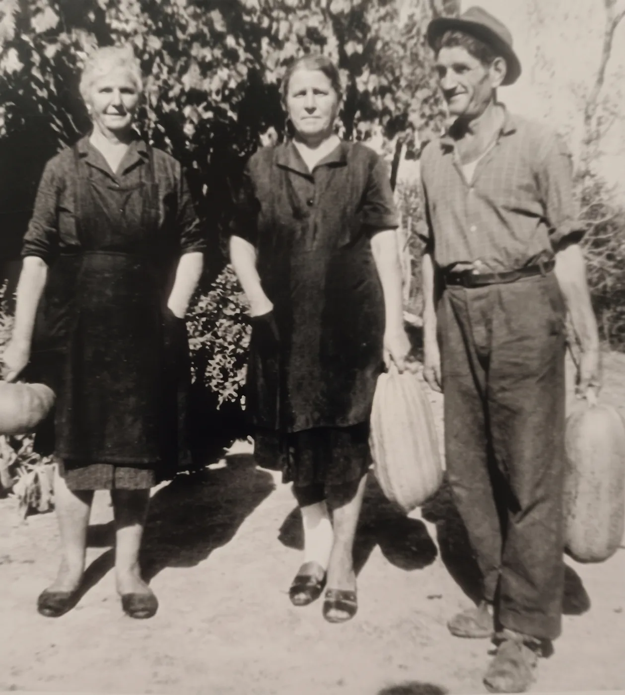

*Três irmãos de Fausto Miotto: **Maria Luigia** ao centro, **Veronica** à direita e **Vittorio**. Fotografia e identificação enviadas por Giorgio Forner, neto de Maria Luigia.*

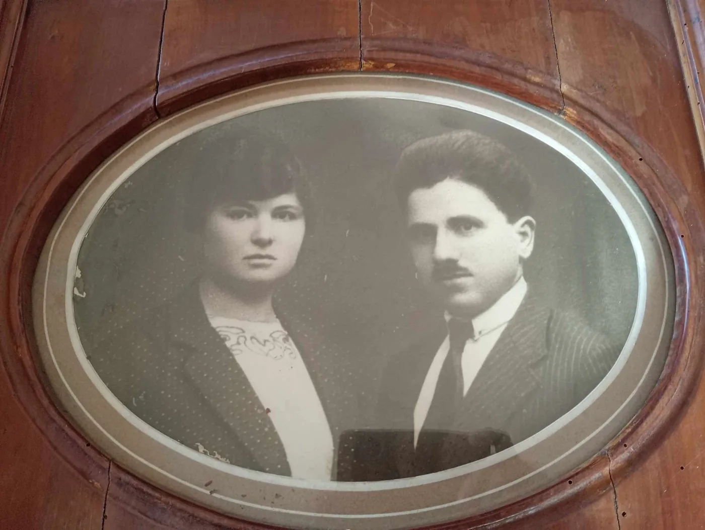

***Sante Forner e Maria Luigia Miotto.** Ele, irmão de Rosa. Ela, irmã de Fausto. Os dois casamentos desta história cruzaram as mesmas duas famílias.*

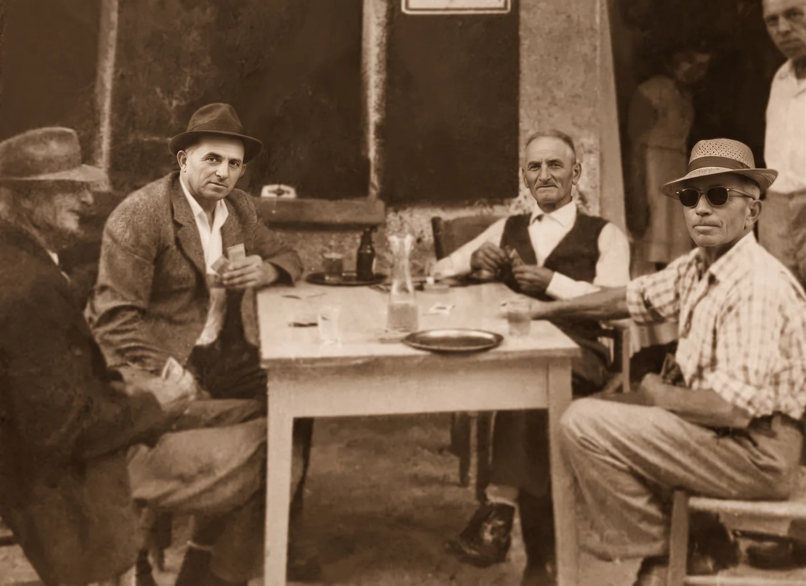

*Martino Forner, irmão de Sante e de Rosa. Fotografia de época enviada da Itália.*

## 4. O cartaz

> Agenciadores, promessas, fare l’America. A propaganda e o que ela escondia.

O cartaz não era colorido.

Tinta preta sobre papel barato. O que chamava atenção não era cor nenhuma. Era a letra do alto: gótica, cheia de volutas, do tamanho de meia folha, do tipo que se usava em cartaz de circo e em capa de missal.

Duas palavras, com uma reticência antes, como quem completa uma frase que a pessoa já vinha pensando sozinha havia meses:

*… In América.*

Embaixo do título, numa faixa desenhada como um pergaminho que se desenrola:

*Terre in Brasile per gli Italiani.*

Terras no Brasil para os italianos. E logo abaixo, em letra miúda e reta, a parte prática:

*Navi in partenza tutte le settimane dal Porto di Genova.*

Navios partindo toda semana do porto de Gênova.

No meio da folha, ocupando metade dela, não há campo, não há plantação, não há casa.

Há um navio.

Uma gravura de vapor misto, com mastros, velas e uma chaminé soltando fumaça, saindo do porto com a bandeira içada e um farol pequeno ao fundo.

Repare no que isso quer dizer. **O cartaz não vende o Brasil. Vende a travessia.** A imagem que aquela gente levava para casa depois de olhar o papel na praça não era a de uma terra. Era a de um navio saindo.

Mais abaixo, duas linhas:

*Venite a construire i vostri sogni con la famiglia.*

Venham construir os seus sonhos com a família.

E no rodapé, onde ficam as promessas de verdade:

*Un paese di opportunità. Clima tropicale, vito in abbondanza. Ricchezze minerali. In Brasile putete havere il vostro castello. Il governo dá terre ed utensili a tutti.*

Um país de oportunidades. Clima tropical, comida em abundância. Riquezas minerais. No Brasil vocês podem ter o seu castelo. O governo dá terra e ferramenta a todo mundo.

Cinco promessas, e as cinco respondiam exatamente às cinco coisas que faltavam na encosta do Grappa.

Isso não é coincidência. Quem escreveu aquele texto sabia muito bem com quem estava falando.

Quem escreveu aquele texto não sabia escrever italiano.

*Construire*, com um *n* que não existe em *costruire*. *Putete havere*, no lugar de *potete avere*, com um *h* que o italiano tinha largado havia séculos. *Vito* onde deveria estar *vitto*, que é comida.

E o próprio título: *América*, com acento agudo. Em italiano não se acentua. Em português, sim.

Não é falha da minha leitura. Está impresso. Alguém compôs aquele tipo letra por letra, alguém mandou rodar, e ninguém corrigiu.

Não sei quem imprimiu esse cartaz. Sei que não era gente para quem o italiano fosse língua de trabalho, e que ninguém no caminho achou que valesse a pena revisar — porque o público alvo, na praça da vila, em boa parte não sabia ler.

Era por isso que alguém lia em voz alta.

E a notícia andava do jeito que notícia andava: na feira, na saída da missa, no moinho enquanto se esperava a vez.

O que o cartaz não dizia é quem estava pagando, e por quê.

Não era a Itália.

Quem pagava a passagem era o Brasil, e mais especificamente o estado de São Paulo, com dinheiro público, a pedido dos fazendeiros de café.

O número é impressionante: entre 1891 e 1895, oitenta e nove por cento de toda a imigração que entrou em São Paulo foi imigração subvencionada. Nove em cada dez pessoas que desembarcaram tiveram a viagem paga pelo Estado brasileiro.

Isso não era caridade e nunca foi apresentado como caridade. Era política de mão de obra.

A razão é de 1888.

Com a abolição, a lavoura de café do interior paulista perdeu de uma vez o regime de trabalho sobre o qual tinha sido construída, e precisava de gente. Muita, barata e rápida.

Havia um segundo motivo, e ele é feio, e omiti-lo seria desonesto. Parte da elite brasileira da época defendia abertamente a imigração europeia como projeto de embranquecimento da população. Está escrito nos jornais e nos discursos do período, sem eufemismo.

O camponês vêneto que olhava aquele cartaz na praça não fazia ideia de que estava sendo recrutado para dois projetos ao mesmo tempo, e que só um deles tinha a ver com café.

Entre o cartaz na praça e o navio em Gênova havia uma indústria inteira.

Em 1892 existiam na Itália trinta agências de emigração registradas e cinco mil cento e setenta e dois subagentes.

Cinco mil recrutadores. Percorrendo vila por vila, feira por feira, batendo em porta de casa de camponês.

O subagente típico não vinha de fora. Era alguém da região, às vezes o comerciante, às vezes o próprio moleiro, alguém que a família conhecia e em quem confiava. Essa era a eficácia do sistema: a proposta chegava pela boca de um conhecido.

Os subagentes eram pagos por cabeça.

Guarde isso, porque explica tudo o que veio depois. A remuneração era por pessoa embarcada, não por pessoa que desse certo do outro lado.

A regra oficial dizia que só deviam ser recrutados agricultores aptos ao trabalho. Na prática recrutava-se qualquer um. Chegavam ao Brasil, no meio dos jovens camponeses, velhos que não aguentavam a lavoura, crianças de peito e mulheres em gravidez avançada.

Havia litígio no desembarque por causa disso. O agente já tinha recebido, e estava a um oceano de distância.

Sobre o que esperava do outro lado, o cartaz era econômico.

Não dizia que a passagem paga virava dívida, a ser descontada do que a família produzisse. Não dizia que se comprava no armazém da fazenda, a preço da fazenda, anotado no caderno da fazenda. Não dizia que o contrato prendia a família por um ano e que sair antes significava sair devendo.

Não dizia que o castelo do rodapé podia ser um barracão de colônia, e que a terra para cultivar podia ser um pedaço para plantar feijão nas horas em que não se estivesse no cafezal.

Nada disso era mentira exatamente. Era a mesma frase, com o resto cortado fora.

Mesmo assim o cartaz não foi o recrutador mais eficiente.

O recrutador mais eficiente foi o primo.

Existe uma categoria inteira de documento nos arquivos brasileiros chamada carta de chamada.

Era o mecanismo formal: quem já estava aqui chamava um parente de lá, assumindo responsabilidade por ele. Mas por trás do documento havia a coisa real, que era a carta comum, escrita ou ditada, atravessando o oceano de volta.

Os historiadores que estudam a imigração no Espírito Santo descrevem essas cartas como propaganda espontânea altamente eficaz. É uma boa definição, e ela esconde uma crueldade.

Ninguém escreve para casa dizendo que fracassou.

Quem chegou e se quebrou, quem perdeu filho na travessia, quem descobriu que a dívida não acabava, quem voltou para a Itália derrotado: essas pessoas ou não escreviam, ou escreviam pouco, ou escreviam contando outra coisa.

Quem escrevia era quem tinha comprado um pedaço de terra, quem tinha aberto um comércio, quem podia mandar dinheiro dentro do envelope.

O resultado é que a informação que voltava para o Vêneto era verdadeira e era sistematicamente enviesada. Não por mentira. Por seleção.

A propaganda mais poderosa daquela emigração não foi escrita por agência nenhuma. Foi escrita pelos próprios emigrantes, e funcionava por omissão.

O tamanho do que isso produziu:

Entre 1870 e 1920, os italianos foram quarenta e dois por cento de todos os imigrantes que entraram no Brasil. De três milhões e trezentas mil pessoas, cerca de um milhão e quatrocentas mil eram italianas.

Setenta por cento delas foram para São Paulo. Até 1920, os italianos chegaram a representar nove por cento da população total do estado.

Não é uma nota de rodapé da história do Brasil. É um dos maiores deslocamentos populacionais do século, e ele foi organizado com cartaz, subagente e comissão.

Tudo isso é do século XIX. O panfleto na praça, as trinta agências, os cinco mil subagentes.

Em 1902 o governo italiano proibiu a emigração subvencionada para o Brasil, pelo decreto que leva o nome do ministro Prinetti e que é assunto do próximo capítulo. Quando Fausto Miotto embarcou, em meados dos anos 1920, aquela praça já tinha outro aspecto.

Foi com essa ideia na cabeça que passei vinte e cinco listas de desembarque do *Principessa Mafalda*, uma por uma, no Arquivo Público de São Paulo, procurando o nome dele entre 1919 e 1924.

Não achei o Fausto.

Achei outra coisa.

Está num formulário anexo à lista de chegada de 23 de fevereiro de 1923, no porto de Santos. Duas folhas, sessenta e sete pessoas, dez famílias, e um cabeçalho impresso que diz o que aquilo era: *Relação dos immigrantes ITALIANOS AGRICOLTORES embarcados no Porto de GENOVA c/ o Vap. “PRINCIPESSA MAFALDA”*, por conta da Companhia Commercial de São Paulo.

O mesmo navio. Quatro anos antes de Rosa. E, na margem esquerda da lista geral daquele dia, ao lado de dezenas de nomes, uma palavra repetida à mão: **Subsidiados**.

A máquina não tinha acabado. Tinha mudado de freguês.

Quem ainda vinha subsidiado em 1923 vinha recrutado, dentro de um contrato que outra pessoa assinou. Fausto veio por conta própria, com dinheiro que a família juntou.

Duas emigrações diferentes, no mesmo período, saindo do mesmo porto e dentro do mesmo navio. O que aquele formulário diz, coluna por coluna, fica para o capítulo em que ele decide uma vida — o da terra vermelha.

O produto final daquela indústria de recrutamento não foi um passageiro.

Foi um hábito.

O cartaz convenceu uma geração. Essa geração escreveu cartas. As cartas convenceram a seguinte. E na terceira, quando o cartaz já tinha desbotado e a agência já tinha fechado, partir tinha deixado de ser uma decisão extraordinária e virado uma das coisas que uma pessoa da região simplesmente fazia.

É nesse ponto da história que entra o Estado italiano, tarde, tentando fechar a porteira.

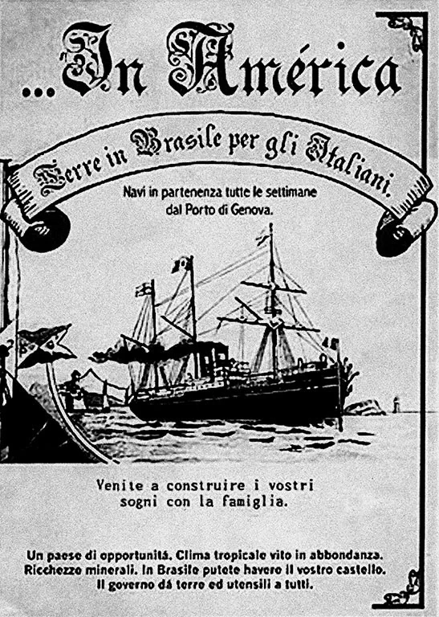

*“…In América. Terre in Brasile per gli Italiani.” Reprodução de linha do cartaz: preto sobre papel barato, com o italiano cheio de erros de composição e um navio no lugar onde deveria estar a terra prometida. Imagem de uso público; a procedência não foi localizada.*

## 5. O Decreto Prinetti

> 1902: a Itália proíbe a emigração subsidiada para o Brasil.

Os relatórios começaram a chegar a Roma no fim do século.

Eram documentos consulares, escritos por funcionários italianos espalhados pelo Brasil, gente cujo trabalho era cuidar dos interesses de cidadãos italianos em território estrangeiro. Iam por navio, levavam semanas, e caíam numa mesa em Roma onde alguém tinha que lê-los.

Durante muito tempo ninguém leu com atenção. A emigração era vista como válvula de escape: gente demais, terra de menos, e um país vizinho de além-mar disposto a receber. Se estava indo, ótimo.

Até que o conteúdo daqueles relatórios ficou impossível de ignorar.

O que os cônsules descreviam era o seguinte.

Que os imigrantes italianos nas fazendas de café tinham se tornado, na prática, servos. Que não havia assistência médica. Que não havia escola para os filhos. Que as casas eram pequenas e sem as condições mínimas de higiene.

E que havia violência física, inclusive com uso de chicote.

Essa última linha aparece nos documentos que embasaram a decisão italiana. Catorze anos depois da abolição, num país que tinha acabado de deixar de escravizar pessoas, o instrumento continuava em uso, agora contra europeus recém-desembarcados.

O cônsul italiano no Espírito Santo, onde a colonização era intensa, foi específico no relatório dele.

Reclamou das condições climáticas para as quais ninguém tinha preparado aquela gente. Da escassez e da má qualidade da comida. Do tratamento dado aos imigrantes pela polícia. Da incerteza da justiça, quando um colono tentava reclamar alguma coisa. E das falhas na medição dos terrenos que deveriam ser entregues a cada família.

Esse último item é o mais revelador dos cinco. A promessa central do cartaz era terra. E o cônsul está dizendo que nem a medição da terra era confiável.

Uma coisa tinha mudado na Itália e tornou possível que esses papéis produzissem efeito.

Em 31 de janeiro de 1901 o país aprovou a primeira lei geral sobre emigração e criou o Commissariato Generale dell’Emigrazione, um órgão de Estado com a atribuição de olhar para aquilo.

Até então a emigração italiana era um fenômeno sem dono dentro do governo. Havia agências privadas, havia subagentes pagos por cabeça, havia companhias de navegação, e não havia ninguém encarregado de perguntar o que acontecia com as pessoas depois que o navio saía.

A partir de 1901 passou a haver.

Em 26 de março de 1902, o governo italiano baixou o decreto que ficaria conhecido pelo nome do ministro das Relações Exteriores, Giulio Prinetti.

O decreto proibia a emigração subsidiada para o Brasil.

Ou seja: ficava proibido a um italiano embarcar para o Brasil com a passagem paga por outra pessoa. Especificamente, com a passagem paga pelo governo brasileiro.

É essencial entender o que o decreto não fez, porque é aí que mora a inteligência dele.

Ele não proibiu italianos de irem para o Brasil.

Quem quisesse ir continuava podendo ir. Só teria que comprar a própria passagem, com o próprio dinheiro, e chegar do outro lado sem dever nada a ninguém.

A Itália não estava impedindo a saída dos seus cidadãos. Estava cortando o mecanismo financeiro que transformava a viagem em dívida e a dívida em servidão.

Vale parar aqui, porque este é o capítulo que desmonta uma frase.

Existe uma versão da história da emigração, confortável e muito repetida, em que a Itália expulsou os pobres. Um país que se livrou da própria miséria empurrando-a para dentro de um navio.

O Decreto Prinetti é a prova documental de que não é assim tão simples.

Em 1902 o Estado italiano olhou para o que estava acontecendo com os seus nas fazendas paulistas e fechou a torneira. Tarde, desajeitado e sem resolver a causa, mas fechou. E fechou contrariando o interesse imediato de um governo que ficaria muito satisfeito de continuar exportando bocas.

O efeito foi imediato e foi grande.

A imigração italiana para o Brasil despencou. O fluxo, que não deixou de existir, mudou de endereço: passou a ir com mais força para a Argentina e para os Estados Unidos, onde não havia proibição desse tipo.

Para São Paulo, que tinha construído a lavoura de café sobre passagem subvencionada, foi um problema sério. Foi preciso buscar mão de obra em outros lugares, e é aí que se intensificam outras correntes migratórias no estado.

O Brasil reagiu com diplomacia e com irritação. Em 1906 ainda havia gestão em curso para tentar derrubar as restrições italianas. Não conseguiram.

Agora a parte que interessa diretamente a esta família.

O decreto não parou a emigração vêneta. Nada parou a emigração vêneta.

O que ele fez foi mudar quem podia ir e em que condição. Sem passagem paga, ir para o Brasil deixou de ser uma coisa que um miserável absoluto conseguia fazer e virou uma coisa que exigia dinheiro na mão. Juntar economia, vender o que houvesse, pedir a parente.

A emigração continuou, mas ficou mais lenta, mais familiar e mais deliberada. Menos levas organizadas, mais gente indo atrás de gente.

Vinte e cinco anos depois do decreto, Fausto Miotto embarcou.

Não como colono recrutado, não com passagem paga por ninguém, não dentro de um contrato assinado antes de sair. Foi por conta própria, primeiro, sozinho, do jeito que boa parte da emigração vêneta passou a se fazer depois de 1902: alguém vai, se estabelece, e chama.

Como se viu no capítulo anterior, ainda saía de Gênova gente subsidiada em 1923, com patrão declarado antes do embarque, neste mesmo navio. Fausto não estava entre eles.

Depois chamou a mulher.

E a mulher, quando veio, veio pelo mesmo caminho.

**Rosa Forner não estava sendo recrutada. Estava indo encontrar o marido.**

É uma diferença que parece pequena e que decide tudo o que vem depois.

Ela viajou num transatlântico de linha regular, que levava primeira, segunda e terceira classe na mesma viagem, com passageiros que tinham comprado bilhete.

Ela pagou para estar ali.

Junto com a irmã, com quatro sobrinhos e com um filho de um ano.

Seria bonito dizer que uma canetada dada em Roma pôs esta família naquele navio, vinte e cinco anos depois.

Não é verdade, e o documento de 1923 é a prova: aquele navio ainda levava gente subsidiada.

O que o decreto fez foi mais modesto, e ainda assim grande. Mudou quem podia ir sem dinheiro e quem precisava juntar. Empurrou uma parte da emigração vêneta para o modelo de um por vez, por conta própria, chamando os outros depois.

A família Miotto cabe inteira dentro desse modelo.

Fica um buraco neste capítulo, e ele é grande.

O Decreto N. 2400, de 13 de julho de 1918, citado no cabeçalho daquela Relação de 1923, é a base legal *brasileira* do transporte subsidiado. Do lado italiano, não sei até quando a proibição de 1902 continuou valendo na prática, nem se foi revogada, nem se simplesmente deixou de ser aplicada.

Sem essa peça, este capítulo não pode dizer que a proibição durou até 1927, e também não pode dizer que caiu antes.

Fica assim, declarado, até o documento aparecer.

Há uma última ironia neste capítulo, e ela é silenciosa.

O decreto foi criado porque cônsules italianos denunciaram que seus compatriotas estavam sendo tratados como escravizados nas fazendas de café.

Ou seja: a Itália sabia. Em 1902, o governo italiano tinha, por escrito, na própria mesa, a descrição do que esperava um camponês vêneto que desembarcasse em Santos.

E ainda assim, entre 1902 e 1927, centenas de milhares continuaram vindo.

Porque quando a alternativa é a encosta do Grappa com a terra dividida em três, a polenta três vezes ao dia e o contrato vencendo em novembro, até o relatório do cônsul soa como uma proposta.

## 6. Sante nos Alpes

> A Grande Guerra, as trincheiras, as três medalhas. O ramo que ficou.

O quadro está pendurado numa parede no Vêneto.

Moldura dourada, fundo claro, três medalhas presas com as fitas para cima, e no meio uma figura alegórica: a Itália vitoriosa, cercada de estandartes.

Ele nunca atravessou o oceano. Ficou onde sempre esteve, passando de mão em mão dentro do ramo da família que não foi embora, até chegar em Giorgio Forner, que hoje o guarda e que foi quem mandou a fotografia para o Brasil.

É o objeto mais antigo desta história que ainda existe fisicamente. E ele pertence a um homem que quase ninguém do lado brasileiro sabia que existiu.

O homem é Sante Forner, nascido em 1893.

Filho de Vincenzo Forner e Santa Pandolfo. Quarto na lista dos dez. Irmão mais velho de Rosa, a que atravessaria o Atlântico dez anos depois de tudo isso terminar.

Na Itália daquele tempo você não era apenas nascido em 1893. Você era da *classe 1893*. O ano de nascimento virava uma categoria administrativa que acompanhava o homem a vida inteira, e que servia para uma coisa acima de todas as outras: saber quando chamá-lo.

A classe 1893 foi chamada.

A Itália entrou na guerra em 24 de maio de 1915, quase um ano depois de o resto da Europa começar.

Tinha passado esse ano negociando com os dois lados para ver qual pagava mais, e acabou com a Tríplice Entente pela promessa de receber territórios ao norte, incluindo áreas ainda sob a Áustria.

Sante tinha vinte e dois anos.

Naquele mesmo momento, na casa em que ele tinha crescido, havia um detalhe que os manuais de história não registram: a mãe, Santa Pandolfo, tinha morrido no ano anterior, em 1914. Rosa tinha onze anos. Maria M., a caçula, tinha sete.

Ele saiu de uma casa que tinha acabado de enterrar a mãe.

A guerra italiana começou no rio Isonzo, e ficou ali por dois anos e meio.

Onze batalhas com o mesmo nome, numeradas de um a onze, entre junho de 1915 e setembro de 1917. Onze vezes atacando as mesmas posições, no mesmo terreno, contra o mesmo inimigo entrincheirado em cima.

O terreno era karst: pedra calcária. Não dá para cavar trincheira em pedra. Os soldados empilhavam pedra solta para se proteger, e quando um obus caía perto, a própria proteção virava estilhaço.

Não sei em qual dessas batalhas Sante esteve, nem se esteve em alguma. Não tenho o registro militar dele. Mas um homem da classe 1893, convocado, tinha uma probabilidade muito alta de estar em pelo menos uma.

E havia o outro front, o das montanhas, que os italianos chamam até hoje de guerra branca.

Combate acima dos dois mil metros. Trincheira escavada no gelo. Posições abastecidas por teleférico e por mula. Homens dormindo em caverna aberta na rocha, a trinta graus negativos, com o inimigo a cem metros de distância fazendo a mesma coisa.

No inverno de 1916 as avalanches mataram milhares de soldados dos dois lados numa única semana de dezembro. Não em combate. Soterrados.

A montanha matou tanto quanto o exército austríaco, e matava sem preferência de uniforme.

O comandante supremo italiano era Luigi Cadorna.

Sim, o mesmo sobrenome do capítulo 2. Raffaele Cadorna, o general a quem o Senado deu plenos poderes em 1869 para reprimir as revoltas contra o imposto sobre a moagem, era o pai dele.

O filho comandou a guerra do mesmo jeito que o pai comandou a repressão: com a convicção de que o problema era a falta de disciplina de quem estava embaixo.

Cadorna mandou fuzilar soldados italianos por recuo, por indisciplina e por suspeita. Ressuscitou a decimação, o castigo romano de escolher homens por sorteio e executá-los como exemplo coletivo. Os números exatos ainda são discutidos por historiadores, e são altos em qualquer contagem.

Um camponês vêneto de vinte e dois anos, naquele front, tinha dois inimigos, e um deles usava o mesmo uniforme.

Em 1916 morreu Pietro Luigi Forner, irmão mais velho de Sante, aos vinte e sete anos.

Durante muito tempo eu completei essa frase com outra, dizendo que ele tinha morrido na guerra, porque era o que fazia sentido. O nome dele não está no Albo d’Oro. O capítulo 3 conta essa busca e o que ela derrubou.

Então aqui fica só o que se sustenta: em 1916, no meio da guerra, aquela casa perdeu mais um, e eu não sei de quê.

O que a guerra fez com os Forner, porém, está documentado. E é pior do que um irmão.

Procurei o sobrenome Forner no Albo d’Oro e apareceram dezesseis homens.

Nove eram de Monfumo. O vilarejo da Rosa.

Angelo di Antonio, classe 1876. Giuseppe di Antonio, 1880. Giovanni di Agostino, 1882. Giovanni di Giuseppe, 1884. Umberto di Vittore, 1886. Florindo di Antonio, 1887. Pietro di Fortunato, 1887. Vittorio di Antonio, 1887. Ferruccio di Giovanni, 1891.

Nove homens, um sobrenome, uma vila.

Monfumo hoje tem pouco mais de mil habitantes, e naquela época tinha menos. Não sei o grau de parentesco de cada um com Rosa, mas o capítulo 3 já mostrou o que um sobrenome significa numa vila daquele tamanho. É quase certo que houvesse parentesco com quase todos.

Vale ler *como* eles morreram, porque desmonta a imagem de guerra que a gente carrega.

Florindo morreu no Monte Sabotino em 1915, de ferimentos em combate. Ferruccio no Médio Isonzo em 1916, de ferimentos. Giovanni di Agostino no Monte Rombon em 1917, em combate.

Os outros seis, não.

Angelo morreu em 1918 num hospital de guerra, de doença. Umberto num hospital de campanha em 1916, de doença. Vittorio em Mestre, 1917, de doença. Pietro em Bologna, 1917, de doença. Giuseppe morreu em 1918 na *prigionia*, cativeiro, de doença.

Mais da metade não caiu atacando trincheira. Adoeceu e morreu longe, numa enfermaria ou num campo de prisioneiros, às vezes meses depois de ter saído de casa.

Foi assim que a Primeira Guerra matou a maior parte da gente que matou.

Fiz a mesma busca com o outro sobrenome desta história.

Miotto aparece cinquenta e quatro vezes no Albo d’Oro, espalhado pelo Vêneto e pelo Friuli: Arba, Vo’, Candiana, Adria, Vicenza, Veneza.

Nenhum de Castelcucco. Nenhum de Monfumo, de Possagno, de Cavaso del Tomba, de Asolo ou de Pieve del Grappa.

Os Miotto do sopé do Grappa não perderam ninguém na guerra. Pelo menos ninguém que tenha entrado no registro oficial.

Ponha as duas contas lado a lado, porque elas se encontram num casamento.

Em 1926, uma moça de uma família que enterrou nove homens casou-se com um rapaz de uma família que não enterrou nenhum.

Moravam a quatro quilômetros um do outro. Eram pobres do mesmo jeito, comiam a mesma polenta, olhavam a mesma montanha. E saíram da mesma década com contas completamente diferentes.

Não sei se eles conversavam sobre isso. Desconfio que não. Aquela geração não conversava sobre isso.

Em 24 de outubro de 1917 o front arrebentou em Caporetto.

Foi a maior derrota da história militar italiana. Em duas semanas o exército recuou mais de cem quilômetros, perdeu centenas de milhares de homens entre mortos, feridos e prisioneiros, e a palavra Caporetto entrou no italiano como sinônimo de desastre completo. É usada assim até hoje.

Cadorna foi demitido em novembro. Culpou os próprios soldados publicamente.

E aí a guerra chegou em casa.

O exército recuou até parar em duas linhas: o rio Piave e o Monte Grappa. O Grappa é a montanha que se vê da janela de Castelcucco e de Monfumo. É a montanha do capítulo 1.

Entre 13 e 26 de novembro de 1917, e outra vez entre 11 e 21 de dezembro, os austro-húngaros atacaram aquele maciço para descer na planície e chegar a Veneza.

Sante Forner era um soldado italiano de vinte e quatro anos, do exército que defendia aquela posição, e aquela posição ficava alguns quilômetros acima da casa onde os irmãos menores dele estavam, órfãos, esperando.

Poucos soldados na história defendem literalmente a vista da própria janela.

No verão de 1918 os austro-húngaros tentaram o Grappa de novo e falharam de novo.

Em 24 de outubro de 1918, um ano exato depois de Caporetto, os italianos atacaram subindo, dentro da ofensiva de Vittorio Veneto. O império austro-húngaro se desfez enquanto a batalha acontecia.

Em 4 de novembro de 1918 acabou.

A Itália terminou a guerra do lado vencedor. As estimativas de mortos militares italianos variam conforme o critério, mas ficam em torno de seiscentos e cinquenta mil homens. Some os civis e passa de um milhão.

Agora as medalhas, e aqui é preciso ser exato, porque exatidão é uma forma de respeito.

As três não têm o mesmo peso, e a família nunca teve por que saber disso.

A *Medaglia al Valor Militare* é uma condecoração de bravura, criada em 1833 pela casa de Saboia, concedida em ouro, prata ou bronze por ato específico. Ela é dada porque alguém fez alguma coisa, e vem com uma justificativa escrita, uma *motivazione*, que descreve o ato.

Essa é a medalha que importa. E quer dizer que em algum arquivo italiano existe uma folha de papel que diz o que Sante Forner fez.

A segunda é a *Medaglia commemorativa della guerra italo-austriaca 1915-1918*, e ela é de outra natureza.

Foi criada por decreto real de 29 de julho de 1920 e concedida a todos que serviram pelo menos quatro meses em zona de guerra. Não é prêmio por ato. É registro de presença.

Isso não a torna menos interessante. Torna outra coisa.

No anverso está Vitor Emanuel III de capacete e a inscrição *guerra per l’unità d’Italia 1915-1918*. No reverso, uma Vitória alada carregada em triunfo por soldados, sobre um pedestal feito de escudos de trincheira. O desenho é de Silvio Canevari.

E o metal tem procedência declarada: o decreto determinou que a medalha fosse cunhada com o bronze fundido de canhões austríacos capturados. Ficou conhecida como a medalha do *bronzo nemico*, bronze inimigo.

Sante Forner carregava no peito o metal que tinha atirado nele.

Há um detalhe nessa medalha que pode responder uma pergunta que ninguém fez.

Ela vinha com fascette, pequenas barras presas à fita. Uma barra para cada ano civil em que o soldado tivesse servido no mínimo quatro meses, e cada barra traz o ano gravado: 1915, 1916, 1917, 1918.

As barras são a folha de serviço dele, em metal, na parede da casa do Giorgio. Cada uma traz o ano gravado, e juntas dizem em quantas campanhas ele esteve e quais foram.

Estão ali desde 1920.

Ninguém nunca as contou.

A terceira medalha eu não consigo identificar pela descrição.

A família a chama de medalha de campanha. Pode ser a Medalha Interaliada da Vitória, que os países vencedores emitiram em versões nacionais a partir de 1922, pode ser uma comemorativa da unidade, pode ser outra coisa.

Fica sem nome, porque inventar aqui seria fácil e seria errado.

Sante Forner voltou.

Casou com Maria Luigia Miotto, irmã mais velha de Fausto — de modo que os dois Forner desta história, Rosa e Sante, casaram com dois Miotto.

Teve filhos e continuou onde sempre esteve. Leo, Delfina e Galliano são dele. De Galliano veio Giorgio, que hoje mora na mesma região, conhece a história inteira, e é quem guarda o quadro.

Nunca emigrou. Nunca viu o Brasil. Ninguém naquela condição atravessava o Atlântico duas vezes, e ele não foi exceção.

E existe um segundo objeto, guardado na mesma pasta.

Em 8 de março de 1940 o Comune di Asolo emitiu a *carta d’identità* de Sante Forner. Ela está no acervo desta família, gasta nas dobras, com uma marca de vinte e cinco centavos colada no canto de baixo.

E tem a fotografia dele.

Um homem de quarenta e seis anos, de paletó escuro e camisa clara, encostado numa parede. Bigode. O queixo um pouco erguido. A cara de quem foi fotografado porque precisava, e não porque quis.

O documento informa, campo por campo.

*Nato il 16 aprile 1893, a Monfumo.* A data exata, que a genealogia impressa não trazia. E o lugar: Monfumo, não Castelcucco. Ele nasceu antes de a família mudar de comune.

*Stato civile: coniugato. Nazionalità: italiana.*

*Professione: bracciante.*

Bracciante é diarista. Trabalhador de enxada por dia de serviço, sem terra própria.

Vinte e dois anos depois da guerra, com três medalhas emolduradas na parede de casa, a profissão declarada do homem que ajudou a segurar o Monte Grappa é diarista.

E vêm os *connotati e contrassegni salienti*, que é como se descrevia uma pessoa antes de a fotografia resolver o problema:

*Statura m. 1,62. Occhi castani. Naso regolare. Bocca regolare. Capelli castani. Barba*, e aqui um traço, que quer dizer nenhuma. *Baffi castani. Segni particolari: N.N.*

Um metro e sessenta e dois. Castanho de olho, de cabelo e de bigode. Sem barba. Nenhum sinal particular.

O Estado italiano olhou para esse homem em 1940 e concluiu que não havia nada nele que merecesse anotação.

Embaixo, a assinatura do titular, firme e inteira: *Forner Sante*. Ele sabia escrever o próprio nome.

Duas coisas mais, nas bordas do papel.

A primeira está no campo da filiação, e é a linha que resolveu o capítulo 3: *Padre: **di** Vincenzo. Madre: **fu** Pandolfo Domenica Santa.* Pai vivo, mãe morta. Em março de 1940 o velho ainda estava lá.

A segunda está na data. *Asolo, lì 8-3-1940*, e ao lado, A. XVIII. *Anno diciottesimo*: o ano dezoito da era fascista, contado a partir da Marcha sobre Roma. Quem assina não é um prefeito eleito. É *il Podestà*.

Três meses depois desse carimbo, a Itália entrou na Segunda Guerra Mundial.

O homem das três medalhas da primeira guerra tirou carteira de identidade a tempo de ver a segunda começar.

Repare no que ficou de cada lado.

O ramo que partiu tem fotografias, documentos de imigração, uma certidão de óbito em Sorocaba e a lembrança da filha de Rosa, que ainda está viva e ainda conta.

O ramo que ficou tem um quadro na parede, com três medalhas e uma Vitória alada de bronze inimigo. E tem, guardada, uma carteira de identidade de 1940 com o rosto dele dentro.

Nenhum dos dois lados escapou. Um enfrentou o Atlântico, o outro enfrentou o Grappa e, depois dele, a galeria. A diferença é que um dos dois foi obrigado a levar tudo o que tinha numa mala de madeira, e por isso quase nada sobrou.

Por isso este capítulo existe. Porque o objeto que melhor conta essa família nunca esteve no Brasil.

E há mais uma coisa do lado de lá, que eu só soube em setembro de 2026.

Giorgio me contou como o avô morreu.

Houve um acidente numa mina, em Monfumo. Amputaram uma perna. A barriga também estava esmagada. *Dopo tre quattro giorni è morto dalle conseguenze.*

Levou três ou quatro dias. Era 1947, e ele tinha cinquenta e quatro anos.

Eu não sabia que havia mina em Monfumo. Há.

Abriram galerias na encosta, seguindo a camada de linhito — um carvão pobre, que serve para aquecer casa e tocar forno pequeno. A história local conta que uma companhia austríaca as trabalhou até 1866, o ano em que a fronteira mudou de lugar no capítulo 2 deste livro, e que depois disso pararam. Nos anos trinta e quarenta, quando o país passou a precisar de carvão que não dependesse de importação, reabriram, e por uma temporada aquela vila deu trabalho a gente vinda de todos os arredores.

Algumas bocas continuam abertas na subida da forcella Mostaccin, no caminho do Grappa.

É a segunda mina desta família.

A primeira está no capítulo 3, do outro lado do oceano.

Agora ponha em ordem.

A encosta não dava de comer, e foi por isso que as duas irmãs dele embarcaram. A montanha em cima da encosta virou frente de guerra, e ele passou um ano defendendo-a. Voltou.

Vinte e nove anos depois, a mesma encosta se abriu por dentro, aceitou o trabalho dele e caiu em cima dele.

**Ele não precisou de oceano nenhum.**

Nada disto está em papel — ainda.

Giorgio diz que deve ter em casa um documento sobre o acidente, e o *atto di morte* de 1947 está no Comune. Enquanto os dois não estiverem na minha mão, isto aqui é depoimento: o neto contando o que sabe do avô, oitenta anos depois, e eu escrevendo do jeito que ele contou.

Do lado de cá não havia versão nenhuma para comparar. Ninguém aqui sabia.

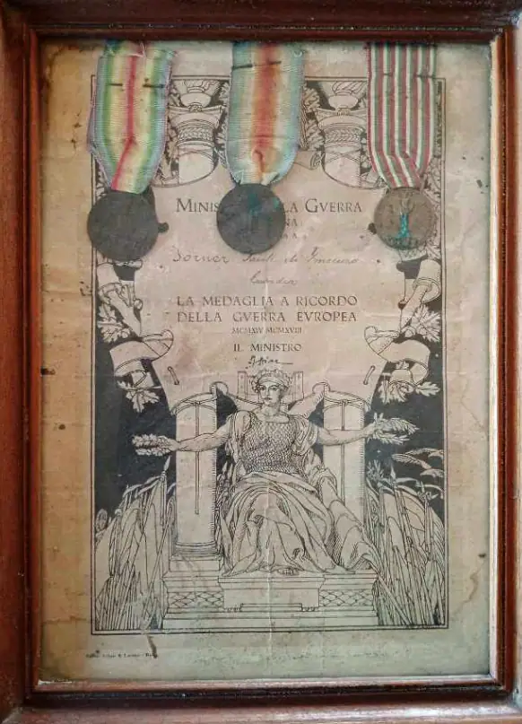

*O quadro com as três medalhas de guerra de Sante Forner, na parede da casa da família no Vêneto. No diploma, escrito à mão: *Forner Sante di Vincenzo*. Fotografia enviada por Giorgio Forner.*

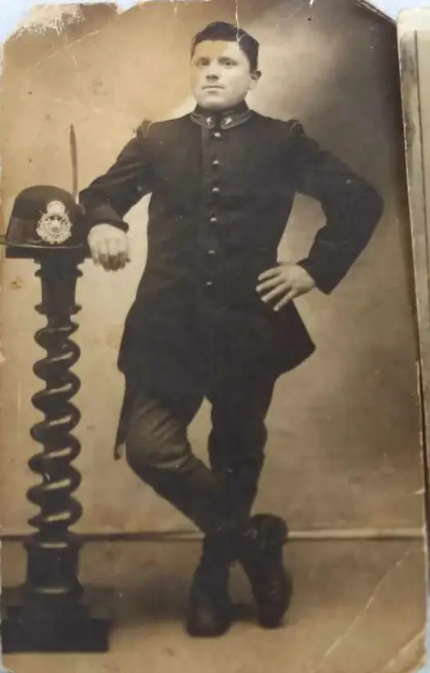

*Sante Forner, 1893 a 1947, fardado.*

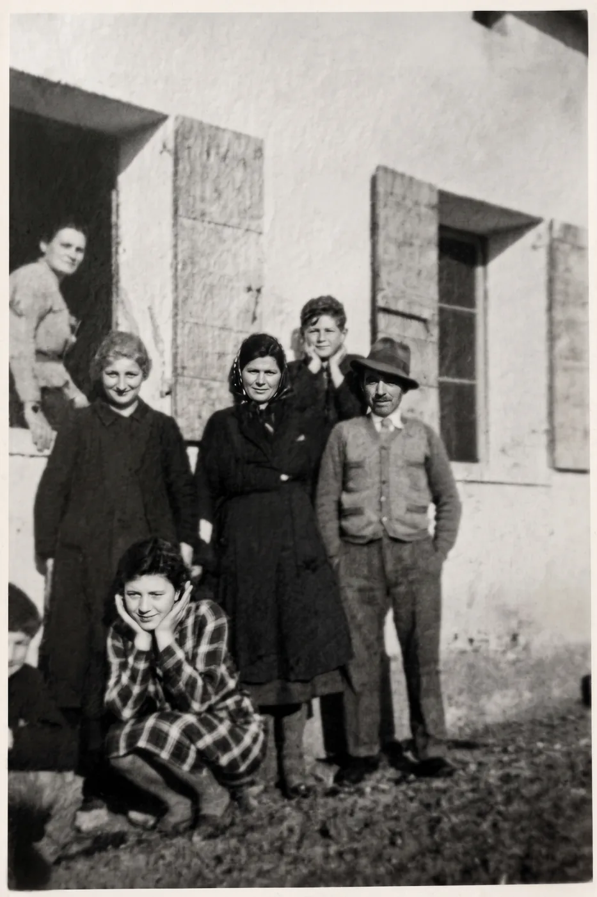

*Sante Forner ao centro, com a mulher Maria Luigia Miotto. Atrás, o filho Leo; à esquerda, em baixo, o filho Galliano.*

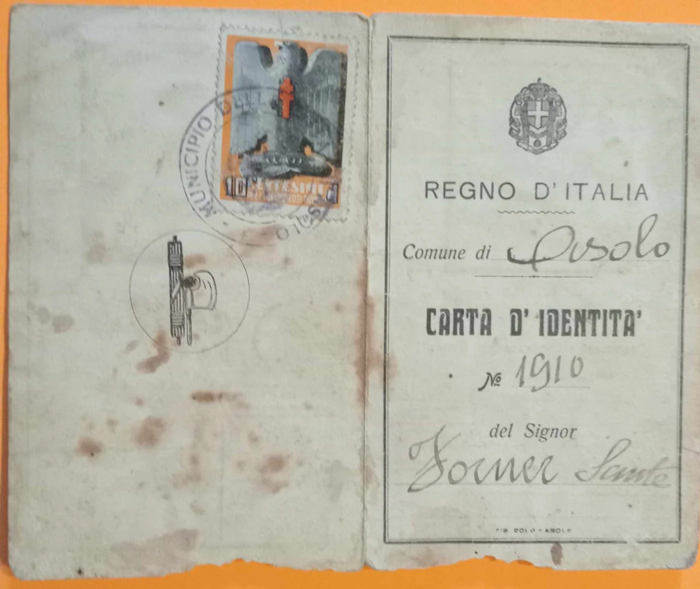

*A carta d’identità de Sante Forner aberta, com o brasão do Regno d’Italia e o Comune di Asolo.*

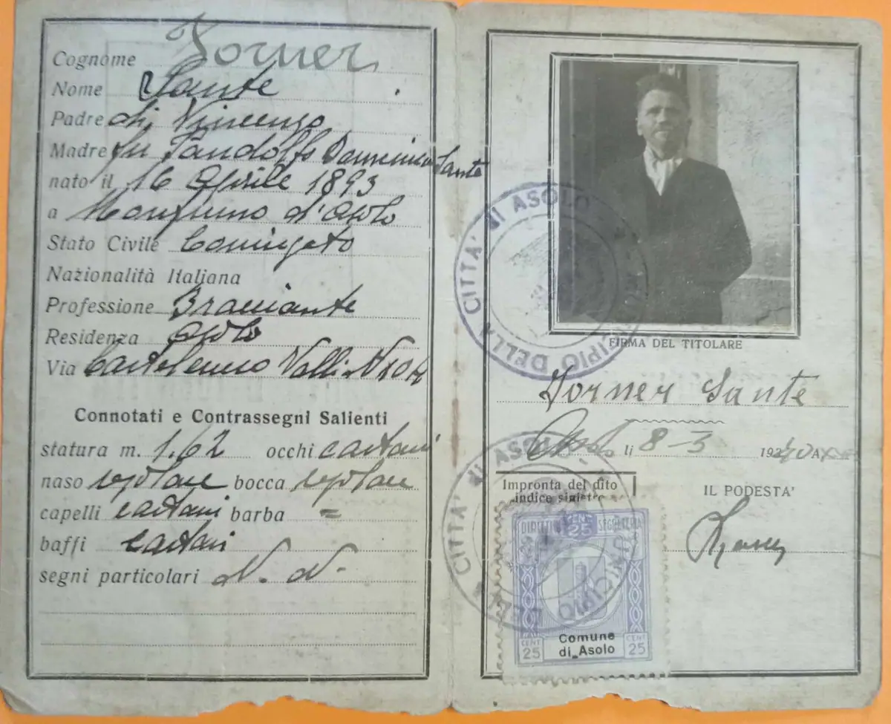

*Carta d’identità de Sante Forner, Comune di Asolo, 8 de março de 1940. Nato il 16 aprile 1893 a Monfumo. Professione: bracciante. Statura 1,62. Assinada pelo Podestà e datada A. XVIII, o ano dezoito da era fascista.*

## 7. Rosa e Fausto

> Enrico nasce em outubro de 1926, o casamento e em dezembro, e Fausto parte.

Não existe fotografia do casamento. Não existe convite, não existe lista de convidados, não existe registro do que se comeu.

O que existe é uma linha, escrita à margem da certidão de nascimento dela, no livro do Comune di Monfumo:

*ha contratto matrimonio con Miotto Fausto in data 03/12/1926 a Castelcucco.*

E a mesma informação do outro lado, à margem da certidão dele, no livro do Comune di Castelcucco: ato número 9, parte I, do ano de 1926. Ali ela aparece com o diminutivo, Forner Rosina.

Casaram-se em 3 de dezembro de 1926, em Castelcucco. Ela com vinte e três anos, ele com vinte e dois.

Vale olhar quem eram essas duas pessoas em 1926.

Rosa tinha perdido a mãe aos onze anos. Tinha perdido um irmão, Pietro Luigi, em 1916, de causa que continua desconhecida. Tinha outro irmão, Sante, que voltou do Monte Grappa com três medalhas e o silêncio que normalmente vem junto. Tinha sido criada, na prática, pela irmã mais velha, Maria Luigia.

Fausto cresceu numa vila em que ir embora era uma das coisas que os homens faziam. Do pai dele, Luigi Miotto, existem três aparições em papel ao longo de oitenta anos, e entre elas nada. Um homem que deixou o nome e não deixou rastro.

Nenhum dos dois tinha herança para receber.

Agora ponha a outra data ao lado.

Enrico Miotto nasceu em 10 de outubro de 1926. Está no Registro de Estrangeiros que ele assinou em São Paulo em 1949: nacionalidade italiana, pai Fausto Miotto, mãe Rosa Forner.

O casamento foi em 3 de dezembro de 1926.

**O filho nasceu cinquenta e quatro dias antes de os pais se casarem.**

Rosa não estava grávida na cerimônia. Estava com um bebê de quase dois meses no colo.

Isso não é escândalo e não é fofoca de cartório. É informação sobre como aquela vida funcionava.

Numa vila católica do Vêneto de 1926, um filho nascido antes do casamento e reconhecido oito semanas depois quer dizer que houve uma relação estável antes, e que a formalização esperou alguma coisa. Dinheiro, autorização de família, a vinda de um padre, o fim de uma colheita, uma papelada. Não dá para saber qual.

E há uma coincidência que o capítulo 3 já mostrou: **trinta e nove anos antes, os pais de Rosa fizeram exatamente a mesma coisa.** Vincenzo e Santa casaram-se em 1887, e a primeira filha, Angela, nasceu em 1886.

Duas gerações, a mesma sequência.

E aí, com o casamento feito e o filho de meses, Fausto foi embora.

Não juntos. Não a família toda num navio. Ele primeiro, sozinho.

É importante não ler isso com olhos de hoje. Não foi abandono, foi o procedimento. Para quem não vinha recrutado, emigrar era uma operação em duas etapas: um homem vai na frente com o dinheiro que a família conseguiu juntar, trabalha, arruma onde morar, e então manda buscar.

Angelo Dei Agnoli, casado com Maria Luigia, fez o mesmo caminho, e antes dele. As duas irmãs ficaram para trás nas duas casas.

Pense no que sobrou para Rosa Forner naquele ano.

Vinte e três anos. Um filho de meses. Um marido do outro lado do oceano, alcançável apenas por carta, com semanas de atraso entre a pergunta e a resposta. A mãe morta havia doze anos.

O pai vivo, a quatro quilômetros, com sessenta e quatro anos.

Não sei o que Vincenzo Forner disse quando soube, nem se disse alguma coisa. Sei que ela foi assim mesmo.

E o inverno de 1926 para 1927 no sopé do Grappa foi o inverno que sempre foi.

Quatro quilômetros dali, em Cavaso del Tomba, Maria Luigia estava fazendo a mesma coisa com quatro crianças.

Gina com seis anos. Pulcheria com cinco. Rino com três. Danilo com um.

Maria Luigia tinha casado em 1917 e ido morar em Cavaso, que é a vila que se esvaziou na guerra enquanto Castelcucco ficava de pé. Ela chegou lá a tempo de ver quase todo mundo sair.

Nove anos depois, saía ela. Dessa vez sem volta prevista.

Duas irmãs, duas casas, dois maridos ausentes, cinco crianças pequenas entre elas, e a mesma correspondência lenta atravessando o Atlântico nos dois sentidos.

Elas já tinham feito isso antes, aliás. Em 1915 os homens tinham ido para a guerra e as mulheres tinham ficado. A diferença é que agora os homens estavam vivos e o que faltava não era notícia do front. Era passagem.

O que chegava era a carta.

Nunca vi essas cartas. É quase certo que não existam mais. Mas sei que existiram, porque o mecanismo inteiro da emigração italiana dependia delas, e porque em algum momento de 1927 aquelas duas mulheres souberam que era hora.

Uma carta dessas trazia três coisas: a notícia de que dava, o dinheiro ou o bilhete, e a instrução do que fazer.

E o que fazer, a essa altura, já era mais complicado do que tinha sido para qualquer geração anterior.

Porque a Itália de 1927 não era mais a Itália que deixava sair.

Mussolini estava no poder desde 1922, e em 1927 o regime fez uma virada explícita contra a emigração. A lógica era demográfica e era de potência: um país que quer ser grande precisa de gente dentro dele, não espalhada pelo mundo. Cada camponês que embarcava era um soldado a menos e um nascimento a menos em solo italiano.

A emigração deixou de ser válvula de escape e passou a ser sangria.

Em 28 de abril de 1927, por decreto-lei, o governo fascista extinguiu o Commissariato Generale dell’Emigrazione.

É o mesmo órgão do capítulo 5 deste livro. Criado em 1901, foi ele que reuniu os relatórios consulares e sustentou o decreto Prinetti que protegeu os italianos das fazendas brasileiras em 1902.

Vinte e seis anos depois, foi extinto e substituído pela Direzione Generale degli Italiani all’Estero.

A mudança de nome não é detalhe burocrático. A palavra emigrante saiu do vocabulário oficial e entrou italiano no exterior. Não existe mais alguém que sai. Existe um italiano que por acaso está longe, e que continua pertencendo.

Junto com a mudança de nome veio a mudança prática.

Ficou mais difícil obter os documentos necessários para deixar o país. As instruções aos prefeitos mandavam exercer o máximo de severidade e de contenção na liberação de passaporte, abrindo exceção para emigração temporária e para intelectuais e profissionais liberais.

Ou seja: quem podia sair era quem ia voltar, e quem tinha diploma.

Uma camponesa de vinte e quatro anos, sem instrução, indo em definitivo, com um filho pequeno, para reunir a família em outro continente, era exatamente o perfil que o Estado tinha acabado de decidir segurar.

Não tenho os passaportes delas. Não sei se houve dificuldade, quanto tempo levou, se foi preciso pedir favor a alguém, se houve um funcionário compreensivo ou um funcionário difícil.

O que dá para afirmar é que as duas conseguiram, em algum momento do segundo semestre de 1927, um conjunto de documentos que o próprio governo tinha instruído os prefeitos a conceder com o máximo de contenção, seis meses antes.

E saíram.

Passaram por uma porta que estava sendo fechada.

Repare no que estava fechando exatamente naquele ano.

Os Estados Unidos já tinham praticamente encerrado a imigração italiana com o sistema de cotas de 1921 e 1924. A Itália, em 1927, começava a travar a saída. E o Brasil, que setenta anos antes pagava a passagem, agora não pagava mais nada.

A janela que a família Forner atravessou em outubro de 1927 é uma das últimas daquele ciclo. Cinco anos depois teria sido muito mais difícil. Dez anos depois, com a guerra chegando de novo, seria impossível.

Elas não sabiam disso. Ninguém sabe quando está passando pela última porta.

Da casa de Castelcucco até Asolo se desce a pé.

De Asolo se pega o trem. De Treviso se muda de trem. De Veneza se atravessa a planície até Gênova, e em Gênova está o mar, que a maioria daquela gente estava vendo pela primeira vez na vida.

Rosa Forner tinha vinte e quatro anos e carregava Enrico, que tinha acabado de fazer um. Maria Luigia tinha trinta e um e carregava quatro.

Não sei o que levaram na bagagem. Sei o que aquela gente costumava levar: roupa, ferramenta, um retrato, e comida para os primeiros dias.

Havia um irmão que ficou.

Sante Forner tinha trinta e quatro anos em 1927. Tinha defendido aquela montanha, tinha voltado, tinha casado e estava criando os filhos dele na mesma encosta em que os pais morreram.

Ele viu as duas irmãs irem embora.

É quase certo que nunca mais as tenha visto. Morreu em 1947, na Itália. Rosa morreu em 1986, no Brasil. Maria Luigia em 1992. Nenhuma das duas voltou.

A última coisa que aquelas duas mulheres viram do lugar onde nasceram foi a mesma montanha que o irmão delas tinha passado um ano inteiro defendendo. Para ele, o Grappa era o que se protege. Para elas, virou o que se deixa.

Aqui termina a parte que se passa em terra firme.

Tudo o que veio até agora, o terremoto de 1695, a fronteira que atravessou dois homens parados, o imposto sobre a moagem, a pelagra, os dez filhos de uma mulher só, os cinco mil subagentes, o cônsul escrevendo de Vitória, o chicote nas fazendas, o bronze inimigo no peito do Sante, tudo isso existe neste livro por um motivo só.

Para que quando o navio afundar, o leitor saiba exatamente o que aquelas pessoas estavam tentando alcançar, e o que já tinham atravessado antes de chegar à água.

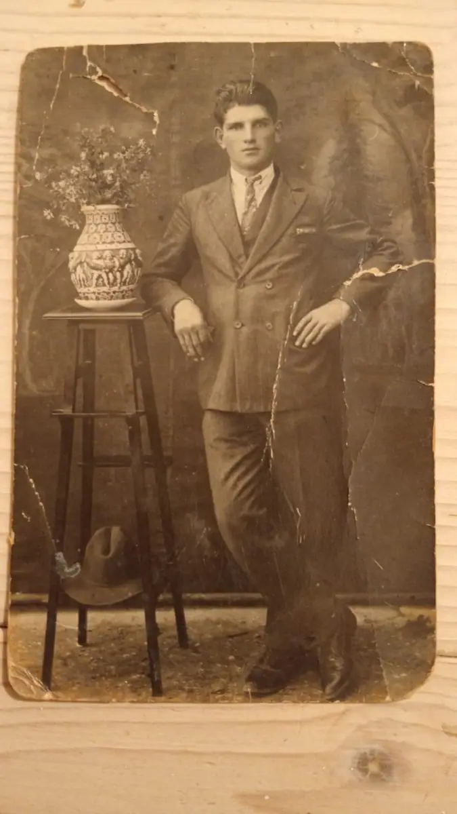

*Fausto Miotto, nascido em Castelcucco em 1904. Casou-se com Rosa Forner em 1926 e partiu sozinho para o Brasil.*

# Parte II — A travessia

*1874 – 1927*

---

## 8. Gênova

> O porto como sistema. A babel de dialetos, a despedida definitiva.

Gênova, em 1927, tinha mais gente dentro dela do que todas as vilas do sopé do Grappa somadas.

Rosa Forner nunca tinha visto uma cidade. Nem a irmã. As duas conheciam Asolo, que tem uma praça e uma rua principal, conheciam Treviso de passagem, e nada mais.

E não foram a Gênova para conhecer Gênova. Ninguém ia. A cidade não era destino, era funil: o lugar por onde a Itália vinha escoando a própria gente havia sessenta anos.

Em algum momento daquela chegada, elas viram o mar.

Não sei em que momento nem de onde. Sei que era a primeira vez, para as duas e para as cinco crianças.

É uma coisa difícil de imaginar hoje: uma mulher de trinta e um anos vendo o mar pela primeira vez.

Quem cresce no sopé de uma montanha tem o horizonte a dois quilômetros de distância, e sempre teve. O horizonte é uma encosta, e atrás dela vem outra.

Gênova é a primeira vez em que aquela gente olha para a frente e não encontra nada.

E ali, encostado no cais, está o navio.

O *Principessa Mafalda* tinha dezenove anos e nove mil duzentas e dez toneladas.

Tonelagem não diz nada a ninguém. Isto diz: naquela viagem ele levou mil duzentas e cinquenta e nove pessoas. Castelcucco inteira, com os seus mil setecentos e vinte e nove habitantes, quase cabia lá dentro.

Era, com folga, a maior coisa construída que qualquer uma daquelas pessoas tinha visto na vida.

E não era navio novo, nem bonito, nem orgulho de ninguém. Era um transatlântico velho de linha regular, no fim da carreira, fazendo o trajeto que sobra para os navios velhos.

Quem subiu aquela prancha junto com elas?

É uma pergunta que quase nunca tem resposta. Nesta história tem, e por um motivo ruim: catorze dias depois, cinquenta daquelas pessoas seriam recolhidas do mar e desembarcadas no Rio de Janeiro, e um funcionário da Intendência de Imigração sentou e escreveu os nomes numa lista.

Todos com a mesma anotação na coluna do embarque: Genova, 3ª.

**Beck Josef**, iugoslavo, cinquenta e três anos, agricultor, com a mulher Anna, o filho Ivan de vinte e três e a filha Elizabeth de dezesseis. Iam para São Paulo.

**Bán Sándor**, húngaro, vinte e nove anos, israelita, sozinho.

Os irmãos **Ströbel**, Ernö e Gottfried, vinte e seis e vinte e cinco anos.

**Ruspollo Eugenio**, quarenta e dois, agricultor, com a mulher Maria e quatro filhos: Giselda de catorze, Serafina de treze, Paulo de onze e Maria-Luisa de dois.

**Zaninni Oliviano**, cinquenta e seis anos, e a mulher **Zaira**, cinquenta e oito. Os mais velhos da lista.

**Dattoma Cosimo**, dezoito anos, sapateiro.

E os Pettina.

Ottavio, vinte e cinco anos. A mulher, também chamada Rosa, vinte e cinco. A filha Ottavia, de dois.

E a segunda filha, Maria, cuja idade a lista registra assim:

**3/12**

Três doze avos de um ano. Três meses.

Alguém subiu aquela prancha em Gênova, em outubro de 1927, carregando no colo um bebê de três meses de idade.

E subiram duas mulheres que importam mais do que todas as outras desta lista.

**Luchini Teresa, dezenove anos.**

**De Rosi Emilia, cinquenta e cinco.**

Na relação do Rio de Janeiro elas aparecem uma seguida da outra, sozinhas, sem parentesco declarado, e as duas com um *x* marcado à margem.

No pé da mesma folha, escrito à mão pelo funcionário que fechou o documento, está o motivo:

*As passageiras constantes sob Nº 24 e 25 perderam seus maridos, e pedem de ser enviadas para Italia.*

Em Gênova, em 11 de outubro, elas não eram isso.

Eram duas mulheres casadas subindo uma prancha com os maridos do lado, indo começar outra vida.

Uma delas tinha dezenove anos.

Dezessete dias depois estava pedindo para voltar para o lugar de onde tinha acabado de sair.

Repare na composição daquela lista.

Iugoslavos, húngaros, italianos do norte, italianos do sul, um israelita, um sapateiro de dezoito anos, um casal de quase sessenta, lavradores, um carpinteiro, um carvoeiro.

**A terceira classe não era um lugar. Era uma tarifa.**

O que aquelas pessoas tinham em comum não era país, nem língua, nem religião, nem ofício. Era o preço do bilhete.

Quinze anos antes aquele porão teria sido quase todo italiano. Em 1927 já não era. Nas duas semanas seguintes, aquela gente ia dividir o mesmo espaço sem partilhar uma língua.

No meio disso, sete pessoas de uma família só.

**Forner Rosa**, vinte e quatro anos, com **Enrico**, de um.

**Forner Maria**, trinta e um anos, com **Ginneta**, de sete, **Pulgheria**, de seis, **Rino**, de quatro, e **Danilo**, de dois.

Duas mulheres e cinco crianças. A mais velha delas tinha sete anos.

Nenhum homem adulto no grupo.

O navio saiu de Gênova em 11 de outubro de 1927.

Um dia antes, em 10 de outubro, Enrico Miotto tinha completado um ano de idade.

Fez um ano em Gênova, esperando embarcar, e não existe registro nenhum de que alguém tenha comemorado.

O capítulo anterior termina dizendo que a última coisa que aquelas duas mulheres viram do lugar onde nasceram foi o Monte Grappa.

É verdade, e agora dá para completar.

A última coisa que elas viram da *Itália* não foi o Grappa. O Grappa fica a trezentos quilômetros de Gênova.

Foi uma cidade portuária que elas conheciam havia poucos dias, cheia de gente falando um dialeto que elas não entendiam, vista de longe, do convés de um navio velho.

Ninguém se despede de uma pátria. Despede-se de um lugar. E o lugar delas tinha ficado para trás dias antes, numa estrada que descia para Asolo.

Do cais, o que se via era um navio grande saindo devagar.

Mil duzentas e cinquenta e nove pessoas a bordo, a maior parte delas no porão. Catorze dias de mar até o Rio de Janeiro.

Trezentas e catorze não chegariam.

## 9. A terceira classe

> O porão por dentro: beliches, comida racionada, os corpos jogados ao mar.

Quem viajou na primeira classe daquele navio deixou registro. Deu entrevista aos jornais, publicou, contou. Sabemos até o nome do fotógrafo de bordo.

Do porão não sobrou memória escrita. Ninguém que atravessou lá embaixo publicou um livro sobre aquilo, e é quase certo que a maioria não teria como.

Sobraram três coisas: papel de repartição, um punhado de entrevistas dadas em pânico, e a lembrança de uma menina de seis anos.

Sobre as entrevistas, uma palavra antes de usá-las, aqui e no resto deste livro.

Nos dias seguintes ao naufrágio, jornais da Argentina e do Brasil ouviram dezenas de sobreviventes. Vinte desses relatos chegaram até mim, em tradução, com nome, idade e procedência de cada um.

São a melhor fonte que existe sobre o que se passava dentro daquele navio, e são, praticamente, a única. Ainda não localizei o jornal, a data e a página de cada um, e estou atrás disso.

Enquanto não acho, digo toda vez o que eles são: gente que tinha acabado de sair da água, falando com repórter, poucos dias depois.

A terceira classe do *Principessa Mafalda* não era um convés aberto com gente deitada no chão, como nas fotografias de vinte anos antes.

Era um andar de dormitórios, abaixo da linha d’água, com beliches de ferro em duas ou três alturas, separados por sexo, e camarotes de quatro ou seis lugares para as famílias.

Maria Spinelli, italiana, terceira classe, conta que às cinco da tarde do dia 25 estava se lavando *na cabine*. Não era um alojamento coletivo. Era um quarto apertado, com porta.

Isso importa, e vou voltar a isso: significa que aquelas pessoas estavam separadas em compartimentos pequenos, embaixo, quando a água entrou.

O resto era o que sempre foi.

Comida servida em fila, com a marmita que cada um trazia de casa. Ar recirculado por ventilação forçada, que funcionava quando funcionava. Banheiro coletivo. Piolho e sarna, que atravessavam o Atlântico com a mesma regularidade dos passageiros.

E a bagagem, que era desinfetada antes do embarque e voltava cheirando a enxofre.

Quem morria durante a travessia era enterrado no mar. Não era brutalidade: era o procedimento de um navio com duas semanas de viagem pela frente e sem lugar para guardar um corpo.

O que me interessa é que o navio anotava isso.

Nas folhas de terceira classe de 1923 e 1924, alguém riscou os títulos impressos das colunas de bagagem e escreveu por cima, à mão, quatro palavras em italiano:

*Bauli · Valigie · Denaro · Indirizzo*

Baús. Valises. Dinheiro. Endereço.

*Denaro* é o dinheiro que cada pessoa declarava trazer ao desembarcar.

Está preenchido assim, linha após linha:

*1 baú, 1 valise, £ 120, Araraquara.*

*2 baús, 1 valise, £ 800, São Paulo.*

*1 baú, 1 valise, £ 1.350, Cuiabá.*

E, numa linha que eu li três vezes para ter certeza:

*8 baús, 1 valise, £ —, São Paulo.*

Um traço. Oito baús e um traço.

Alguém desembarcou em Santos carregando tudo o que possuía no mundo e nenhum dinheiro para o dia seguinte.

A coluna do *Indirizzo* existe porque o Estado brasileiro queria saber onde cada uma daquelas pessoas ia parar. Traz cidade, e às vezes o nome de uma fazenda.

É uma coluna administrativa e é, ao mesmo tempo, a lista dos lugares para onde a Itália estava indo morar. Araraquara. São Paulo. Cuiabá.

Ninguém escreveu *Gênova* em nenhuma delas. Não havia volta prevista.

Há uma anotação que desfaz uma imagem inteira.

Na folha de 25 de janeiro de 1924, ao lado de três linhas, alguém escreveu à margem:

*passato in 2ª cl.*

Passou para a segunda classe. No meio da travessia.

Uma das três é Giannini Giovanni, cinquenta e três anos, declarado *possidente*, viajando com a filha.

A imagem confortável é a de três mundos lacrados, separados por chapa de aço: os ricos em cima, os pobres embaixo, e nenhuma passagem entre eles.

Não era assim.

**A terceira classe não era um lugar. Era um preço.** E preço se paga a qualquer hora, inclusive no quinto dia de mar, quando alguém que podia decidiu que já tinha dormido embaixo o suficiente.

Quem não podia continuava lá.

Na mesma folha, linha noventa e dois, há um nome riscado em vermelho.

Ao lado, na margem, uma palavra e uma data. A palavra é de leitura difícil e não vou forçá-la. A data não é: 19 de janeiro de 1924.

O navio atracou em Santos no dia 25.

Aquela pessoa embarcou em Gênova, atravessou o Atlântico, morreu seis dias antes de chegar, e o registro disso é um traço vermelho sobre o nome dela numa lista de desembarque.

O corpo foi para o mar. O nome ganhou uma linha por cima.

Outra coisa que o papel revela, e que eu não esperava.

**O porão não esvaziava em Santos.**

Em 17 de dezembro de 1921 o navio trazia oitocentos e vinte pessoas na terceira classe. Pouco mais de oitenta desembarcaram.

Os outros setecentos continuaram viagem, para Montevidéu e Buenos Aires.

Quem descia em Santos descia sozinho, no meio de um navio que seguia sem ele. E quem ficava a bordo via a fila diminuir e o Brasil ficar para trás.

E o navio só ia cheio numa direção.

Descendo da Europa: oitocentas pessoas na terceira classe. Oitocentas e vinte e três numa viagem, setecentas e oitenta e uma noutra, novecentas e dez em junho de 1923, que é o recorde do conjunto que examinei.

Subindo de Buenos Aires: vinte e três.

Não era um navio de passageiros que também levava imigrantes. Era um navio de imigrantes que também levava passageiros, e só numa direção.

Quem estava naquele porão em 1927 já não era só italiano.

As colunas de nacionalidade mostram a virada acontecendo em cinco meses: em agosto de 1923 desembarcaram em Santos sessenta e cinco italianos e vinte e oito sírios; em janeiro de 1924, quarenta sírios e trinta e dois italianos.

Milhem Solk, libanês de Beirute, na terceira viagem dele à Argentina, disse depois uma frase que resume o andar inteiro: a maioria dos companheiros dele não falava italiano nem espanhol.

Duas semanas dividindo o mesmo ar, a mesma fila e o mesmo cheiro, sem conseguir conversar.

E havia a cozinha.

Numa terceira classe com quinhentas, oitocentas, novecentas pessoas, a cozinha é o único lugar do navio que funciona sem parar. É quente, é barulhento, tem gente entrando e saindo a toda hora, e é o lugar de onde vem a única coisa que todo mundo ali espera três vezes ao dia.

Crianças não deveriam entrar. Uma entrou.

**Pulcheria Dei Agnoli tinha seis anos**, era filha de Maria Luigia, e não saía da cozinha.

Brincava com todo mundo, e havia ali um cozinheiro, um homem de pele escura, que gostava dela.

Isto não está em documento nenhum. Não está nos manifestos, não está nas listas, não está em jornal. É lembrança de família, atribuída à própria Pulcheria, e chegou até mim por uma prima de outro ramo.

E não é lembrança unânime. Outra bisneta de Maria Luigia, que ouviu do avô tudo o que sabe desta história, não conhece este cozinheiro.

Guarde esse cozinheiro.

Daqui a cinco capítulos, quando o navio estiver inclinado e cheio de água e as duas irmãs tiverem se escondido no fundo de um porão, é ele que vai descer atrás delas.

O papel de repartição registrou o dinheiro, a bagagem, o destino e a morte daquela gente.

Não registrou isso.

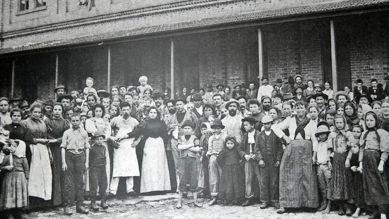

*Imigrantes italianos na Hospedaria dos Imigrantes, São Paulo, por volta de 1890. Acervo público.*

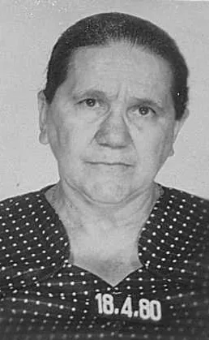

***Pulcheria Pasqua Dei Agnoli**, 1921 a 2013. Tinha seis anos na noite do naufrágio, e era ela quem não saía da cozinha. Fotografia de documento, 18 de abril de 1980.*

## 10. Duas irmãs embarcam

> Sete pessoas sobem a prancha, e nenhuma delas é um homem adulto.

Este capítulo é sobre sete pessoas subindo uma prancha, e sobre uma coisa que quase ninguém aponta quando conta esta história.

**Não havia um homem adulto entre elas.**

Rosa Forner, vinte e quatro anos, com Enrico, de um ano.

Maria Luigia Forner, trinta e um, com Gina de sete, Pulcheria de seis, Rino de quatro e Danilo de dois.

Duas mulheres e cinco crianças. A mais velha das crianças tinha sete anos. E um bebê que tinha completado um ano na véspera.

Os dois maridos já estavam do outro lado do oceano.

Angelo Dei Agnoli tinha desembarcado em Santos em abril. Fausto Miotto tinha ido antes, num mês que eu ainda não sei.

Foi assim que se fez a maior parte da emigração italiana, e é assim até hoje em qualquer emigração do mundo: o homem vai primeiro, aguenta um tempo sozinho, junta o que dá, e manda buscar.

O que quase nunca se conta é o que sobra para quem é buscado.

O que sobrou para elas foi isto.

Sair de Monfumo e de Castelcucco com cinco crianças. A estrada até Asolo, o trem até Treviso, outro trem até Gênova. Atravessar uma cidade que nenhuma das duas conhecia, com bagagem e com criança de colo.

E só então o navio.

Aqui eu vou fazer uma coisa que não fiz em nenhum outro capítulo deste livro, e é melhor avisar antes de fazer.

Não existe descrição do embarque delas. Ninguém escreveu, ninguém contou, e a lista de Gênova é um dos papeis que eu não achei.

O que existe é a data, os sete nomes, as sete idades — e o procedimento, que era o mesmo para toda gente de terceira classe que embarcava num porto italiano em 1927, e sobre o qual há documentação farta.

Então o que vem agora é reconstrução, e está declarada. Está aqui porque a alternativa é continuar resumindo em quatro linhas a coisa que dá título a este capítulo.

É 11 de outubro de 1927.

Elas já estão em Gênova há alguns dias, porque ninguém chegava no dia. Enrico completou um ano na véspera, dentro dessa espera.

A terceira classe embarca separado, e embarca antes. É uma fila comprida de gente com trouxa, mala amarrada e criança, encostada no cais, e ela não anda: pára e anda.

O que faz a fila parar é o médico.

A companhia respondia pelo passageiro recusado do outro lado do oceano, e por isso examinava deste lado. O exame que importava era o dos olhos: o polegar do médico vira a pálpebra para cima e procura o tracoma.

Esse exame é feito em sete pessoas. Em Rosa, em Maria Luigia, e em cinco crianças, das quais a mais velha tem sete anos e a mais nova tem dois — e uma que tem um ano e não anda.

Uma pálpebra virada num bebê de um ano dá choro. Cinco crianças em fila dando choro, e a fila atrás esperando.

Há um detalhe físico nisso que eu só percebi depois de contar as mãos.

Para mostrar os próprios olhos, Rosa precisa das duas mãos livres, ou pelo menos da cabeça solta. Ela está com Enrico no colo.

Não há marido, não há irmão, não há pai. Maria Luigia está com quatro.

**A única pessoa disponível para segurar o bebê naquele instante tem sete anos.**

Depois do médico vem o funcionário, e o funcionário pede os nomes.

Essa parte não é reconstrução — ela deixou marca. Catorze dias depois, no Rio de Janeiro, outro funcionário escreveu aqueles mesmos nomes numa lista, e escreveu assim:

Forner Maria. Ginneta. Pulgheria.

Não é *Maria Luigia*, não é *Gina*, não é *Pulcheria*. São os nomes como soam na boca de uma mulher do Vêneto e como caem no ouvido de um homem que escreve depressa.

**Nenhum daqueles nomes foi lido. Todos foram ouvidos.** É a prova, no papel, de que ali não houve documento nenhum passando de mão em mão: houve uma mulher dizendo em voz alta o nome dos filhos, uma vez atrás da outra.

E então a prancha.

Uma prancha de embarque de terceira classe é estreita. Passa uma pessoa por vez, com corrimão de um lado só, e ela sobe: do cais até o portaló há vários metros de subida.

Quem sobe uma prancha dessas com uma criança de mão dada tem que escolher entre a mão da criança e o corrimão.

Rosa sobe com Enrico. Maria Luigia sobe quatro vezes essa escolha.

No alto, dentro, alguém conta.

Cinco. Conta de novo.

Depois é o porão, o beliche numerado, o cheiro que o capítulo 9 já descreveu, e catorze dias de mar.

**Sem um único adulto para dividir isso.**

Há uma palavra num documento deste livro que só faz sentido depois de se ler essa cena inteira.

Quando as duas foram anotadas numa lista, três dias depois do naufrágio, o funcionário escreveu na coluna de parentesco a mesma coisa para as duas: **CHEFE**.

Aquilo não foi um erro de leitura do escrivão, nem uma delicadeza com duas náufragas.

Foi uma descrição correta do que tinha acontecido durante catorze dias no mar.

E as duas eram irmãs, mas não eram irmãs de qualquer jeito.

Maria Luigia nasceu em 1896. Rosa, em 1903. Sete anos entre uma e outra.

Em 1914 a mãe delas, Santa Pandolfo, morreu. Rosa tinha onze anos. Maria Luigia tinha dezoito.

Numa casa de dez filhos, no Vêneto rural, quando a mãe morre e existe uma filha de dezoito anos, não se contrata ninguém.

**A filha de dezoito vira a mãe.**

Treze anos depois, as duas estão na mesma prancha em Gênova.

A que criou e a que foi criada, cada uma carregando os próprios filhos, indo para o mesmo lugar.

Não é coincidência de irmãs que combinaram viajar juntas: foram chamadas para o mesmo destino porque os maridos estavam no mesmo lugar. Mas o efeito é o que é.

Numa noite de outubro, no meio do Atlântico, a mulher que tinha criado Rosa estava a poucos metros dela, na água, com quatro filhos.

E ficou gente para trás.

Vincenzo Forner ainda estava vivo. O pai delas tinha sessenta e cinco anos em 1927, e continuaria vivo por pelo menos mais treze — eu sei disso pela carteira de identidade que o filho Sante tirou em Asolo, em 1940, com o pai anotado como vivo.

Sante ficou. Os outros irmãos ficaram.

Rosa e Maria Luigia se despediram do pai em 1927 e, até onde eu consegui apurar, nenhuma das duas o viu outra vez.

Eu não sei o que elas levavam.

As listas de passageiros daqueles anos têm colunas para isso. Bagagem, com marca e número de volume. E o dinheiro declarado, por pessoa — em algumas listas o campo traz só um traço, que quer dizer chegada sem recurso nenhum.

A lista de embarque de Gênova de outubro de 1927 é um dos papéis que eu ainda não achei.

Se ela aparecer, vai dizer quantos volumes aquelas duas mulheres subiram carregando. Que é a mesma coisa que dizer quantos volumes foram para o fundo do Atlântico catorze dias depois.

A partir daqui a história já está decidida, e elas não sabem.

Subiram a prancha num dia de outubro achando que estavam começando uma vida nova. E estavam. Só que entre a prancha e a vida nova havia uma coisa que ninguém tinha posto na conta.

Rosa Forner tinha vinte e quatro anos e não conhecia o mar até aquela semana.

Catorze dias depois ela ia passar horas dentro dele.

O *Principessa Mafalda* largou de Gênova em 11 de outubro de 1927.

A viagem completa, da Itália até a Argentina, levava catorze dias em condições normais.

Ele afundou em 25 de outubro.

**O navio durou exatamente o tempo de uma travessia.**

## 11. Os que já estavam lá

> Fausto e Angelo no Brasil, a casa preparada, a espera.

Enquanto o navio atravessava, dois homens esperavam em algum lugar do interior de São Paulo.

Angelo Dei Agnoli, casado com Maria Luigia. Fausto Miotto, casado com Rosa.

Dos dois, um deixou rastro. O outro não deixou nenhum.

Angelo foi primeiro, e foi muito antes do que a família conta.

Em 14 de fevereiro de 1925, no Comune di Cavaso del Tomba, registrou-se o nascimento de Danilo Angelo Dei Agnoli.

Quem foi declarar não foi o pai. Foi a parteira, Celli Maria. E o escrivão anotou o motivo, em italiano de cartório:

*in luogo del marito, perché residente all’estero a scopo di lavoro.*

Em lugar do marido, por estar residindo no exterior a trabalho.

Leia outra vez o que esse documento é.

**É uma certidão de nascimento que registra a ausência de um pai.**

E o Estado italiano tinha fórmula pronta para isso. A situação era tão corriqueira que não exigia explicação nenhuma: bastava a frase feita, e o escrivão seguia para a linha seguinte.

Não era exceção. Era categoria.

Isso desfaz uma coisa que a família conta.

A versão que chegou até mim é a de que os dois cunhados atravessaram juntos. Os dois maridos vão na frente, as duas irmãs ficam para trás, e depois mandam buscar.

Não foi assim.

Em fevereiro de 1925, quando Angelo já estava fora trabalhando, Fausto Miotto tinha vinte anos e ainda não tinha casado. Faltavam vinte e dois meses para o casamento dele com a Rosa.

Angelo saiu antes, e por uma margem larga.

Em algum momento Angelo voltou à Itália, porque em 1927 ele fez a travessia outra vez, no sentido de vir.

Existe uma certidão do Serviço de Registro de Estrangeiros, número 61, que registra o desembarque:

Santos, 30 de abril de 1927. Vindo do vapor Principessa Mafalda.

Pare um segundo nessa linha.

Angelo Dei Agnoli conheceu aquele navio. Atravessou nele. Dormiu naquele porão, comeu naquela fila, subiu e desceu aquelas escadas.

E seis meses depois embarcou nele a mulher, com Gina, Pulcheria, Rino e Danilo.

**Ele mandou buscar a família no navio que ele mesmo tinha usado, e do qual não teve o que reclamar.**

E o Fausto?

Nada.

Não está no Registro de Matrícula da Hospedaria do Brás: a busca pelo nome dele retorna zero. Não está em nenhum dos vinte e cinco manifestos do *Principessa Mafalda* que examinei, embora esses parem em 1924. Não há ficha de estrangeiro localizada.

O homem que fez esta família atravessar o Atlântico não deixou registro nenhum de ter atravessado ele mesmo.

O que dá para dizer é onde ele cabe.

Casou-se em Castelcucco em 3 de dezembro de 1926, o que prova que estava na Itália naquele dia. Rosa embarcou em Gênova em 11 de outubro de 1927, o que prova que ele já estava do outro lado, e estabelecido o bastante para mandar buscá-la.

Dez meses.

É toda a precisão que eu tenho sobre a travessia do meu bisavô.

A ausência dele não é mistério. É coerência.

O capítulo 5 mostrou que Fausto não veio recrutado. Não tinha patrão declarado, não tinha fazenda marcada, não estava em Relação de subsidiados nenhuma.

Quem chegava assim, com dinheiro próprio e destino próprio, não passava pela Hospedaria. A Hospedaria era para quem precisava ser encaminhado, e ele não precisava.

A falta dele naquele livro não é buraco do arquivo. É o retrato de um homem que veio por conta própria.

O destino, esse eu sei.

Grama, hoje São Sebastião da Grama, município da comarca de São José do Rio Pardo, no nordeste do estado de São Paulo. Terra de café.

Dois documentos põem a família ali: o carimbo da Delegacia de Polícia de Grama na ficha de estrangeiro do Angelo, e o assento de casamento número 660 do cartório de Grama, de 1947, que registra o casamento de uma filha de Fausto e Rosa nascida naquele município.

Era para lá que aquelas sete pessoas estavam indo.

E o que ele foi fazer lá foi o que sabia fazer.

Agricultor.

O mesmo ofício que a família tinha na encosta do Grappa. A mesma enxada, o mesmo corpo, a mesma terra de outro homem.

Atravessaram um oceano para fazer exatamente a mesma coisa.

O cartaz da praça, vinte anos antes, prometia *terre in Brasile per gli Italiani*. Terras no Brasil para os italianos. Prometia que o governo dava terra e ferramenta a todos, e que no Brasil se podia ter o próprio castelo.

O que havia era café, e trabalho de agricultor, e nenhuma escolha.

Não porque tivessem sido enganados na hora de embarcar. Fausto veio em 1927, quando o cartaz já tinha desbotado havia duas décadas e ninguém precisava mais vender nada a ninguém.

Veio porque era isso ou a encosta. E do outro lado era isso também, com café no lugar do milho.

Era com esse trabalho que se pagavam as passagens.

Sete bilhetes de terceira classe, Gênova a Santos. Dois homens no interior paulista guardando o que a lavoura deixava guardar, durante meses, até dar.

Não sei quanto custava um bilhete daqueles em 1927. Ainda não achei o número.

Sei o intervalo: Angelo desembarcou de volta em abril, e elas embarcaram em outubro. Seis meses entre uma coisa e outra.

Há um mecanismo por trás desses seis meses, que tem nome e era o mais comum de todos.

Chamava-se chamada.

O homem que já estava do outro lado juntava dinheiro, comprava a passagem aqui, e mandava — em remessa, ou como bilhete pré-pago para ser retirado numa agência do porto de Gênova.

Não era gesto isolado de ninguém. Era uma das maiores movimentações de dinheiro da Itália daquele tempo: emigrante mandando moeda estrangeira para casa, mês após mês, por décadas.

Se foi assim com esta família — e é de longe o mais provável — então há uma consequência que eu levei muito tempo para enxergar.

**A data da viagem de Rosa não foi decidida por Rosa.**

Foi decidida pelo tempo que Fausto levou para juntar o dinheiro numa lavoura de café no interior de São Paulo.

Se ele tivesse juntado dois meses antes, ela teria pegado outro navio. Se tivesse demorado dois meses a mais, teria pegado outro navio.

É a coisa mais fria deste livro, e eu ainda não sei o que fazer com ela.

Um homem de vinte e três anos, sem português, trabalhando terra que não era dele, mandou buscar a mulher e o filho assim que pôde. Fez a única coisa certa que havia para fazer, e fez o mais rápido que conseguiu.

E foi isso que escolheu o navio.

Em outubro de 1927 os dois sabiam a data.

Sabiam o nome do navio, sabiam quando tinha saído de Gênova e sabiam mais ou menos quando encostaria. Uma carta tinha atravessado o oceano com essa informação, semanas antes.

O que aconteceu depois é assunto da parte seguinte deste livro, e eu não vou antecipar.

Só uma coisa, que pertence a este capítulo e não àquele.

Os dois foram esperar. Estavam lá, procurando.

Isso não está em documento nenhum. É lembrança de família, atribuída a uma menina de seis anos que estava naquele navio, e chegou até mim por duas primas de outro ramo.

**Fausto Miotto não aparece em nenhuma lista de 1927.**

Aparece na memória de uma criança que nem filha dele era.

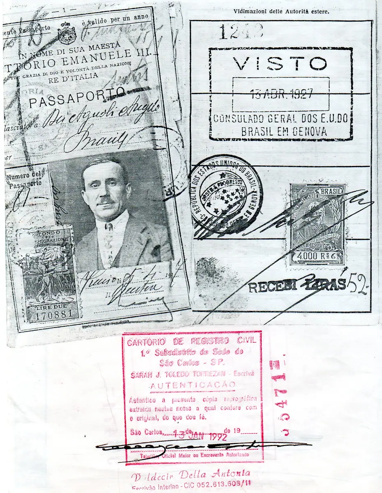

*Passaporte italiano de Angelo Dei Agnoli, Regno d’Italia, com o visto do Consulado Geral do Brasil.*

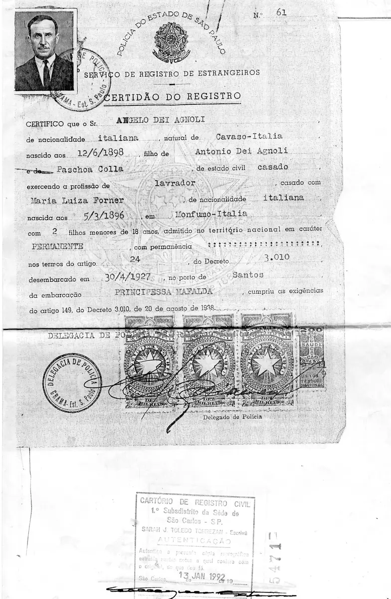

*Certidão do Registro de Estrangeiros nº 61, Polícia do Estado de São Paulo. Angelo Dei Agnoli, nascido em 12 de junho de 1898 em Cavaso, filho de Antonio Dei Agnoli e Paschoa Colla, lavrador, casado com Maria Luiza Forner, nascida em 5 de março de 1896 em Monfumo. *Desembarcado em 30/4/1927, no porto de Santos, da embarcação Principessa Mafalda.* Carimbo da Delegacia de Polícia de Grama.*

# Parte III — O navio

*1908 – 1928*

---

## 12. 1908

> O navio nasce de um acidente, vive disfarçado de hotel e morre rebaixado.

Para entender o que aquele navio era em 1927, é preciso saber o que ele foi em 1908.

E para saber isso, é preciso começar pelo irmão dele, que nunca navegou.

22 de setembro de 1907. Estaleiro em Riva Trigoso, no litoral perto de Gênova.

O Lloyd Italiano, companhia genovesa fundada três anos antes, ia lançar o primeiro de dois transatlânticos gêmeos encomendados para a rota da América do Sul. O primeiro se chamava *Principessa Jolanda*.

Havia autoridade, havia imprensa, havia madrinha, havia multidão. Lançamento de navio grande era espetáculo público, e este tinha sido anunciado.

O casco desceu a rampa e entrou na água.

E **tombou**.

Adernou para um lado, deitou, e afundou ali mesmo, diante de todo mundo, sem nunca ter navegado um metro.

Foi fotografado. As imagens existem: um transatlântico novo, com a pintura fresca, deitado de lado na água rasa do próprio estaleiro.

É um dos desastres navais mais constrangedores da história italiana, e ele não matou ninguém que se saiba — matou uma reputação.

O *Jolanda* foi lançado com o acabamento interno já instalado, mobília e tudo, e sem lastro suficiente. Ficou pesado demais em cima.

Um navio pesado em cima tomba. É a mesma física que ia importar dezenove anos depois, do outro lado do Atlântico, numa noite de outubro.

E o *Jolanda* tinha um gêmeo.

Mesmo projeto, mesmo estaleiro, casco já em construção ao lado.

Depois do desastre, refizeram os cálculos, corrigiram o que havia para corrigir, e lançaram o segundo navio em 1908. Esse desceu direito. Entrou em serviço em 1909.

**Esse navio se chamava Principessa Mafalda.**

Ele existe, na forma em que existiu, por causa de um acidente. Foi construído duas vezes: uma vez no papel, junto com o irmão, e outra vez depois que o irmão afundou na frente da imprensa italiana.

O nome veio de uma criança.

Mafalda di Savoia nasceu em 1902, segunda filha de Vittorio Emanuele III, rei da Itália. Tinha seis anos de idade quando um casco de nove mil toneladas recebeu o nome dela.

Era o que se fazia. Navio grande de bandeira nacional levava nome de gente da casa real, porque o navio era propaganda antes de ser transporte: dizia ao mundo que a Itália construía coisas grandes.

Ela não escolheu nada disso, e não teve como saber o que estava sendo posto no nome dela.

Que em 1927 aquele casco ia afundar no Atlântico com trezentas e catorze pessoas dentro.

E que quarenta anos depois, num sítio do interior de São Paulo, ia haver uma mulher brasileira com o nome dela e com o nome do navio, sem que as duas coisas fossem distinguíveis.

As medidas, para quem quiser: nove mil duzentas e dez toneladas. Velocidade de serviço por volta de dezoito nós. Capacidade para pouco mais de mil e quatrocentos passageiros, a grande maioria em terceira classe.

Entre 1909 e 1927 ele fez cerca de noventa travessias do Atlântico.

A conta é minha e é grosseira, mas dá a ordem de grandeza: em dezoito anos de serviço, algo perto de cem mil pessoas atravessaram o Atlântico dentro daquele casco.

Em 1908, quando aquele casco entrou na água pela primeira vez, em Monfumo não aconteceu nada.

Rosa Forner tinha cinco anos. Santa Pandolfo, a mãe, estava viva e ainda ia viver seis anos. Vincenzo trabalhava a terra. Sante tinha quinze e ainda não tinha ouvido falar em Caporetto. Maria Luigia tinha doze.

Ninguém naquela casa tinha ouvido falar de Riva Trigoso, nem do *Jolanda*, nem da filha do rei.

A distância entre Monfumo e Riva Trigoso é de uns trezentos quilômetros.

Naquele ano, numa ponta, uma família de agricultores plantava milho num pedaço de encosta que já não bastava.

E na outra, um estaleiro punha na água a coisa que ia decidir a vida daquela família dezenove anos depois.

Entre uma ponta e a outra há dezenove anos, e é o que houve no meio deles a parte deste capítulo que costuma ser contada errada.

O que se conta sobre esses navios é sempre a mesma coisa. Os salões. A escadaria. O jantar servido em várias etapas. A orquestra. As senhoras descendo para o jantar.

Tudo isso é verdade, e é a parte menos importante do navio.

A rota do *Principessa Mafalda* era esta:

Gênova — Barcelona — Dakar — Rio de Janeiro — Montevidéu — Buenos Aires.

Catorze dias entre a Itália e a Argentina, em condições normais. Cerca de noventa vezes, entre 1909 e 1927.

Era uma linha de ônibus. Uma linha de ônibus de catorze dias, atravessando um oceano e uma linha do equador, mas uma linha: sempre os mesmos portos, sempre na mesma ordem, sempre para o mesmo lado.

Agora a aritmética, que é onde a glória desses navios costuma se desmanchar.

Na última viagem, a de outubro de 1927, iam a bordo novecentos e setenta e um passageiros.

Pouco mais de sessenta na primeira classe. Cerca de oitenta na segunda.

E todo o resto na terceira — mais de oitocentas pessoas.

Mais duzentos e oitenta e oito tripulantes.

Leia esses números outra vez, devagar.

**Cento e quarenta pessoas em cima. Mais de oitocentas embaixo.**

Para cada passageiro que jantava com orquestra, havia seis dormindo em beliche de ferro num porão sem janela.

Então é preciso inverter a frase que se usa para descrever esses navios.

Um transatlântico da rota sul-americana não era um hotel de luxo que também levava imigrante.

**Era um transporte de imigrante com um hotel montado em cima.**

O dinheiro estava embaixo. As passagens de terceira classe pagavam o navio. As sessenta cabines de primeira pagavam a reputação dele.

A reputação servia para uma coisa muito concreta.

O luxo do andar de cima era o que gerava a reportagem, a fotografia no jornal, o nome conhecido e o cartaz colado na parede de uma praça de província.

**A propaganda era feita com a escadaria e vendida para quem ia no porão.**

O panfleto que Rosa e Fausto podem ter visto em Asolo não trazia foto de beliche. Trazia uma palavra: *América*.

Isso não é hipocrisia particular daquele navio nem daquela companhia.

É o modelo inteiro da emigração transatlântica, e funcionou por sessenta anos justamente porque funcionava: quem ia embaixo chegava, na esmagadora maioria das vezes, e mandava buscar a família.

O *Principessa Mafalda* foi apenas competente nesse modelo. Dezoito anos de serviço e noventa travessias.

E havia uma coisa que a primeira e a terceira classe daquele navio nunca faziam: se ver.

Conveses separados. Escadas separadas. Refeitórios separados. Horários de banho separados. Grades e portas que se abriam num sentido só.

Uma pessoa podia atravessar o Atlântico inteiro naquele casco sem trocar uma palavra com alguém que estivesse três andares abaixo dela.

Foi assim durante dezoito anos.

E numa única noite, em 25 de outubro de 1927, as duas partes daquele navio foram para a mesma água, ao mesmo tempo, com os mesmos coletes.

O que aconteceu ali está no capítulo 15, e é a primeira e a última vez que os dois lados daquele casco falaram um sobre o outro.

**Não gostaram do que viram.**

Mas para chegar àquela noite é preciso passar pelos dezoito anos de serviço que vieram antes, e por uma coisa que aconteceu com aquele casco enquanto ninguém olhava.

Um navio não envelhece sozinho. Envelhece porque chegam outros.

Em 1909, quando entrou em serviço, o *Principessa Mafalda* era o que a Itália tinha de melhor para mandar à América do Sul.

Casco novo, nome de princesa, nove mil toneladas, a linha inteira de Gênova a Buenos Aires. Era o navio que se mostrava.

Dezoito anos depois, era o navio que sobrava.

O que aconteceu no meio não foi ferrugem. Foram duas coisas que nada tinham a ver com aquele casco.

A primeira: os Estados Unidos fecharam a porta.

As leis de cota de 1921 e de 1924 cortaram brutalmente a entrada de gente do sul e do leste da Europa. Um italiano que em 1910 iria para Nova York, em 1925 já não ia.

O fluxo não parou. Virou. Desceu para Buenos Aires, Montevidéu e Santos.

De repente, a rota da América do Sul deixou de ser a rota secundária e virou o negócio principal da emigração italiana.

A segunda: as companhias italianas encomendaram navios novos.

*Giulio Cesare*, 1922. *Conte Rosso*, 1922. *Conte Verde*, 1923. *Duilio*, 1923.

Maiores, mais rápidos, com máquinas de outra geração, projetados depois da guerra para exatamente aquela rota que tinha acabado de ficar valiosa.

Um navio de 1908 não compete com um de 1923. Não é questão de conservação. É questão de projeto.

Aí acontece com um navio o que acontece com qualquer frota.

**O *Mafalda* não foi aposentado. Foi rebaixado.**

Cada navio novo que entrava na água o empurrava um degrau para baixo. O melhor navio faz a viagem de prestígio, com o nome no jornal. O segundo faz a mesma rota sem barulho. O terceiro faz o que sobra: a data que ninguém quer, a carga que ninguém disputa, a manutenção que der.

Há uma consequência econômica disso que é fria e é direta.

Um navio cujo dinheiro vem de mil passagens de terceira classe, e cujo prestígio já foi para outro casco, é um navio em que consertar custa caro e rende pouco.

Não porque alguém seja mau. Porque cada lira gasta na casa de máquinas de um navio de dezenove anos é uma lira que não foi para o navio de quatro.

As avarias sucessivas da última viagem — Barcelona, a escala africana, os mecânicos trabalhando durante a travessia — não foram azar de outubro de 1927.

Foram o fim de uma sequência de decisões que começou quando o primeiro navio novo entrou na água.

Nada disso chegava até quem comprava a passagem.

O panfleto colado numa parede de Asolo não dizia *navio de dezenove anos, terceiro na fila da companhia, casa de máquinas remendada*.

Dizia **América**.

Essa informação existia dentro da companhia, dentro do estaleiro e dentro da casa de máquinas. Não existia em Monfumo, não existia em Castelcucco, e não existia no bolso de ninguém que subisse aquela prancha.

Rosa Forner e Maria Luigia viram o que qualquer pessoa naquela situação teria visto.

Um navio enorme, encostado no cais de Gênova, com bandeira italiana e nome de princesa.

A maior coisa construída que qualquer uma das duas tinha visto na vida.

**Ninguém sobe uma prancha olhando para o eixo.**

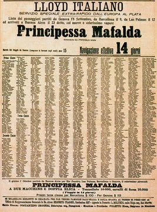

*Cartaz do **Lloyd Italiano** anunciando o *Principessa Mafalda*: *servizio speciale extra-rapido dall’Europa al Plata*, saída de Gênova, escalas em Barcelona e Las Palmas, chegada a Buenos Aires. **Navigazione effettiva 14 giorni.** Traz impressa a lista de passageiros da travessia.*

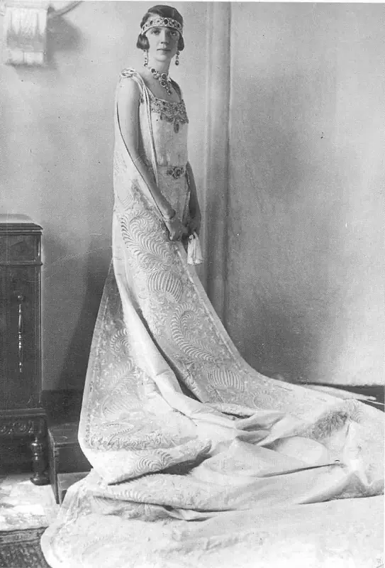

*Mafalda di Savoia, segunda filha de Vittorio Emanuele III. Tinha seis anos quando o casco recebeu o nome dela.*

## 13. A última viagem

> Catorze dias de avaria, dois passageiros que quase pararam o navio, e às cinco e quinze da tarde o eixo se parte.

O *Principessa Mafalda* saiu de Gênova em 11 de outubro de 1927, e já saiu atrasado.

Não muito. Um dia, mais ou menos. O tipo de atraso que ninguém anota e que todo mundo esquece assim que o navio pega o mar.

Dezoito anos antes, quando ele entrou em serviço, um atraso desses teria virado assunto de jornal. Em 1927 já não virava. Era um navio velho fazendo o que navio velho faz.

A bordo iam novecentos e setenta e um passageiros e duzentos e oitenta e oito tripulantes. Mil duzentas e cinquenta e nove pessoas, e a maior parte delas na terceira classe.

Só que já não era o porão italiano de vinte anos antes.

Quando Rosa embarcou, o porão do Mafalda falava italiano, árabe, servo-croata, húngaro e alemão. A lista dos náufragos resgatados confirma: dos cinquenta imigrantes desembarcados no Rio, quarenta e três eram italianos, quatro iugoslavos e três húngaros.

Sete daquelas pessoas interessam a este livro: as duas irmãs Forner e as cinco crianças, todas na terceira classe, embarque em Gênova.

E é tudo o que eu sei delas nesses catorze dias.

Não existe um documento sequer que registre o que aquelas sete pessoas fizeram entre 11 e 25 de outubro de 1927. Elas entram no papel antes, na lista de embarque, e voltam ao papel depois, na lista dos náufragos. No meio há duas semanas em branco.

O que dá para fazer é reconstruir o navio em volta delas. É o que este capítulo faz.

Não sei o que elas conversavam. Ninguém sabe. O que os documentos guardam são as idades, os nomes escritos com a grafia de quem ouviu e anotou, e a última residência de cada uma: Castelcucco para uma, Cavaso del Tomba para a outra. Duas vilas que hoje se cruzam de carro em quarenta minutos, e que naquela altura já estavam a um oceano de distância.

A grafia, aliás, não é detalhe. A menina que o ato de Cavaso registra como **Gina Oliva**, nascida em 28 de março de 1920, aparece como **Ginneta** na lista do Rio, vira **Dinetta** na entrada de São Paulo três dias depois, e sai **Ginita** nos jornais argentinos.

Quatro grafias para uma menina de sete anos, em duas semanas. O nome atravessou dois idiomas e um naufrágio e chegou do outro lado com outra forma. Vai acontecer com quase todos eles.

O navio quebrou pela primeira vez logo no começo.

Chegou a Barcelona com cerca de um dia de atraso, por problema de máquina. Consertaram e seguiram.

Pouco depois de Gênova, um passageiro argentino chamado **Patricio de Rosas** conversou no convés com **Antonio Zanni**, gerente do Hotel Savoia de Capilla del Monte, na província de Córdoba. Zanni tinha andado perto da casa de máquinas e contou o que viu: os mecânicos vinham consertando avarias sucessivas.

De Rosas perguntou se o chefe de máquinas tinha dito que estava tudo resolvido.

Zanni respondeu que não. Faltava um pouco de trabalho, e esse pouco podia ser feito no curso da viagem.

Havia também as coisas pequenas, que numa travessia de duas semanas deixam de ser pequenas.

Os banheiros funcionavam mal.

A refrigeração funcionava mal, e refrigeração ruim num navio que cruza o Equador em outubro não é conforto: é comida.

Passageiros da primeira classe reclamaram. A companhia registrou as reclamações, que é o que companhia faz com reclamação.

Nada disso, sozinho, é catástrofe. Tudo isso junto é um navio que já não deveria estar naquela linha.

Em algum porto da escala africana o Mafalda parou outra vez, por avaria na máquina de bombordo.

Escrevo *algum porto* de propósito. As descrições da rota habitual do navio citam Dakar, mas o que as fontes registram desta última viagem é a saída de São Vicente, em Cabo Verde, no dia 18 de outubro, rumo ao Rio.

Ainda não tenho documento que diga em qual dos dois a máquina abriu; quando tiver, nomeio. Consta como parada emergencial. Consertaram mais uma vez, com o que havia, e seguiram mais uma vez.

Restavam sete dias.

Foi por volta desse ponto da viagem que dois passageiros tentaram fazer o navio parar.

De Rosas caminhava pelo convés numa manhã quando encontrou **Antonio Fontana**, uruguaio, que trazia exatamente o mesmo medo. Os dois conversaram sobre o que estavam vendo e chegaram à mesma conclusão.

Decidiram redigir um protesto coletivo, assinado pelos passageiros, para entregar ao comandante.

O pedido era um só: que a viagem fosse suspensa.

Começaram a falar com outras pessoas a bordo.

Um passageiro chamado **Camilo Rivarola** os desaconselhou. Um abaixo-assinado desses, disse ele, não pararia navio nenhum. Serviria só para transformá-los em inimigos do capitão, e ainda faltavam muitos dias de viagem sob a autoridade daquele homem.

O argumento venceu.

O documento não foi escrito. Ninguém assinou nada. A viagem seguiu.

**Antonio Fontana perdeu o irmão, Eduardo, na noite de 25 de outubro.**

Eu li esse trecho do depoimento umas dez vezes antes de escrever este parágrafo, porque ele tem uma coisa que a maior parte das histórias de naufrágio não tem.

Normalmente o que se conta é que ninguém sabia.

Aqui, duas pessoas sabiam, escreveram na cabeça o que precisava ser feito, e foram convencidas por um terceiro de que não valia a pena por causa do incômodo político de encarar a autoridade do navio.

Rivarola não estava errado sobre o abaixo-assinado. Provavelmente não teria parado nada mesmo.

Ele estava errado sobre o custo de tentar.

Havia ainda uma coisa a bordo que não precisava de mecânico para ser percebida.

O navio estava tombado.

**Milhem Solk**, um libanês de trinta e cinco anos que fazia a terceira viagem à Argentina, foi direto ao ponto: o Principessa Mafalda navegou quase o dia inteiro adernado para um lado.

De Rosas, no depoimento dele, chama aquilo de *o perpétuo adernamento do navio*.

Diz-se que a inclinação vinha de falha nas bombas e que chegava a variar entre sete e dez graus. Esse número eu ainda não confirmei em documento nenhum, e não vou fingir que confirmei. O que está confirmado, por três depoentes que não se conheciam entre si, é que **dava para ver a olho nu**.

Aqui a coisa fica interessante, porque o que se sabia a bordo dependia de onde a pessoa dormia.

**Nicola Lynose**, iugoslavo, terceira classe, explicou o mecanismo sem querer explicar nada: os passageiros da terceira estavam muito próximos da tripulação e tinham consciência dos riscos que o navio corria.

É isso, e é simples. O porão ficava colado à casa de máquinas. Os marinheiros comiam, dormiam e conversavam ali do lado.

Quem viajava embaixo ouvia o navio, e ouvia quem consertava o navio.

Quem viajava em cima ouvia o comandante.

O comandante **Simone Gulì** era um homem velho com uma vida inteira de mar, e o método dele diante do medo alheio era desmenti-lo.

As fontes não concordam sobre a idade. O Museu da Imigração registra cinquenta e cinco anos. Uma publicação italiana o descreve como sexagenário de sessenta e dois. Enquanto não aparecer documento, fica assim: entre os cinquenta e cinco e os sessenta e dois, e quase quatro décadas embarcado.

Isso vai pesar muito na noite do dia 25, e é assunto dos capítulos seguintes. Aqui importa por antecipação, porque atravessou a viagem inteira: a versão oficial a bordo, do primeiro dia ao último, foi a de que não havia nada de anormal acontecendo.

**Pascual Pecci**, que viajava na segunda classe com a mulher e a filha, disse depois uma frase que é quase uma acusação. Segundo ele, o conselho do comandante foi decisivo para embalar os passageiros da primeira classe numa falsa sensação de segurança.

Pecci não acreditou nela. Tirou a família do navio cedo, na noite do naufrágio.

Os três sobreviveram.

Em 24 de outubro de 1927, uma segunda-feira, à uma da tarde, os apitos da sirene tocaram.

Era exercício de incêndio, do tipo que todo navio de passageiros fazia e que quase ninguém a bordo levava a sério, porque quase nunca serve para nada.

O Mafalda tinha trinta e três horas de vida.

No dia seguinte, à tarde, aconteceu uma coisa que deixou o porão otimista.

O Mafalda ultrapassou o *Alhena*.

O Alhena era um navio holandês da Zuid Rotterdam, mais lento, indo para o mesmo lado. Ver o navio velho passar por outro com desenvoltura, depois de duas semanas de pane, avaria e adernamento, foi o suficiente para o medo baixar alguns graus.

Lynose conta que foi exatamente esse o efeito: os passageiros se encheram de otimismo pela velocidade com que o Mafalda passou pelo Alhena.

Pouco depois cruzaram com outro, o *Empire Star*, britânico.

Gulì o saudou do jeito que se saudava no mar: um apito longo, que atravessa a água e que qualquer passageiro no convés ouve e entende.

Estavam a dois quilômetros do navio inglês quando Lynose ouviu o primeiro estalo.

Guarde esses dois nomes, porque os dois voltam.

O Alhena, que o Mafalda tinha acabado de ultrapassar por vaidade de máquina, é o navio que recolheu Rosa Forner, a irmã e as cinco crianças, e que três dias depois as desembarcou na Ilha das Flores, no Rio de Janeiro.

O Empire Star, saudado com apito naquela mesma tarde, tirou da água mais de uma centena de pessoas.

A coisa que salvou aquela gente já estava à vista quando o eixo partiu.

É o único detalhe bom desta história inteira, e ele é bom por acaso.

Faltava dizer onde ele estava.

Na tarde de 25 de outubro de 1927 o *Principessa Mafalda* navegava a cerca de setenta quilômetros a leste do arquipélago dos Abrolhos, que já fica a uns setenta da costa da Bahia. É dessa soma que sai a cifra de cento e trinta quilômetros de litoral que circula nos relatos. Ia atrasado. Devia ter chegado ao Rio, e não chegou, e por isso ainda estava no mar naquele fim de tarde.

Eram cinco e quinze da tarde de 25 de outubro de 1927.

Às cinco e quinze da tarde o eixo da hélice de bombordo se partiu.

Não foi uma explosão, embora muita gente tenha dito depois que foi. Um eixo de hélice é uma barra de aço que atravessa o casco de dentro para fora. Quando ele se rompe girando, a ponta solta continua girando, e o que gira fora de eixo arranca o que estiver por perto.

O que estava por perto era o casco, abaixo da linha d’água.

O aço rasgou. A água entrou. E entrou naquela velocidade que os relatórios descrevem em metros cúbicos por minuto e que, para quem estava lá dentro, significou simplesmente que o chão do porão sumiu debaixo de um barulho que ninguém nunca tinha ouvido.

Na sala de máquinas os homens souberam primeiro. Sempre sabem.

O compartimento inundou depressa. Os motores pararam. Sem propulsão, um navio deixa de ser um navio e vira um peso comprido boiando de lado no caminho das ondas, e o *Mafalda* começou a adernar para bombordo quase de imediato, devagar, poucos graus, do jeito que engana.

No convés a maioria dos passageiros ainda não entendia. Um estrondo, o silêncio esquisito dos motores desligados, e depois nada. Muitos continuaram onde estavam. Alguns foram ver.

É desse intervalo que quase não sobrou registro: os minutos em que ainda dava para achar que não era nada.

Vale parar nas cinco e quinze mais um instante, porque é aqui que este livro costuma correr.

O que aconteceu no fundo daquele navio naquele minuto tem descrição possível, e ela não depende de saber onde Rosa estava. Depende de onde ficava a terceira classe.

O eixo se parte na popa, embaixo, abaixo da linha d’água.

**A terceira classe é a acomodação mais próxima disso.** Não é acaso e não é azar: é a tarifa. O bilhete mais barato é o pior lugar, e o pior lugar é o de baixo, encostado no casco e encostado nas máquinas.

Cento e quarenta pessoas em cima ouviram um estrondo. Mais de oitocentas embaixo ouviram o aço.

Cinco e quinze da tarde é hora de gente acordada.

Não é a noite, não é a madrugada, não é gente dormindo. É o fim de tarde de uma terça-feira no mar, com o corredor cheio, a fila da comida começando a se formar e as crianças correndo no corredor de madeira porque não havia outro lugar para correr.

O barulho pega aquilo assim, inteiro e de pé.

Então as máquinas param, e com elas param os dínamos.

Um navio a vapor faz a própria eletricidade. Quando a casa de máquinas alaga, a luz vai junto.

Em cima ainda há sol: falta uma hora e seis minutos para as seis e vinte e um.

Embaixo, não. Um porão sem janela e sem luz elétrica fica escuro no ato, no meio da tarde.

Para sair dali, sobe-se.

Não há outra maneira. A terceira classe está abaixo, os botes estão acima, e entre uma coisa e outra há escadas de bordo — íngremes, estreitas, degrau de ferro, feitas para uma pessoa por vez.

São as mesmas escadas separadas, os mesmos corredores separados e as mesmas portas que se abriam num sentido só, que durante dezoito anos serviram para que a primeira classe não visse a terceira.

Às cinco e quinze da tarde de 25 de outubro de 1927 elas viraram outra coisa.

Aqui está a conta que este capítulo tem de fazer, e é a conta da prancha de Gênova, ao contrário.

Duas mulheres. Cinco crianças. A mais velha com sete anos. Um bebê de um ano no colo.

Subindo uma escada de ferro, no escuro, num navio que já estava inclinando para bombordo.

Na ponte, o comandante fez o que havia para fazer.

Mandou avaliar a avaria, mandou o rádio pedir socorro e mandou dizer aos passageiros que se mantivessem calmos, o que é a coisa que todo comandante manda dizer e que quase nunca funciona.

O rádio funcionava. Isso salvou centenas de vidas e é preciso registrar, porque quase tudo o mais que se conta daquela noite é sobre o que deu errado. O pedido de socorro saiu, foi ouvido, e navios mudaram de rota para vir.

O que não havia era tempo suficiente para que chegassem antes do escuro.

O sol se pôs às seis e vinte e um da tarde.

Esse é o dado mais cruel da noite inteira, e é um dado astronômico, não literário. Calculado para a posição aproximada do naufrágio, dezessete graus e cinquenta e quatro minutos de latitude sul, em 25 de outubro de 1927: pôr do sol às 18h21, fim do crepúsculo civil às 18h48.

Entre o rompimento do eixo e o sol desaparecer houve **uma hora e seis minutos**. Todo o resgate, todo o embarque nos botes, toda a decisão sobre quem descia e quem esperava, tudo aconteceu no escuro, num navio inclinado, sem energia, com lanternas.

Se o eixo tivesse partido às sete da manhã, esta seria a história de uma avaria grave e de um reboque até Salvador.

Partiu às cinco e quinze da tarde.

Não sei onde Rosa estava naquele momento.

Passei anos querendo saber e não vou inventar. O que os documentos dizem é o que vem depois.

Três dias depois do naufrágio, em 28 de outubro de 1927, o vapor holandês *Alhena* encostou no porto do Rio de Janeiro e entregou à Intendência de Imigração uma lista com cinquenta náufragos, todos de terceira classe. Na coluna onde deveria estar o porto de procedência, o escrivão escreveu uma palavra só: **Náufragos**.

Nas linhas 26 e 27 daquela folha, e depois nas linhas 44 a 48, estão as sete pessoas desta história.

Todas as sete.

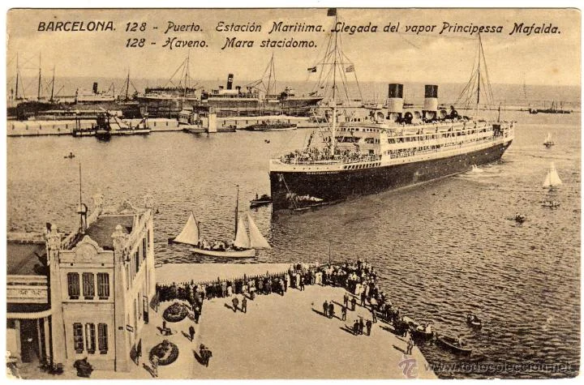

**Barcelona. 128 — Puerto. Estación Marítima. Llegada del vapor Principessa Mafalda.* Cartão-postal de época, com a legenda repetida embaixo **em esperanto**: *Haveno. Mara stacidomo.* Barcelona era a primeira escala do navio, e foi onde a última viagem parou um dia por avaria.*

## 14. A noite

> Hora a hora, do estrondo às 22h10.

A primeira coisa que aconteceu depois do estrondo foi alguém subir à ponte para perguntar.

Eugenio Gabassi, vice-cônsul italiano na cidade argentina de Paraná, cinquenta e seis anos, foi falar com o comandante assim que sentiu o navio parar.

Voltou tranquilizado. Disseram a ele que não havia com que se preocupar e que, no pior dos casos, o navio seria rebocado até o Rio de Janeiro.

Essa frase circulou pelo navio a noite inteira, e matou gente.

Pedro Volpi, trabalhador agrícola italiano de trinta e três anos, ficou a bordo até o último instante possível. Explicou depois por quê, sem nenhum rancor: o capitão tinha dito que o navio ficaria à tona até o dia seguinte.

Ele não estava sendo ingênuo. Estava obedecendo a autoridade do lugar onde estava.

Enquanto isso, no porão, ninguém sabia de nada.

Milhem Solk, libanês de trinta e cinco anos, ouviu o estrondo e foi perguntar. Procurou marinheiro, perguntou a vários, um atrás do outro.

Nenhum deles soube dizer o que tinha acontecido.

Não é que estivessem escondendo. É que não sabiam. A informação levava tempo para descer, e a essa altura já havia mais gente perguntando do que gente com resposta.

E o navio ia deitando.

Ele já vinha adernado desde antes do acidente, como se viu no capítulo anterior. Depois do eixo, a inclinação deixou de ser desconforto e virou geometria.

Enrico Nazzeconi descreve a certa altura da noite uma inclinação a estibordo em estado extremo. Ali Hassen fala da popa afundando.

Uma coisa que quem nunca esteve num navio não imagina: quando o casco inclina, o chão deixa de ser chão. Corredor vira ladeira. Escada vira parede. E cada grau a mais torna mais difícil sair de onde se está.

O pedido de socorro saiu, e é sobre a hora dele que as fontes brigam.

Uma diz 17h35, vinte minutos depois do eixo partir. Outra diz 19h15, quase duas horas depois.

São duas noites diferentes. Numa, o navio pediu ajuda quase imediatamente. Na outra, esperou.

Não tenho como decidir entre as duas, e não vou fingir que tenho. O que é certo é o resultado: o pedido foi ouvido, e navios mudaram de rota para vir.

Às seis e vinte e um da tarde o sol se pôs, como o capítulo anterior mostrou.

A partir daí, tudo o que se conta desta história aconteceu no escuro.

Não é detalhe atmosférico. É a condição de tudo o que vem: cada decisão, cada bote, cada salto na água, cada pessoa procurando outra, tudo isso foi feito sem enxergar.

Os depoimentos voltam a esse ponto o tempo todo, e sempre da mesma maneira.

Volpi, perguntado se tinha visto tubarões, respondeu que não, e emendou: *a noite estava muito escura*.

Batista Beria, nadando, só via o que os holofotes dos navios de resgate alcançavam. Nos intervalos, ouvia gritos sem conseguir localizar de onde vinham.

Havia também quem simplesmente esperasse.

A família Vacelli — o casal e três filhos de quinze, treze e dez anos — passou a noite inteira na popa, junto à escada, aguardando a vez. O pai repetia que havia tempo.

Às nove e meia da noite um bote do *Empire Star* encostou naquela escada e levou os cinco.

Eles acham que foram dos últimos a sair. Mal chegaram ao navio inglês e o Mafalda já não estava lá.

Meia hora antes do fim, o navio começou a fazer um barulho novo.

Lynose descreve: móveis, louça e cristais se quebrando dentro dos salões.

Era a inclinação chegando ao ponto em que nada mais fica parado. Tudo o que estava sobre uma superfície horizontal deixou de estar, ao mesmo tempo, em todos os cômodos do navio.

Quem estava no porão ouviu aquilo por cima da cabeça e entendeu.

E as sete pessoas desta história?

Nenhuma das duas sabia nadar. Nenhuma delas falava a língua da tripulação. Estavam num andar abaixo da linha d’água, num navio inclinando, no escuro.

O que os documentos dizem sobre elas nessa noite é nada. Elas entram no papel de novo só três dias depois, no Rio de Janeiro.

O que existe é uma lembrança.

**Rosa e Maria Luigia desceram e se esconderam no fundo de um porão.**

Não subiram para o convés. Não foram para os botes. Foram para baixo, para o lugar mais fundo que conheciam, e ficaram lá com as cinco crianças.

Pode parecer a pior decisão possível. Não é difícil de entender.

Lá em cima havia empurrão, grito, gente correndo em quatro línguas e botes virando. Elas não sabiam nadar. Duas mulheres com cinco crianças pequenas, num convés inclinado no escuro, não têm chance nenhuma de manter as cinco juntas.

Então fizeram o que se faz quando não há como avançar: se enfiaram num canto e seguraram as crianças.

E alguém foi buscá-las.

Havia na cozinha daquele navio um cozinheiro, um homem de pele escura, que tinha se afeiçoado a Pulcheria nas duas semanas de travessia. A menina de seis anos que não saía de lá.

Quando o navio estava se enchendo de água, ele desceu ao porão, achou as duas mulheres e as cinco crianças, e tirou todos de lá.

Levou-os para o **bote dos cozinheiros**.

Preciso dizer exatamente o que isto é.

Não está em documento nenhum. Não está nos manifestos, não está na lista do Rio, não está em jornal, não está no inquérito. Nenhum papel deste livro registra esse homem.

É lembrança de família, e eu preciso ser exato sobre de quem.

Ela é atribuída à própria Pulcheria, que tinha seis anos e estava lá, e chegou até mim por uma prima de outro ramo — bisneta de Maria Luigia, como eu sou bisneto de Rosa.

E **a outra linha desta família não tem essa história.** A Patrícia Betti, também bisneta de Maria Luigia e neta da Pulcheria, ouviu tudo o que sabe do avô, João Betti, que era o marido da Pulcheria. Do cozinheiro ele nunca falou.

Então não são duas testemunhas. É uma lembrança que desceu por um galho desta família e não desceu pelo outro.

E é a única explicação que existe para sete pessoas terem saído de dentro de um porão alagado.

**Sem esse homem, este livro não teria autor.**

O *Principessa Mafalda* perdeu energia às dez e três da noite.

Sete minutos depois, às dez e dez, afundou.

Nazzeconi, na água, ouviu três apitos longos e, logo em seguida, um estrondo que ele não soube descrever de outro jeito.

E não viu nada, porque estava escuro.

## 15. Os botes

> Lugares vendidos, botes danificados, os tubarões.

Lendo os vinte depoimentos em sequência, uma coisa aparece que nenhum deles diz sozinho.

**O que matou naquela noite não foi a água.**

Quase ninguém morreu por ter caído no mar e não saber nadar. Morreu por ter entrado num bote.

Ali Hassen, árabe de quarenta e cinco anos, viajando com três primos, subiu ao convés e se atirou num bote junto com cerca de cinquenta pessoas. Pelo peso, o bote afundou.

Salvador Malone conseguiu lugar no terceiro bote lançado. A poucos metros do navio, ele virou.

Antonio Ponce entrou num com pelo menos trinta pessoas. A vinte metros do *Alhena*, o nervosismo de um dos companheiros fez o bote emborcar.

Valeriano Galli, como boa parte da terceira classe, foi dos primeiros a entrar. O bote cedeu sob o peso e ele foi parar na água.

Maria Spinelli tinha ao lado a amiga Teresa Forggia e o filho dela, Mario, de três anos.

Um tripulante as obrigou a descer e entrar num bote. Elas entraram.

E então, **a trinta centímetros da água**, as cordas de um dos lados arrebentaram.

Trinta centímetros. Foi essa a margem.

Vincenzo Mandolezzi esperou uma hora e meia a bordo antes de se jogar. Nadou até alcançar um dos botes do próprio Mafalda.

Estava furado, ou rachado, ou de alguma forma inservível — ele diz apenas que não estava em bom estado.

Eram nove pessoas dentro. Remaram com as mãos.

As razões se acumulam e nenhuma delas é misteriosa.

Botes velhos num navio velho. Superlotação, porque todo mundo queria o mesmo lugar ao mesmo tempo. Lançamento feito às pressas, no escuro, por gente que nunca tinha feito aquilo de verdade — o único exercício foi na véspera, à uma da tarde, e era exercício de incêndio.

E o adernamento.

Um navio inclinado tem um lado bom e um lado inútil. De um deles os botes descem raspando o casco. Do outro, ficam pendurados longe demais para alguém alcançar.

Metade dos botes daquele navio já não servia antes de qualquer pessoa entrar neles.

E aí a quilha virou o lugar mais seguro do Atlântico.

Alfio Sanfilippo se atirou na água às seis da tarde com o irmão e um oficial do Mafalda. Quase todos os botes já tinham virado. Os três se agarraram ao casco de um deles, de barriga para cima.

Ficaram ali oito horas, até o *Empire Star* se aproximar.

Domenico Leo passou a noite do mesmo jeito, na quilha de outro bote, com sete ou oito pessoas.

Agora eu preciso avisar o leitor de uma coisa.

O que vem a seguir são três versões da mesma meia hora, contadas por três pessoas que estavam naquele navio.

Elas não se completam. Elas se contradizem.

E o que separa uma da outra não é honestidade. É o convés em que cada uma dormia.

**A família Vacelli viajava na primeira classe.** O casal e três filhos, de quinze, treze e dez anos. Esperaram a noite inteira na popa e foram recolhidos às nove e meia.

A versão deles:

*Centenas de passageiros da terceira classe foram tomados de tal pânico que se tornaram animais selvagens, perdendo o juízo. Avançaram desesperadamente como uma massa aterrorizada sobre os botes, muitos deles portando facas que seguramente, em mais de um caso, foram usadas contra outros passageiros.*

E concluem: aquilo obrigou os passageiros de primeira e segunda classe a permanecerem paralisados, assistindo à luta terrível que se desenrolava diante deles.

**Mario Ottaviani, vinte e três anos, viajava na segunda classe**, a negócios, e sabia nadar.

A versão dele:

*Os passageiros da terceira classe e a tripulação foram os responsáveis por transformar a situação em anarquia. Cometeram atos impróprios de gente civilizada. Empurraram-se para dentro dos botes e tomaram posse deles pela violência, sem pensar nas mulheres e nas crianças que clamavam por ajuda.*

**Nicola Lynose, iugoslavo, viajava na terceira classe.**

A versão dele:

Ao primeiro estalo, correram todos ao depósito para pegar os coletes salva-vidas. Quando voltaram ao convés com os coletes na mão, encontraram **a tripulação em frenesi, jogando-se dentro dos botes que já se afastavam do navio**.

*Só então* os imigrantes, cegos de medo, derrubaram três botes no mar e se atiraram neles de um jeito tão desordenado que os três viraram.

Eu não vou escolher entre as três.

E preciso dizer por quê, porque a essa altura já ficou claro de que lado eu venho.

**Sou bisneto de duas mulheres que viajavam na terceira classe daquele navio.** Se eu arbitrasse essa disputa, estaria arbitrando em causa própria, e o leitor teria todo o direito de descontar o que eu dissesse.

Então não arbitro. Ponho as três lado a lado e deixo à vista o que elas têm em comum: cada depoente descreve com precisão o que aconteceu perto dele, e com fúria o que aconteceu do outro lado do navio, onde não estava.

Um homem da primeira classe viu a terceira invadir os botes. Um homem da terceira viu a tripulação já dentro deles. As duas coisas provavelmente aconteceram, com meia hora de diferença, em pontos distintos de um convés no escuro.

Há uma coisa, porém, em que os três lados concordam.

Parte da tripulação ficou.

Os Vacelli, que são os mais duros com a terceira classe, fazem questão de registrar o comportamento nobre do primeiro oficial e do primeiro maquinista, que segundo eles fizeram esforços inauditos para salvar passageiros.

E Pedro Volpi deve a vida a um deles. Depois de se jogar na água, foi ajudado pelo terceiro maquinista do Mafalda, que nadou com ele até um bote.

Volpi acrescenta uma linha que vale o capítulo inteiro: o homem que o salvou, depois de deixá-lo em segurança, voltou. E salvou outros dois.

E o herói mais citado daquela noite não era da tripulação.

Era um passageiro: Juan Santororo, cadete naval argentino.

Galli, que é o mais crítico de todos em relação aos oficiais do Mafalda, faz questão de contrastar: enquanto a tripulação fazia o que fazia, havia um passageiro salvando gente na água.

Santororo só descobriu quem era o homem que ele tinha visto trabalhando no escuro quando chegou ao porto e viu a multidão carregá-lo nos ombros.

Na água, o perigo deixou de ser o navio.

**Lynose nadou das sete da noite às dez e meia.** E o que ele conta desse percurso não é sobre ondas.

*A luta mais intensa não foi com as ondas, mas com os passageiros boiando que, não sabendo nadar, se agarravam a quem estivesse ao lado, soltando gritos desesperados. Ouviam- se pragas em todas as línguas. Para avançar era preciso se afastar dos outros, que formavam uma barreira humana.*

Batista Beria descreve o mesmo mecanismo: quem não sabia nadar direito se agarrava à roupa de quem estava na frente.

Uma pessoa se afogando não é uma pessoa pedindo ajuda. É uma pessoa que puxa para baixo quem chega perto.

E os tubarões.

É a parte mais famosa deste naufrágio, a que aparece em toda reportagem, e é a que menos resiste a um exame.

Gabassi diz que uma mulher e uma criança foram levadas por um tubarão enorme, na tábua em que ele boiava. Ponce viu dois. Galli viu vários, e diz que um feriu um companheiro que morreu depois de içado. Malone não viu nenhum.

Volpi não viu — e acrescenta: *a noite estava muito escura*. Sanfilippo não viu, e diz outra coisa no lugar: viu o corpo de uma mulher boiando agarrada a um bebê. Beria, Uccelli e Solk também não viram.

E Domenico Leo resume a dificuldade toda numa frase: *não sei se era um tubarão, mas era um peixe enorme.*

Pascual Pecci, o único cético do grupo, foi mais longe.

Duvidou que houvesse tubarão nenhum. Atribuiu a história a peixes que vinham sendo vistos seguindo o navio nos dias anteriores, e que ninguém a bordo sabia identificar.

Achava, mais amplamente, que muitos dos relatos dramáticos daquela noite eram invenção de quem quis criar drama onde não havia. Sobre a própria fuga com a mulher e a filha, disse que tinha sido tão dramática quanto *um dia no Tigre*, que é um balneário de fim de semana perto de Buenos Aires.

Nem ele nem os outros têm como provar o que dizem. Estava escuro, e eles estavam com medo.

O que este livro pode fazer é não decidir por eles.

De todos os botes que aparecem nestes vinte relatos, quase nenhum chegou inteiro do outro lado.

Afundaram pelo peso, viraram a poucos metros do casco, cederam, arrebentaram nas cordas, ficaram pendurados no lado errado do navio, ou chegaram furados e foram remados com as mãos.

**O que segurou foi o dos cozinheiros.**

## 16. 22h10

> O navio afunda. Gulì fica a bordo.

Às dez e três da noite, o navio apagou.

Não foi um apagão como o de uma casa. Um transatlântico sem energia perde a luz, perde as bombas, perde o rádio. Em poucos segundos deixa de ser uma máquina e passa a ser um objeto grande boiando torto.

A partir daquele minuto, a única luz sobre aquela água veio dos holofotes dos navios que já tinham chegado.

E holofote ilumina um círculo. O resto continua preto.

Entre a luz apagar e o navio sumir passaram-se **sete minutos**.

Pouco antes disso, Mario Ottaviani olhou em volta antes de se jogar, e contou.

Ainda havia nos conveses cerca de sessenta mulheres e crianças, e cerca de duzentos homens.

Duzentas e sessenta pessoas, a sete minutos do fim, num navio já deitado.

Enrico Nazzeconi ficou até dez para as dez.

Quando a inclinação a estibordo chegou ao que ele chamou de estado extremo, correu para a popa. A água já estava pelos joelhos dele, no convés.

Então se jogou.

E foi da água que ele ouviu.

Três apitos longos, um atrás do outro.

E depois um estrondo que ele não conseguiu descrever de outro jeito senão como estrondo.

E não viu nada.

Nazzeconi estava a poucas dezenas de metros do casco e diz, com todas as letras, que não conseguiu ver o navio afundar. Estava escuro demais.

A família Vacelli, já a bordo do *Empire Star*, também não viu. Mal tinham chegado, olharam para trás, e o Mafalda não estava mais lá.

Um navio de nove mil toneladas desapareceu do Atlântico, e quase ninguém que estava a duzentos metros dele viu aquilo acontecer.

O que se sentiu foi a água.

Andres Scavani del Vicario tinha se soltado de uma corda pouco antes, junto com o fotógrafo de bordo, com quem tinha feito amizade durante a viagem. Quando o navio afundou de vez, o redemoinho da descida arrastou os dois para longe.

Foi o que os salvou. A sucção os empurrou na direção do *Formosa*, e três horas depois a tripulação francesa ouviu os gritos deles e os pescou.

O navio, ao afundar, moveu quem estava na água. Alguns para longe da ajuda, outros para perto dela. Ninguém escolheu.

E o comandante ficou.

Nisso os vinte depoimentos concordam, e é a única coisa daquela noite sobre a qual eles não brigam.

Não há um único relato, entre todos os que li, de alguém que tenha visto Simone Gulì tentar sair daquele navio. Passageiros de primeira, de segunda e de terceira classe; italianos, árabes e iugoslavos; gente que discorda de tudo o mais, concorda nisso.

Ele estava na ponte quando o navio afundou.

**Como ele morreu é outra história, e tem duas versões.**

Salvador Malone, já içado a bordo do *Alhena*, diz que assistiu ao fim de longe e que viu o comandante na ponte, se despedindo com um *Viva Italia*.

Eugenio Gabassi, ainda na água, conta outra coisa: ouviu tiros vindos da ponte, onde estavam o comandante e o primeiro maquinista, e concluiu que os dois tinham se matado.

As duas testemunhas estavam na água, no escuro, a distâncias que nenhuma delas soube precisar.

Uma interpretou uma silhueta. A outra interpretou um som.

Nenhuma das duas está mentindo, e nenhuma das duas tinha como ter certeza. Aquela noite não ofereceu certeza a ninguém que estivesse dentro dela.

Então fica o que dá para dizer.

Simone Gulì levou o *Principessa Mafalda* de Gênova até quase dezoito graus de latitude sul. Passou as últimas horas mandando dizer aos passageiros que o navio aguentaria até o dia seguinte.

Não aguentou. E não há como saber se ele acreditava naquilo, se estava errado nas contas, ou se estava apenas tentando conter um pânico que veio de qualquer maneira.

O que se sabe é que ele ficou.

**O navio afundou às dez e dez da noite de 25 de outubro de 1927, com o comandante a bordo.**

Às dez e onze, aquele ponto do Atlântico era um campo de gente boiando.

Homens agarrados à quilha de botes virados. Mulheres em tábuas. Crianças dentro de coletes grandes demais para elas. E centenas de pessoas que não sabiam nadar tentando se segurar em quem sabia.

E, a alguns quilômetros dali, com os holofotes acesos, os navios vindo no escuro.

## 17. Alhena, Mosella, Empire Star

> O resgate a noite inteira.

A única coisa boa desta história inteira é que os navios já estavam perto.

Pouco antes, naquela mesma tarde, o Mafalda tinha cruzado com o *Empire Star* e o comandante o saudara com um apito longo. Quando o eixo partiu, o navio inglês ainda estava a cerca de dois quilômetros.

Não foi previdência de ninguém. Foi rota comercial. Aquele trecho do Atlântico, em outubro de 1927, tinha tráfego.

O pedido de socorro alcançou mais navios do que se costuma contar.

Os telegramas daquela noite registram **Alhena**, **Empire Star**, **Formosa**, **Mosella**, **Avelona**, **Rosetti**, e ainda *Salem*, *Forthmouth*, *Frederik* e *Piauhy*.

Dez nomes. Holandês, inglês, francês, italiano, brasileiro. Nenhum deles tinha qualquer obrigação com aquela gente além da que existe entre navios.

Alguém, a bordo do *Alhena*, teve uma ideia que salvou vidas.

Esticaram uma corda ao longo do casco, da popa à proa, à altura da água.

Quem chegasse nadando, chegasse onde chegasse, encontrava corda.

Três sobreviventes que não se conheciam descrevem a mesma corda. Nazzeconi diz que foi ela que o deixou aguentar até alguém puxá-lo. Beria diz que ela permitiu que ele subisse com facilidade. Solk conta que nadou até levar uma pancada forte na nuca, ergueu os braços por instinto, e havia corda ali.

Nem todo mundo teve essa sorte.

Ali Hassen, quarenta e cinco anos, viajava com três primos. O bote em que entrou afundou pelo peso. Voltou à superfície, achou um pedaço de madeira e ficou boiando quatro horas.

Nesse tempo ele bateu várias vezes contra o casco de um dos navios de resgate sem que ninguém o notasse.

Já tinha perdido a esperança quando encontrou uma corda, se agarrou, e sentiu que estava sendo içado.

Os três primos dele morreram.

Os tempos na água, como os próprios sobreviventes contaram:

Uccelli, uma hora e meia. Beria, duas. Milano, duas. Galli, duas. Scavani, três. Lynose, três e meia. Hassen, quatro. Sanfilippo, oito.

E Gabassi, a noite inteira, sobre uma tábua, até o *Rosetti* o recolher de manhã.

**Domingo Milano tinha catorze anos e viajava sozinho.**

O pai e os irmãos estavam na Argentina esperando por ele.

Era bom nadador. Quando viu que o navio ia mesmo afundar, mergulhou da proa e começou a nadar na direção do *Alhena*, que estava longe.

Ficou duas horas na água. Estava a ponto de desistir quando passou perto um bote carregado de náufragos. Num último esforço, agarrou um remo.

Foi assim que ele chegou.

Agora a parte que eu não consigo resolver, e que precisa ser dita.

**A conta do resgate não fecha em nenhuma fonte.**

Uma delas soma os salvos assim: Alhena 450, Avelona 300, Empire Star 202, Formosa 151, Rosetti 122, Mosella 49. Total: mil duzentos e setenta e quatro pessoas resgatadas.

Só que a bordo iam mil duzentas e cinquenta e nove. Somando os trezentos e catorze mortos, dá mil quinhentas e oitenta e oito pessoas num navio que levava mil duzentas e cinquenta e nove.

Outra fonte, com números diferentes, comete o mesmo excesso. E lista dois navios, *Athenas* e *Alhena*, com exatamente o mesmo número de salvos — quase certamente o mesmo navio, contado duas vezes.

Isso não é desleixo de quem contou.

É o que a noite era.

Um homem entrava num bote, o bote virava, ele nadava até outro bote, esse bote encostava num navio, e horas depois aquele navio transferia parte dos recolhidos para outro. Cada vez que alguém trocava de casco, havia a chance de ser contado outra vez.

A soma que não fecha é a única prova aritmética que existe do que aconteceu com aquelas pessoas depois que o Mafalda sumiu: **elas foram passadas de mão em mão, no escuro, por gente que não sabia quem já tinha contado quem.**

É exatamente aqui que a minha família reaparece.

O que a memória guarda é isto: o cozinheiro tirou as duas irmãs e as cinco crianças do porão e as levou para o bote dos cozinheiros.

Desse bote, foram levadas para outro navio. E esse navio, no relato que chegou até mim, **não era um navio de passageiros. Era um navio que carregava carvão.**

Não sei qual era.

O documento que existe põe as sete no *Alhena*, holandês, três dias depois. Entre o bote e o Alhena pode ter havido um navio, ou dois, e a memória da família guardou o que a pele guardou.

Porque o que ficou dessa passagem, e ficou por cem anos, foi o carvão.

**Elas chegaram pretas.** As duas mulheres e as cinco crianças, cobertas de pó de carvão da cabeça aos pés.

Em 28 de outubro de 1927, o vapor holandês *Alhena* entrou no porto do Rio de Janeiro.

O intérprete Thomas Filipovich subiu a bordo e recebeu uma lista. Na coluna de procedência, onde deveria estar o nome de um porto, o funcionário escreveu uma palavra só: **Náufragos**.

Cinquenta imigrantes, todos de terceira classe, todos desembarcados na Ilha das Flores. Quarenta e três italianos, quatro iugoslavos, três húngaros.

Nas linhas 26 e 27, e depois nas linhas 44 a 48, estão as sete pessoas deste livro.

Maria Spinelli desceu naquele mesmo desembarque.

É a mulher que recebeu no colo, por cima da amurada, o filho de três anos da amiga Teresa Forggia, quando parecia que a mãe ia ficar no navio. Terceira classe, italiana, salva pelo *Alhena*.

Ela já tinha atravessado o Atlântico três vezes antes daquela. Não era uma emigrante. Era uma viajante.

E fecha o depoimento assim: *depois de três viagens à América do Sul, resolvi ficar aqui para sempre e nunca mais voltar à Itália*.

O naufrágio não a impediu de chegar. Impediu-a de voltar.

Naquela folha estão as duas mulheres do capítulo 8.

Luchini Teresa, dezenove anos. De Rosi Emilia, cinquenta e cinco. Números 24 e 25, uma seguida da outra, cada uma com um *x* marcado à margem.

Subiram a prancha em Gênova ao lado dos maridos. Desceram aqui sem eles.

Aquela folha de papel é o momento em que esta família volta a existir para o mundo.

Entre o estrondo das cinco e quinze do dia 25 e a assinatura do intérprete no dia 28, não há uma linha sequer sobre elas em documento nenhum. Três dias inteiros de nada.

E então, de repente, sete nomes, sete idades, uma profissão, uma coluna de instrução e um destino.

**Forner Rosa, vinte e quatro anos, chefe. Enrico, um ano, filho.**

Vivos.

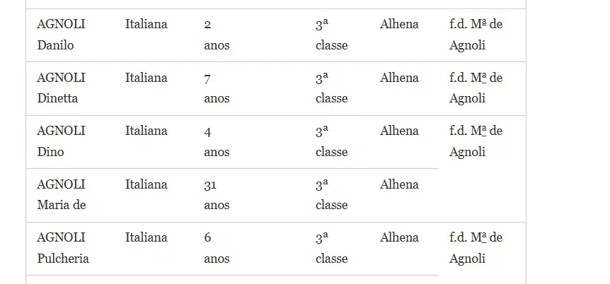

*A família Agnoli na relação dos náufragos recolhidos pelo *Alhena*: Danilo 2, Dinetta 7, Dino 4, Maria de 31 e Pulcheria 6, todos em terceira classe.*

## 18. Os 314

> Os mortos não têm lista, não têm sepultura e não têm nome. E o país nunca guardou a data.

Eu não tenho os nomes deles.

Tenho vinte depoimentos de sobreviventes, com nome, idade, classe, cidade de origem e a profissão de alguns. Tenho cinquenta nomes datilografados na lista do *Alhena*, com idade e grau de parentesco. Tenho uma família inteira reconstruída em cartório, geração por geração, até 1861.

**Dos trezentos e catorze, não tenho lista nenhuma.**

O próprio número não é pacífico. Há fonte que fala em duzentos e setenta e dois. Trezentos e catorze é o que o cruzamento sustenta, e é o que este livro usa.

A bordo iam mil duzentas e cinquenta e nove pessoas.

**Um em cada quatro não chegou.**

O que se sabe sobre como aquelas pessoas morreram não vem de laudo, de perícia nem de inquérito.

**Vem de olho de sobrevivente.**

Não houve autópsia, não houve corpo, não houve investigação no local. O que existe é o que gente apavorada, no escuro, dentro da água, disse ter visto — e disse dias depois, num porto, para jornalistas.

Então é isto o que ficou.

Valeriano Galli tinha um companheiro ao lado. O homem foi ferido na água e morreu depois de içado, já em segurança.

Salvador Malone viu um homem boiando com uma perna destruída.

Alfio Sanfilippo, agarrado à quilha havia horas, viu passar o corpo de uma mulher boiando com um bebê nos braços.

Eugenio Gabassi passou a noite numa tábua com quatro mulheres e três crianças. Quando amanheceu e o *Rosetti* o recolheu, uma das mulheres e uma das crianças não estavam mais ali.

Ali Hassen tinha quarenta e cinco anos e embarcou em Gênova com três primos.

Chegou ao Rio de Janeiro sozinho.

Não sei o nome de nenhum dos três. Não sei a idade, não sei de onde vieram, não sei para onde iam. Sei que eram três, que eram primos dele, e que morreram os três — porque ele contou, e porque quem conta uma coisa dessas não erra a conta.

Há um número que não é a lista dos mortos, mas chega perto.

As duzentas e sessenta pessoas que Ottaviani contou no convés, sete minutos antes do fim.

Não é a lista dos que morreram: parte daquela gente se atirou depois dele e foi recolhida. Mas é **a última vez que alguém, naquele navio, parou para contar quem ainda estava vivo**.

Dois dos trezentos e catorze estão num documento que está em cima da minha mesa. E estão nele como ausência.

Na lista do *Alhena*, os números 24 e 25 são Luchini Teresa, dezenove anos, e De Rosi Emilia, cinquenta e cinco. Aparecem sozinhas, uma seguida da outra, sem parentesco declarado, cada uma com um *x* marcado à margem.

E no pé da folha, escrito à mão:

*As passageiras constantes sob Nº 24 e 25 perderam seus maridos, e pedem de ser enviadas para Italia.*

Os dois homens não têm nome em documento nenhum que eu tenha encontrado. Existem ali como aquilo que faltou ao lado do nome de duas mulheres.

E a última coisa daquela folha é o que elas pedem.

Dezessete dias antes tinham subido a prancha em Gênova ao lado dos maridos, indo embora para sempre. Atravessaram o Atlântico inteiro. Chegaram.

**E o que pedem, na primeira repartição brasileira em que puderam falar, é para voltar.**

Não houve recolhimento de corpos.

Os navios que chegaram naquela noite estavam apanhando gente viva no escuro, e foram embora ao amanhecer, cada um para o porto que já era o seu destino. Ninguém voltou àquele ponto do mar.

Quem morreu ali ficou ali. **Não existe sepultura de nenhum dos trezentos e catorze, em lugar nenhum, com nome nenhum.**

Aqui eu preciso admitir uma coisa sobre este livro.

Ele é feito de depoimento. E depoimento é coisa de vivo.

Este livro chegou até aqui, e quase todos os capítulos são sobre gente que chegou. Não porque quem chegou importe mais. Porque foram eles que puderam falar.

As duas mulheres desta família estão neste livro pelo mesmo motivo pelo qual quase todo mundo está: **não morreram**.

E a minha família fica devendo.

Rosa e Maria Luigia estiveram na água daquela noite com cinco crianças. Estiveram num bote. Foram passadas de navio em navio, no escuro. É quase impossível que não tenham visto alguém morrer.

Nada disso atravessou.

O que chegou até mim, por três gerações e pela boca, foi o cozinheiro, o porão, o carvão, e um pai procurando as filhas entre gente preta de fuligem.

**Sobre os mortos, silêncio.**

Eu acho que sei por quê, e é a coisa menos documentada que eu vou escrever neste livro.

Uma família que atravessou uma noite dessas conta a parte que salva. Conta o cozinheiro. Conta o carvão. Conta o reencontro.

A outra parte ela não conta, e não conta porque contar seria entregar aos filhos e aos netos alguma coisa que ela mesma não conseguiu carregar direito.

Dez anos depois daquela noite, Rosa teve uma filha e botou nela o nome do navio.

Isso não é esquecimento. Quem esquece não faz uma coisa dessas.

Eu cheguei aos quarenta e poucos anos sabendo apenas que tinha havido um navio.

Não aprendi na escola. Não vi em livro didático, não passei por nenhuma placa. Nenhum 25 de outubro da minha vida foi aniversário de coisa alguma.

Um transatlântico afundou diante da costa da Bahia levando mil duzentas e cinquenta e nove pessoas, e a maior parte delas estava vindo para cá. Para ser brasileira. Muitas já tinham parente esperando numa estação do interior de São Paulo.

**Foi memória de família, não memória de país.**

É por causa dessa diferença que este livro existe.

# Parte IV — Os que chegaram

*1927 – hoje*

---

## 19. 31 de outubro

> Hospedaria do Brás. Livro 100, página 290.

Entre a Ilha das Flores e a Hospedaria do Brás existem três dias que ninguém registrou.

O intérprete Thomas Filipovich assinou a parte dele no Rio de Janeiro em 28 de outubro. A entrada na Hospedaria do Brás, em São Paulo, é de 31.

O que aconteceu no meio, eu não sei. Não sei se foram de trem ou de navio costeiro, não sei onde dormiram, não sei o que comeram, não sei quem pagou.

O que dá para dizer é o que elas não tinham.

Tudo o que aquelas duas famílias carregavam da Itália estava dentro do *Principessa Mafalda*, e o *Principessa Mafalda* estava no fundo do Atlântico.

A roupa de cama, as ferramentas, as fotografias, os documentos, a roupa de domingo, o dinheiro que tivesse sobrado da passagem. Uma família que emigra leva o que consegue, e o que consegue é tudo o que tem.

Chegaram com o corpo e com as crianças.

Vale entrar por aquela porta com elas, e aqui eu faço outra vez o que fiz no capítulo 10: o que vem agora é reconstrução declarada.

O que existe é a data, a página, os sete nomes — e o procedimento da Hospedaria do Brás, que era escrito, rígido e igual para todo mundo.

O procedimento é o que interessa, porque ele tem um passo que aquelas sete pessoas não tinham como cumprir.

A Hospedaria não ficava perto da estação. **A estação entrava nela.**

O prédio do Brás tinha desvio ferroviário próprio. O trem parava dentro, e o imigrante descia do vagão já do lado de dentro do muro, sem atravessar a cidade. Era um edifício para milhares de pessoas ao mesmo tempo, e funcionava como funciona uma alfândega de gente.

Chegar ali era chegar direto no procedimento. Não havia rua no meio, nem praça, nem cidade: havia o vagão, a plataforma e a fila.

Do lado de dentro a ordem era banho, desinfecção, inspeção médica, registro, dormitório.

E a bagagem ia para a estufa.

Esse era o passo. Todo volume que entrava naquele prédio era fumigado antes de subir para o alojamento, porque a Hospedaria existia tanto para receber gente quanto para impedir que a gente recebida trouxesse doença para dentro de São Paulo.

**Rosa e Maria Luigia não tinham volume nenhum.**

Não havia mala para pôr na estufa. Não havia trouxa para etiquetar. Não havia passaporte para carimbar, nem certidão, nem contrato, nem bilhete — nem o papel que provasse que elas tinham comprado a passagem do navio que as tinha trazido até ali.

Estava tudo no mesmo lugar onde tinha ficado o navio.

É aqui que a palavra que vem duas páginas adiante deixa de ser uma anotação de escrivão.

Um funcionário de hospedaria trabalha conferindo papel contra pessoa. Quando não há papel, sobra a pessoa.

Alguém teve de ficar de pé na frente daquele balcão e dizer em voz alta, em italiano, sete nomes e sete idades, sem nada na mão para provar nenhum deles.

Já tinha feito isso em Gênova, em 11 de outubro, e no Rio de Janeiro, em 28. Esta era a terceira vez em vinte dias.

E as três vezes valeram. Os sete nomes estão nos três papéis.

Em 31 de outubro de 1927, seis dias depois do naufrágio, alguém abriu o Livro 100 da Hospedaria de Imigrantes do Brás na página 290 e começou a escrever.

Aquele livro era o funil por onde passava a imigração de São Paulo. Nome, idade, residência, número de família, destino. Milhares de páginas iguais, uma atrás da outra, por décadas.

Há uma coluna naquela página que eu não consigo passar sem olhar duas vezes.

A coluna do vapor.

Ela diz **P. Mafalda**.

O navio estava no fundo do mar havia seis dias. Trezentas e catorze pessoas tinham morrido dentro dele. E o formulário pedia o nome do vapor de procedência, então o funcionário escreveu o nome do vapor de procedência.

Não é frieza. É o procedimento fazendo a única coisa que sabe fazer. Mas o efeito, lido cem anos depois, é que aquela página registra sete pessoas chegando a São Paulo num navio que já não existia.

Família número 19270:

**FORNER ROSA, 24 anos, Castelcucco.** 
 **ENRICO, 1 ano.**

Família número 19260:

**FORNER MARIA, 31 anos, Cavaso del Tomba.** 
 Gina, 7. Pulcheria, 6. Rino, 4. Danilo, 2.

Maria Luigia entra ali como Forner.

Ela era casada com Angelo Dei Agnoli desde 25 de fevereiro de 1917. Dez anos e quatro filhos.

Não é erro do escrivão. No registro civil italiano a mulher não troca de sobrenome ao casar: continua sendo quem nasceu, em todos os papéis, a vida inteira.

As duas se apresentaram como as duas irmãs Forner que eram, e o funcionário escreveu o que ouviu.

E as duas entram como **CHEFE**.

Não é leitura minha. Está escrito na coluna de parentesco da lista do *Alhena*, no Rio, em 28 de outubro. E o registro do Brás, três dias depois, em outra cidade e em outro órgão, faz o mesmo.

Duas mulheres casadas, com os maridos vivos e esperando no interior de São Paulo, registradas como chefes das próprias famílias em dois documentos independentes do Estado brasileiro.

Chefe, ali, não é uma opinião sobre o casamento delas.

É uma função. Chefe é quem responde pelo grupo diante da autoridade: quem dá o nome, a idade e o destino de todo mundo, quem assina o que houver para assinar, quem é chamada se faltar alguém.

Rosa Forner tinha vinte e quatro anos, um filho de um ano no colo, nenhum documento, nenhuma bagagem e nenhuma palavra de português.

E foi ela quem respondeu.

A lista do *Alhena* traz uma coluna a mais que a do Brás, e é a que mais me interessa.

**Instrução: sim.**

Rosa Forner sabia ler.

No primeiro capítulo deste livro eu escrevi que muitas crianças daquele lugar aprendiam o calendário agrícola e não aprendiam a ler. Ela aprendeu as duas coisas.

Profissão: doméstica. Destino declarado: S. Paulo.

A mesma página do Brás traz outros sobrenomes: De Rossi, Strufaldi, Lovato, Panarotto, Puldeghinio, Beck.

São os mesmos que estão na lista do *Alhena*, três dias antes, no Rio.

É a mesma leva de gente, documentada duas vezes, em duas cidades, por dois órgãos que não conversavam entre si.

Cinquenta pessoas desembarcaram na Ilha das Flores. Quarenta e duas deram entrada no Brás em 31 de outubro, e mais uma no dia seguinte.

Sete ficaram no Rio. Quem foram, eu não sei.

Há uma coisa nessa sobreposição que eu queria saber e não sei.

Na lista do *Alhena*, a passageira número 25 é De Rosi Emilia, cinquenta e cinco anos, que perdeu o marido no naufrágio e pediu para ser mandada de volta à Itália.

Na página do Brás há um De Rossi.

Na digitalização que eu tenho, não consigo dizer se é ela. Se for, quer dizer que o pedido não foi atendido, ou que ela desistiu dele, e que a mulher que queria voltar pegou o mesmo trem que todo mundo.

É aqui que esta história faz uma curva que eu não esperava quando comecei.

Em 25 de outubro, aquelas sete pessoas foram notícia no mundo inteiro. O naufrágio do *Principessa Mafalda* saiu em jornal de Buenos Aires, de Roma, de Londres e de Nova York. Sobrevivente de terceira classe deu entrevista no cais.

Em 31 de outubro, seis dias depois, elas viraram **família 19270 e família 19260**.

E era exatamente isso que elas tinham vindo fazer.

Ninguém atravessa o Atlântico na terceira classe para virar notícia. Atravessa para virar número de família num livro de hospedaria, para pegar um trem para o interior e para começar a trabalhar numa terra que não é sua.

O naufrágio foi um acidente no meio de uma coisa muito mais comum.

**A página 290 é o momento em que a viagem volta a ser o que sempre foi.**

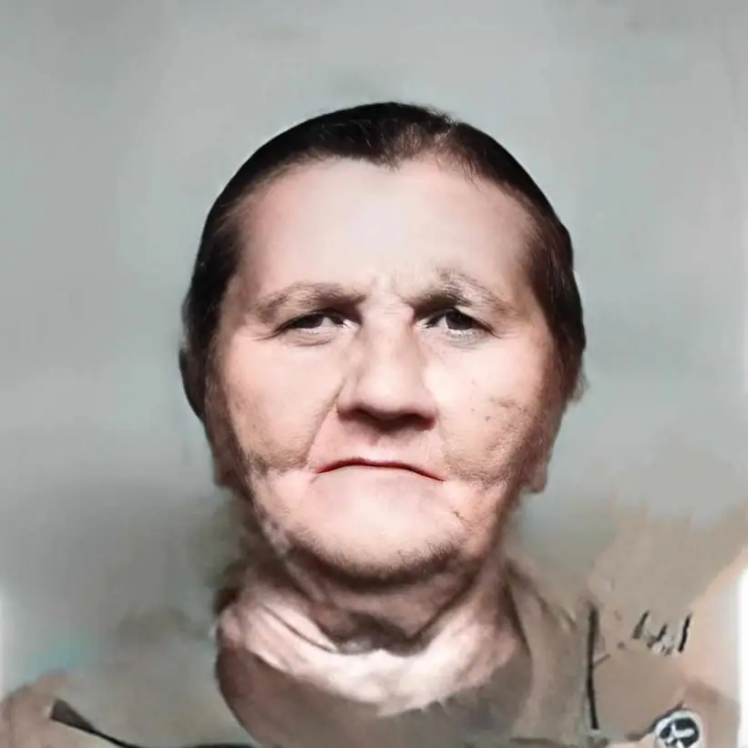

***Rosa Forner Miotto**, 1903 a 1986. Sobreviveu ao naufrágio aos vinte e quatro anos, com o filho de um ano no colo. *Restauração feita pelo autor: o original está muito danificado.**

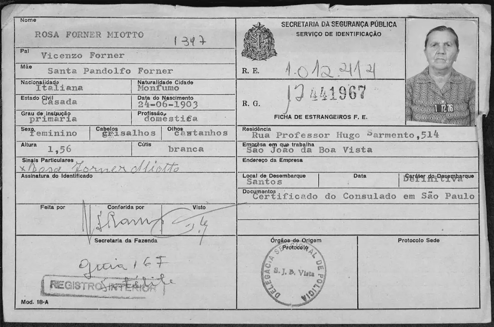

*A cédula de identidade dela, emitida no Brasil décadas depois.*

## 20. O reencontro

> Fausto e Angelo recebem as mulheres e as crianças.

Este é o único capítulo deste livro em que o arquivo não tem nada e a memória tem tudo.

Todos os documentos que eu juntei até aqui registram *que* aquelas sete pessoas sobreviveram. As listas, os manifestos, as folhas de desembarque. Nenhum deles registra *como*, e nenhum deles registra o que aconteceu quando elas desceram.

O que vem agora não tem papel nenhum. Tem cadeia oral, e eu vou dizer qual é antes de contar.

Pulcheria Pasqua Dei Agnoli, filha de Maria Luigia, tinha seis anos na noite do naufrágio. Nasceu em 1921 e morreu em 2013, aos noventa e dois anos.

Ela casou com João Betti, nascido em 1920, que não estava naquele navio.

E foi *ele*, não ela, quem passou a vida contando esta história dentro de casa.

A neta dos dois, Patrícia Betti, é categórica: *quem me contou todas as histórias foi meu avô, que era o marido da Pulcheria. Eu só sei da fonte dele.*

Vale parar um segundo nisso, porque é estranho e é importante.

A mulher que viu aquele navio afundar aos seis anos de idade viveu até 2013, e não é ela a narradora desta história na própria casa.

Quem narrava era o marido. Um homem que ouviu de outra pessoa e recontou por décadas — dela, e talvez também da sogra, Maria Luigia, que morreu em 1992, aos noventa e seis anos.

**Entre a menina que viu e eu, que escrevo, há um homem que não estava lá.**

Os dois homens estavam esperando.

Angelo Dei Agnoli, marido de Maria Luigia, tinha desembarcado em Santos em 30 de abril de 1927. Seis meses antes.

Ele veio no *Principessa Mafalda*.

O mesmo navio, o mesmo casco, provavelmente o mesmo porão. Trouxe o marido em segurança em abril e quase matou a mulher e os quatro filhos em outubro.

Fausto Miotto também já estava aqui.

Veio antes de Rosa, e é por isso que ela atravessou como chefe da própria família, com um filho de um ano, e não ao lado do marido.

Em que mês e em que navio, eu ainda não sei. É uma das coisas que continuo procurando.

E os dois foram esperar.

**Foi em São Paulo.**

Não no cais do Rio, quando o *Alhena* atracou em 28 de outubro. Três dias depois, na Hospedaria de Imigrantes do Brás.

Quem localiza a cena é a Patrícia, repetindo o avô: *quando o meu avô contou que o meu bisavô foi encontrar a família lá em São Paulo, ele não reconheceu… na frente da hospedaria ali…*

Bate com o papel. A entrada no Livro 100 é de 31 de outubro.

E o que desceu foram duas mulheres e cinco crianças **cobertas de pó de carvão da cabeça aos pés**.

O navio que as recolheu, depois do bote dos cozinheiros, carregava carvão. Elas passaram horas, ou dias, dentro dele.

Não havia como se lavar. Não havia roupa para trocar, porque a roupa tinha afundado junto com todo o resto.

**Angelo e Fausto passaram os olhos por elas e não as reconheceram.**

Essa é a frase que atravessou cem anos, e ela vem inteira na voz da Patrícia repetindo o avô: *ele não reconheceu porque disse que ela estava toda suja de carvão. Então, tem uma história, sim.*

Não é que estivessem distraídos. Estavam procurando a cara da mulher deles no meio de uma multidão, e a cara da mulher deles estava preta.

**Quem achou foi uma das meninas.**

Uma criança pequena viu o pai no meio daquela gente toda, e foi ela quem resolveu.

Não sei qual. Gina tinha sete anos, Pulcheria tinha seis. O relato diz apenas *uma das filhas pequenas dele*, e as duas cabem na frase.

E este pedaço vem do outro galho. Na versão do João Betti, o carvão está lá e o não-reconhecimento está lá; a menina que resolve, não.

**Uma linha desta família guardou como a cena começou. A outra guardou como ela terminou.**

Vale parar um segundo no que isso significa.

Durante seis dias, homens adultos com autoridade e formulário contaram aquela gente. Contaram nos botes, contaram nos navios de resgate, contaram no telegrama, contaram no Rio, contaram no Brás.

A conta não fechou em fonte nenhuma. Sobrou gente em toda soma que alguém tentou fazer daquela noite.

E o reencontro que importava foi resolvido por uma menina de seis ou sete anos que reconheceu um rosto.

O relato não diz uma palavra sobre Rosa e Fausto.

É uma história contada do lado Dei Agnoli, por quem estava com os Dei Agnoli. Pulcheria era filha de Maria Luigia, e o pai que ela viu era o pai dela.

O que se passou entre Rosa e Fausto quando finalmente se acharam, ninguém contou a ninguém que contasse a mim.

Eu poderia escrever. Seria fácil, seria bonito, e seria mentira. **Fica em branco.**

Fica também o que a família escolheu guardar.

Aquela noite tinha o estrondo, o convés inclinado, o navio apagando, os gritos na água, os mortos. Nada disso passou.

O que atravessou os dois galhos desta família, três gerações e cem anos de Brasil foi **o carvão**.

A sujeira. A imagem física de duas mulheres e cinco crianças pretas de fuligem, de pé diante de uma hospedaria de imigrantes, sem serem reconhecidas.

Talvez seja porque o carvão é a única parte da história que termina bem.

Quem conta o carvão tem que contar que uma menina achou o pai. A cena vem inteira, e a cena inteira é o reencontro.

Contar o resto seria ter que contar a água.

**Elas escolheram contar a parte em que a família se acha.**

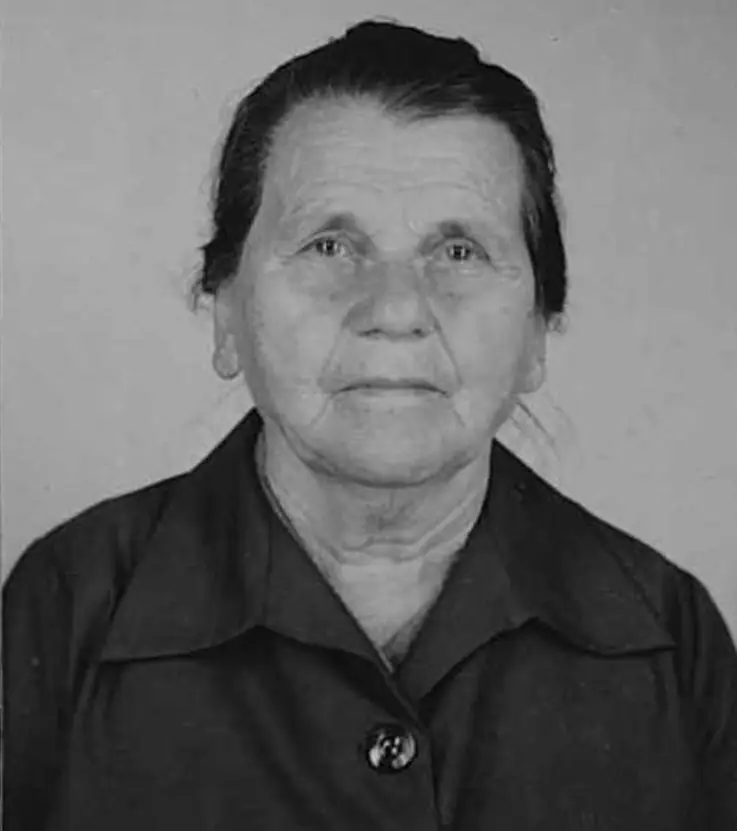

*Maria Luigia Forner, 1896 a 1992, irmã de Rosa.*

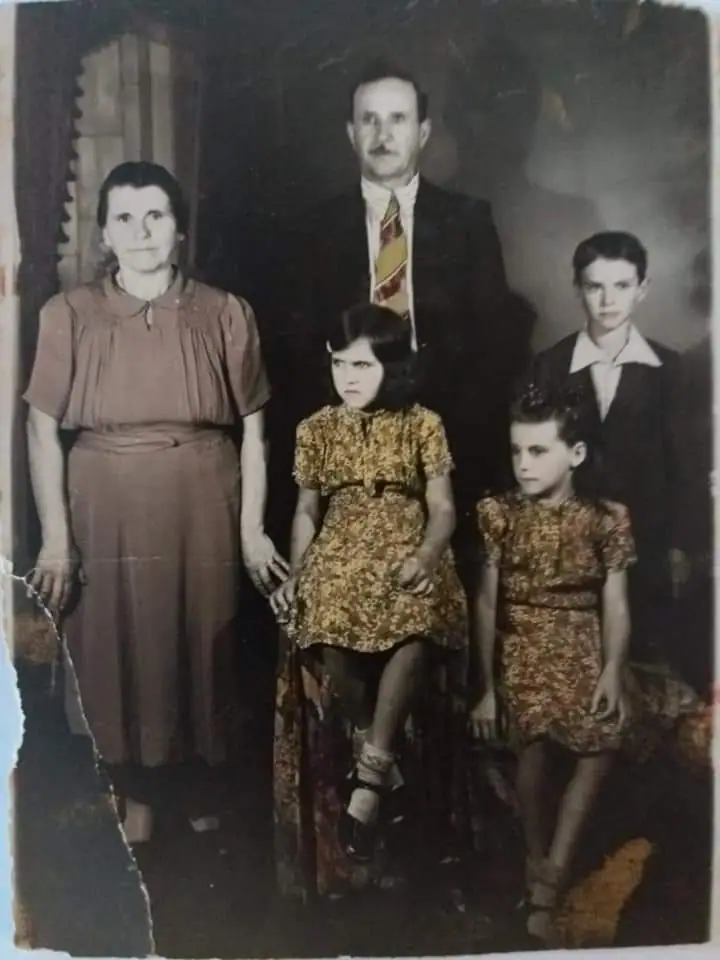

*Maria Luigia Forner e Angelo Dei Agnoli com os filhos.*

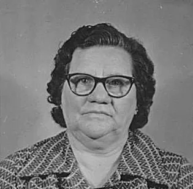

***Gina Oliva Dei Agnoli**, nascida em 28 de março de 1920. Tinha sete anos na noite do naufrágio. Uma das duas meninas que podem ter achado o pai.*

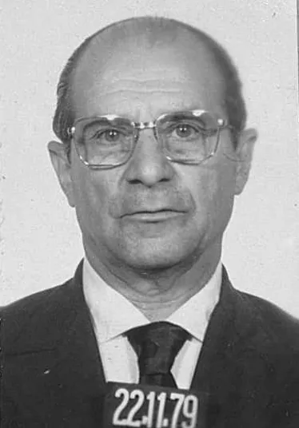

***Rino Dei Agnoli**, nascido em 26 de janeiro de 1923. Tinha quatro anos. Fotografia de documento, 22 de novembro de 1979.*

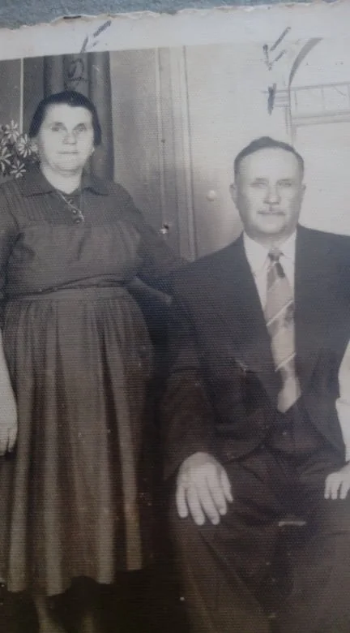

*Maria Luigia Forner e Angelo Dei Agnoli. Ela sobreviveu ao naufrágio com quatro filhos; ele esperava do outro lado, e tinha atravessado no mesmo navio seis meses antes.*

## 21. Terra vermelha

> Grama, o café, e a palavra que decidiu tudo: espontâneos.

O destino era Grama.

Hoje se chama São Sebastião da Grama. É um município pequeno no nordeste do estado de São Paulo, na região que se chamava Mogiana, e naquela época pertencia à comarca de São José do Rio Pardo.

Eu sei disso por dois papéis: um carimbo da Delegacia de Polícia de Grama no registro de estrangeiro de Angelo Dei Agnoli, e um assento de casamento, o número 660 do cartório de Grama, lavrado vinte anos depois.

É terra de café.

O solo daquela região é vermelho, quase alaranjado quando seco e quase roxo quando molhado. Vem de basalto decomposto, é fundo, é fértil, e foi ele que fez a riqueza do café paulista.

Chamam de *terra roxa*. Conta-se que o nome veio dos próprios italianos, que diziam *rossa*, e que o ouvido brasileiro transformou em roxa. Não sei se é verdade. É o tipo de história que um lugar conta de si mesmo, e eu registro como tal.

Na folha do *Alhena* há uma palavra que aparece duas vezes.

**Espontâneos.**

Está na parte do intérprete — *entregou 1 lista com 50 immigrantes sendo todos em terceira classe, espontaneos* — e está outra vez no resumo do desembarque.

É a palavra mais importante daquele documento para entender o que aconteceu com esta família depois.

Para dizer o que ela significa, eu preciso mostrar o que aquelas sete pessoas *não* foram.

Quatro anos antes, o mesmo navio fez a mesma rota com outro tipo de gente a bordo. Está anexado à lista de fevereiro de 1923, num formulário diferente de todos os outros:

*RELAÇÃO dos immigrantes ITALIANOS AGRICOLTORES embarcados no Porto de GENOVA c/ o Vap. “PRINCIPESSA MAFALDA”… em virtude do Decreto N. 2400 de 13 de julho de 1918, por conta da Companhia Commercial de SÃO PAULO.*

Sessenta e sete pessoas, dez famílias. E aquele formulário tem uma coluna que a lista comum não tem.

**Patrão.**

Preenchida antes do embarque, com o destino já resolvido: Chavantes. Barreiro. Fazenda Guatapará. S. Simão. E o mesmo nome repetido linha após linha, *Dr. Ralpho P. Silva*.

E no pé da folha, a conta: *TESTE N° 67, POSTI N° 57 1/4*. Sessenta e sete cabeças contra cinquenta e sete passagens e um quarto, porque criança pequena valia fração de bilhete.

Aquelas pessoas atravessaram o Atlântico com o nome do dono do trabalho delas já escrito no papel, antes de terem pisado no Brasil.

Iam na terceira classe, no mesmo porão, ao lado de quem tinha comprado a passagem.

Do lado de fora não havia diferença nenhuma. A mesma comida, o mesmo beliche, a mesma água, o mesmo cheiro.

A diferença estava no formulário.

**E Rosa não estava nesse formulário.**

Ela não foi recrutada. Não teve passagem paga pelo Estado de São Paulo, não tinha patrão declarado, não seguiu para fazenda nenhuma.

Ela veio encontrar o marido.

**Reunião familiar, não colonização.** É uma distinção que parece burocrática e que decide uma vida inteira.

Quem vinha pelo sistema de colonato chegava devendo.

Devia a passagem, ou o adiantamento, ou as duas coisas. Cuidava de um número contratado de pés de café, comprava no armazém da própria fazenda, e levava anos para saber se a conta andava para a frente ou para trás.

Quem vinha por conta própria chegava sem nada. Sem casa, sem ferramenta, sem adiantamento, sem promessa.

**Mas chegava sem dono.**

Fausto Miotto era agricultor na Itália e foi agricultor aqui.

Não por escolha. Um homem de vinte e três anos, sem uma palavra de português, sem terra, sem instrução formal e sem ofício urbano faz no Brasil a única coisa que sabe fazer.

A diferença é que na Itália ele trabalhava numa encosta pequena, de onde uma família tirava polenta, e aqui foi trabalhar numa terra vasta, fértil e de outra pessoa.

Angelo Dei Agnoli já estava em Grama havia seis meses quando as duas irmãs chegaram.

Tinha onde dormir e tinha trabalho. É por isso que o destino declarado das duas famílias, no Rio e depois em São Paulo, era o mesmo lugar.

A cadeia é simples e é a de sempre: um homem vem primeiro, se estabelece e chama. Angelo chamou Maria Luigia e os quatro filhos. Fausto chamou Rosa e o Enrico.

As duas irmãs vieram no mesmo navio porque foram chamadas para o mesmo lugar.

Em 10 de novembro de 1928, em Grama, nasceu Erminda Miotto.

Treze meses depois do naufrágio.

A primeira brasileira desta família.

Vale parar nessa conta.

Em pouco mais de um ano, aquelas pessoas caíram no Atlântico, perderam tudo o que traziam, foram recolhidas por navios estrangeiros, desembarcaram no Rio, atravessaram para São Paulo, deram entrada numa hospedaria de imigrantes, pegaram um trem para o interior, arrumaram trabalho, montaram uma casa e tiveram um filho.

Não houve luto público. Não houve indenização. Não houve pausa.

Ninguém deu a eles um ano para se recuperar, e eu desconfio que nem lhes tenha ocorrido pedir.

Depois de Erminda vieram Nair, Maria Therezinha, Izaira, Fermino, Mafalda, Rosalia, Luiz, Dionísio, e mais uma.

Onze filhos ao todo, contando o Enrico. Dez nascidos no Brasil.

Nem todos chegaram à idade adulta. Rosalia nasceu em 1940 e morreu em 1941, e naquele lugar e naquela época isso não era exceção.

A Parte I deste livro se chama *A terra que não bastava*.

Rosa e Fausto atravessaram um oceano, sobreviveram a um naufrágio e foram parar numa terra que bastava e que não era deles.

**Chegaram pretas de carvão e foram trabalhar em terra vermelha.**

## 22. Enrico

> 1926 a 1998. Cinco documentos, e nada além do que eles dizem.

Enrico Miotto nasceu em 10 de outubro de 1926, na Itália.

Morreu em 6 de outubro de 1998, no Conjunto Hospitalar de Sorocaba.

Entre uma data e a outra há setenta e um anos e cinco documentos. Este capítulo é feito com eles, e não vai ter aqui nada que eles não digam.

Ele tinha um ano e quinze dias quando o navio afundou.

Estava no colo da mãe, na terceira classe, no porão. Não escolheu nada, não entendeu nada e não se lembrou de nada.

É o passageiro deste livro que menos participou da própria história.

Em 31 de outubro de 1927 ele entrou na Hospedaria do Brás como segunda linha da família 19270.

ENRICO, 1 ano.

Sem sobrenome. Nas listas de imigração o sobrenome se escreve uma vez, na linha do chefe, e vale para todos os que vêm embaixo.

Depois disso ele some dos meus papéis por vinte e dois anos.

Cresceu em Grama, entre os irmãos que foram nascendo. Não achei registro escolar, não achei certidão de nada, não achei fotografia com data.

O que aconteceu com ele entre 1927 e 1949, eu não sei.

E aí ele reaparece, numa repartição de São Paulo, em 29 de dezembro de 1949.

*Registro de Estrangeiros.*

Vinte e três anos. Solteiro. Profissão: pedreiro. Endereço: Parque São Jorge, sem número, Penha, São Paulo, capital. RG 1.335.902, carteira 308.460.

Nacionalidade: italiana.

Vinte e dois anos depois de chegar, ele ainda era italiano.

Se chegou a se naturalizar em algum momento, eu não achei o papel.

Aquele documento prova uma coisa que nenhum outro prova sozinho.

Criança nascida no Brasil não precisa de registro de estrangeiro.

Se Enrico teve que tirar um, aos vinte e três anos, é porque sabia que tinha nascido do outro lado. E alguém contou isso a ele.

**Enrico sabia que tinha estado naquele navio.** Rosa contou a mesma história aos dois filhos: a ele, o primeiro, e à Mafalda, que nasceria dez anos depois com o nome do navio.

E ele saiu da terra.

O pai era agricultor. Os irmãos ficaram no interior. Enrico foi para a capital e virou pedreiro, na Penha, do outro lado da cidade.

Era pedreiro em São Paulo na década de 1950, que é quando São Paulo cresceu mais depressa.

Solteiro em 1949, aos vinte e três.

Solteiro em 1998, aos setenta e um.

Nunca se casou e não teve filhos. Os dois documentos que eu tenho, separados por quase cinquenta anos, dizem a mesma coisa nessa linha.

Morreu de câncer.

A certidão registra insuficiência respiratória como causa direta, e desnutrição. Declaração de Óbito nº 5501831.

Setenta e um anos, aposentado, morador da Rua Cervantes, 607, Vila Assis, Sorocaba.

Enrico Miotto atravessou o Atlântico antes de aprender a andar.

Sobreviveu a um naufrágio antes de aprender a falar.

Não se lembrava de nada daquilo, e sabia de tudo aquilo, porque a mãe contou.

Foi em 6 de outubro.

Ele faria setenta e dois no dia 10.

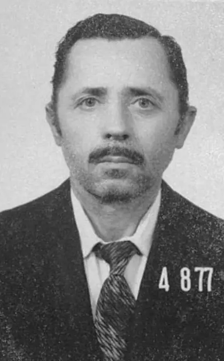

*Enrico Miotto, 1926 a 1998. Tinha um ano e quinze dias na noite do naufrágio.*

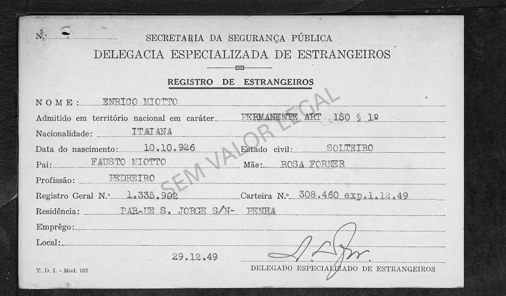

*Registro de Estrangeiros de Enrico Miotto, 29 de dezembro de 1949. Data de nascimento: 10.10.1926.*

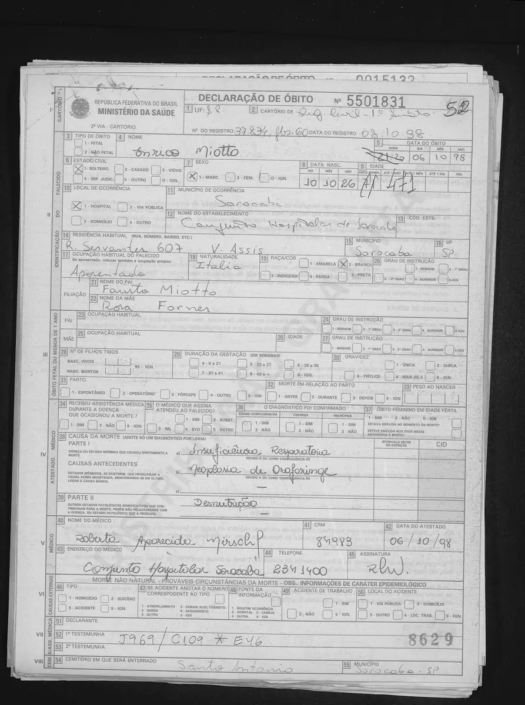

*Declaração de Óbito nº 5501831. Sorocaba, 6 de outubro de 1998. Aposentado, solteiro, natural da Itália, filho de Fausto Miotto e Rosa Forner. Sepultado no Cemitério Santo Antônio. *O nome, o registro profissional, o telefone e a assinatura do médico que atestou o óbito foram tarjados nesta reprodução: ele é a única pessoa deste documento que não pertence à família e não escolheu estar neste livro.**

## 23. 1937

> A menina recebe o nome do navio, e a objeção que essa frase precisa aguentar.

Em 2 de janeiro de 1937, Rosa Forner teve o sétimo filho. Uma menina.

E botou nela o nome do navio.

Essa é a frase que fez este livro existir.

Eu a ouvi pela primeira vez sem entender direito o que ela queria dizer, e depois passei a não conseguir pensar em outra coisa. Uma mulher que quase morreu num naufrágio com um bebê de um ano no colo dá a uma filha, dez anos depois, o nome do navio que afundou.

É uma frase perfeita.

E é exatamente por isso que ela precisa apanhar um pouco antes de eu deixar que fique de pé.

A primeira objeção é a mais óbvia, e é a mais forte.

**Mafalda não era um nome esquisito na Itália.**

Mafalda di Savoia nasceu em 1902, filha de Vittorio Emanuele III, rei da Itália. Era princesa de sangue, casou com um príncipe alemão em 1925, saía em jornal e em revista, e em 1937 estava viva e tinha trinta e quatro anos.

O navio não deu o nome a ela. **Ela deu o nome ao navio.** Quando o casco foi batizado, em 1908, escolheram o nome da filha do rei.

Então uma italiana batizando uma filha de Mafalda em 1937 pode simplesmente estar fazendo o que muitas italianas da geração dela fizeram.

Pode ser nome da moda. Pode ser devoção monárquica. Pode ser porque achava bonito.

Se for isso, este livro perde a pergunta que o organiza. E eu prefiro admitir a possibilidade agora a deixar que um leitor a admita por mim no meio do capítulo.

A segunda objeção é de tempo.

Em janeiro de 1937 o naufrágio tinha dez anos.

Não era ferida aberta. Era coisa de uma década antes, em outro oceano, numa vida que já tinha virado completamente outra. Rosa tinha trinta e três anos, seis filhos vivos, uma casa no interior de São Paulo e uma língua nova mais ou menos na boca.

Quem passa por uma coisa dessas costuma querer distância. Botar o nome do navio numa filha é o contrário de distância.

Há uma terceira objeção, que ninguém levanta e que eu levanto porque seria desonesto não levantar.

**Eu quero que a história seja verdadeira.**

Sou bisneto de Rosa. Cresci ouvindo isso. De todos os capítulos deste livro, este é o que eu mais queria escrever.

Um autor nessa posição é a pessoa menos confiável do mundo para julgar a própria tese.

Então eu fui procurar alguma coisa que não dependesse de mim.

Achei numa lista de nomes.

Rosa e Fausto tiveram onze filhos.

Enrico, nascido na Itália em 1926. Erminda, 1928. Nair, 1931. Maria Therezinha, 1932. Izaira, 1932. Fermino, 1934. **MAFALDA**, 1937. Rosalia, 1940. Luiz, 1942. Dionísio, 1949. E mais uma.

Leia a série de novo e olhe o que ela faz.

O primeiro filho nasceu na Itália e tem nome italiano. Depois dele, a casa começa a batizar em português: Nair, Izaira, Luiz, Maria Therezinha. São nomes brasileiros de menino e de menina dos anos 1930, e não são nomes que se dão em Castelcucco.

Aquela família estava fazendo o que toda família de imigrante faz a partir da segunda leva de filhos: virando daqui.

E aí, no sétimo, Mafalda.

Não Maria, não Ana, não Teresa. Não um nome italiano corriqueiro. Um nome da Casa de Savoia, no meio de uma sequência de nomes brasileiros, numa casa de agricultor no interior paulista, dez anos depois de a mãe ter sido tirada da água de um navio que se chamava assim.

**Não é prova. É um padrão com um furo, e o furo tem nome.**

E não é um furo qualquer. É o único.

De onze filhos, dez foram batizados dentro de uma lógica: o primeiro italiano porque nasceu lá, os outros brasileiros porque nasceram aqui.

Uma só escapa da regra. E a que escapa carrega exatamente as sete letras que estavam pintadas na proa.

Falta dizer onde ela nasceu, e aí aparece uma coincidência que eu não esperava.

A certidão de casamento de Mafalda, de 1954, reemitida em 1981 na cidade de Nova Fátima, diz que ela nasceu em São José do Rio Pardo.

Só que a família morava em Grama. E Grama, naquela época, era município da comarca de São José do Rio Pardo.

O escrivão quase certamente escreveu a jurisdição no lugar do lugar.

Isso já tinha acontecido antes, do outro lado do oceano, com a mãe dela.

Em 1926, o oficial de Castelcucco fez a mesma coisa com a naturalidade de Rosa.

Dois cartórios, dois países, onze anos de distância, e o mesmo hábito de funcionário. Mãe e filha têm o próprio lugar de nascimento levemente errado no papel, pelo mesmo motivo.

É a coisa mais parecida com herança que eu encontrei em documento neste projeto inteiro.

E a pergunta continua de pé, e continua sem resposta.

Eu tenho a data, tenho a lista de nomes, tenho o padrão e tenho o furo. Não tenho a única coisa que resolveria isso: alguém que estivesse naquela casa e que tivesse perguntado à Rosa por que aquele nome.

Só que essa pessoa existe.

Ela nasceu em 2 de janeiro de 1937.

Está viva.

E se chama Mafalda.

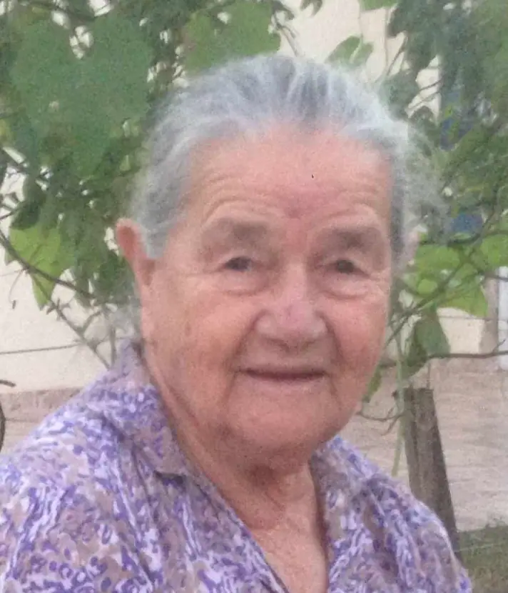

*Mafalda Miotto Terra, nascida em 1937, dez anos depois do naufrágio, com o nome do navio.*

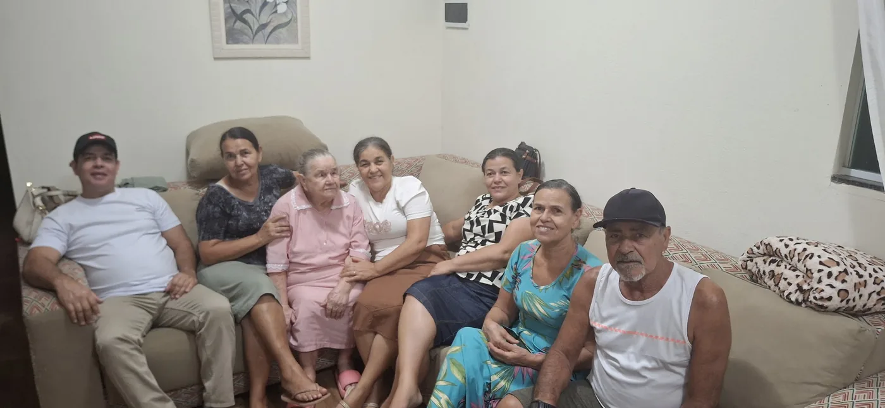

*Mafalda e os filhos: Dionísio, Edna, Mafalda, Inês, Kênia, Marta e Siri. Falta o João.*

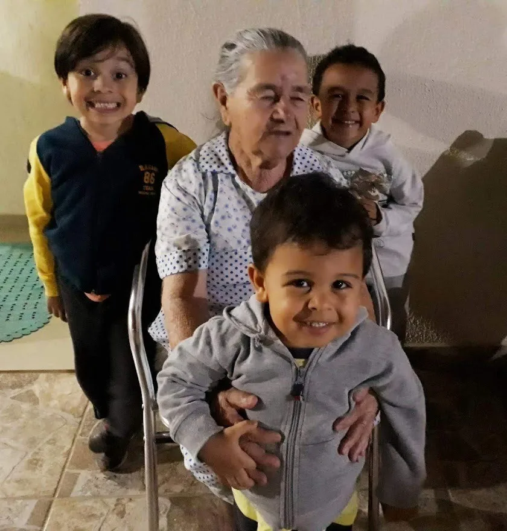

*Mafalda e os bisnetos.*

## 24. Virar brasileiro

> A língua que some em duas gerações, e os sobrenomes que saem da linha em três.

Ninguém vira brasileiro num dia.

Vira devagar, ao longo de uma vida inteira. E depois vira de repente, por decreto, sem ter sido consultado.

A parte devagar já apareceu neste livro sem que eu percebesse que era ela.

Está na lista dos filhos.

Enrico nasceu na Itália e tem nome italiano. Erminda, Nair, Maria Therezinha, Izaira, Fermino, Rosalia, Luiz e Dionísio nasceram aqui e têm nome daqui.

Uma família não decide num dia parar de ser italiana. Ela vai batizando os filhos e, sem anunciar nada a ninguém, muda de língua no meio da própria descendência.

A parte de repente começou dez meses depois de Mafalda nascer.

Em novembro de 1937, Getúlio Vargas fechou o Congresso e instaurou o Estado Novo. Com ele veio a campanha de nacionalização.

Escolas em língua estrangeira, fechadas. Jornal em língua estrangeira, proibido. Associações de imigrantes, sob controle. E, em vários lugares, proibido falar a língua em público.

É preciso entender o que uma lei dessas quer dizer dentro de uma casa.

Não é uma lei sobre bandeira e sobre hino.

**É uma lei sobre a boca.**

Um homem e uma mulher que chegaram adultos, que falavam dialeto vêneto entre si e português tropeçado na rua, passaram a viver num país onde a língua em que eles pensavam tinha virado problema.

Em agosto de 1942, o Brasil declarou guerra à Itália.

Rosa Forner e Fausto Miotto moravam aqui havia quinze anos, tinham sete filhos brasileiros e trabalhavam a terra de outra pessoa no interior de São Paulo.

De um dia para o outro, viraram súditos do Eixo.

Carteira de estrangeiro obrigatória. Restrição de circulação. Registro em delegacia.

É aqui que um papel deste acervo deixa de ser curiosidade de arquivo.

O registro de estrangeiro de Angelo Dei Agnoli, com o carimbo da Delegacia de Polícia de Grama, foi o documento que me provou para onde a família tinha ido. Eu o usei como pista de geografia.

Ele não foi feito para isso. **Foi feito para vigiar.**

Aquele carimbo era a prova de que o Estado sabia onde ele morava. E não tê-lo era um problema muito maior do que tê-lo.

Eu não sei o que aconteceu com esta família naqueles anos.

Não achei processo, não achei multa, não achei denúncia, não achei apreensão. É perfeitamente possível que não tenha acontecido nada: eram agricultores no interior, longe de porto e de colônia grande, e a máquina da guerra apertou muito mais em Santa Catarina e no Rio Grande do Sul do que numa cidade de café da Mogiana.

O que dá para dizer é que a lei valia para eles.

Há uma coisa que o documento diz sozinho.

Em 29 de dezembro de 1949 — quatro anos depois do fim da guerra, vinte e dois anos depois de ter atravessado o Atlântico com um ano de idade e de ter sido pescado de um naufrágio — Enrico Miotto ainda era italiano.

Não é descuido. Naturalizar custava dinheiro, tempo e papel, e para um pedreiro de vinte e três anos não resolvia nada de prático.

Ninguém vira brasileiro porque quer. Vira porque nasceu, ou porque compensa.

O que eu não tenho é o dentro da casa.

O que se falava à mesa. O que se cozinhava no domingo. Em que língua se rezava, se é que se rezava. Se o dialeto servia para conversar, ou só para brigar e para contar segredo na frente das crianças. Se alguém ensinou uma palavra de italiano a alguém de propósito, ou se todos deixaram cair.

Nenhum arquivo guarda isso. Não existe cartório de cozinha.

É a parte da história que só existe na cabeça de quem estava lá — e a única pessoa que estava lá e ainda pode contar nasceu em 2 de janeiro de 1937.

O que dá para medir é a velocidade.

Na lista do *Alhena*, em 1927, a coluna Instrução diz Sim para Rosa Forner. Ela sabia ler, em italiano, num tempo e num lugar em que muita gente não sabia ler em língua nenhuma.

Os netos dela não falam italiano.

**Duas gerações.** É esse o prazo.

Existe um marcador ainda mais frio, que eu só enxerguei quando montei a árvore inteira numa página só.

Rosa **Forner** casou com Fausto Miotto, e teve Mafalda **Miotto**.

Mafalda Miotto casou com José Mariano Terra, e teve Marta **Terra**.

Marta Terra casou com Carlos de Andrade, e teve João de **Andrade**.

Em três gerações, por três casamentos, os dois sobrenomes que atravessaram o Atlântico saíram da linha.

Forner durou uma geração. Miotto durou duas.

O bisneto que está escrevendo este livro não se chama nem Forner nem Miotto.

Não houve perda nenhuma nisso, no sentido em que se costuma falar de perda.

Ninguém foi apagado, ninguém foi obrigado a trocar de nome, nenhuma dessas três mulheres foi coagida a coisa alguma. Casaram com quem quiseram e adotaram o sobrenome do marido, que era o que se fazia.

**Virar brasileiro, nesta família, foi isso: uma sequência de mulheres trocando de nome, e cada troca afastando um pouco mais a linha do porto de onde ela saiu.**

Talvez seja por isso que a memória desta família passou por mulher.

O sobrenome foi embora pelo lado dos homens. A história ficou do outro.

Rosa contou ao Enrico e contou à Mafalda. Mafalda contou à Marta. E chegou a mim.

No outro galho foi diferente, e vale reparar: o que a Pulcheria viu passou primeiro pelo marido dela, e só então chegou à neta, e da neta a mim. Do lado da Rosa a memória desceu por mulheres. Do lado da Maria Luigia, atravessou um homem no meio do caminho.

**Quatro gerações de gente que não se chama Forner carregando o que aconteceu com uma mulher chamada Forner.**

## 25. Os que ficaram, cem anos depois

> O ramo do Sante. Ficar não produz documento — e o site que reencontrou a família.

Vincenzo Forner e Santa Pandolfo tiveram dez filhos.

Este livro seguiu dois deles através de um oceano: Rosa, a nona, e Maria Luigia, a sexta.

Este capítulo é sobre o quarto.

Sante Forner nasceu em 16 de abril de 1893, em Monfumo.

Foi para a Grande Guerra, esteve nos Alpes, e voltou com três medalhas que a família mandou emoldurar.

Aquele quadro existe até hoje. Nunca atravessou o oceano.

E ele ficou.

Não por coragem, não por apego, não por nenhuma razão que alguém tenha escrito num papel. Ficou porque ficar também é uma decisão, e é a única das duas que não deixa rastro.

Aqui é preciso admitir uma assimetria que atravessa este livro inteiro.

**Este livro existe porque uma parte da família foi embora.**

Ir embora produz documento. Produz lista de embarque, manifesto, folha de desembarque, registro de estrangeiro, livro de hospedaria, carimbo de delegacia. Cada fronteira que uma pessoa cruza gera um papel, porque alguém do outro lado quer saber quem entrou.

**Ficar não produz quase nada.**

O resultado é constrangedor, e eu vou dizer com todas as letras:

Eu sei mais sobre quatro dias da vida de Rosa Forner em outubro de 1927 do que sobre os cinquenta e quatro anos inteiros de vida do irmão dela.

Tenho a hora em que ela nasceu. Tenho a cabine em que ela viajou, o número da família dela numa hospedaria, a profissão que ela declarou, o destino que ela deu e o fato de que sabia ler.

Do Sante eu tenho uma data de nascimento, três medalhas, uma carteira de identidade e um ano de morte.

Aquela carteira de identidade é o exemplo perfeito do problema.

Ele a tirou no comune de Asolo, em março de 1940. Ela existe neste projeto não pelo que diz sobre ele, mas pelo que diz sobre o pai dele: foi a linha *Padre: di Vincenzo* que me provou que o velho ainda estava vivo naquele mês.

**O homem que ficou aparece no meu arquivo como testemunha da vida de outra pessoa.**

E é aqui que a régua deste capítulo se quebra.

Em setembro de 2026 eu soube como Sante Forner morreu, e quanto tempo ele levou para morrer.

Três ou quatro dias.

Exatamente o tamanho do único pedaço da vida da irmã dele que este livro conseguiu reconstituir hora a hora.

Isso não saiu de arquivo nenhum, e não sairia nunca.

Saiu de um homem que mora a poucos quilômetros daquela mina, que é neto dele, e que um dia resolveu me escrever.

Ficar não produz documento, e isso continua sendo verdade. Mas ficar produz outra coisa, e eu demorei a enxergar: produz gente que ainda está lá para contar.

**O lado que passou cem anos produzindo papel é o lado que não sabia.**

Sante morreu em 1947, aos cinquenta e quatro anos.

Rosa morreu em 1986, aos oitenta e três, no Brasil.

**Depois de outubro de 1927, os dois nunca mais se viram.** Ela sobreviveu a ele por trinta e nove anos, em outro continente.

Se escreveram cartas, eu não sei. Nenhuma sobreviveu deste lado.

Maria Luigia durou ainda mais.

Nasceu em 1896, sobreviveu ao naufrágio aos trinta e um anos com quatro filhos, e morreu em 1992, aos noventa e seis.

Sessenta e cinco anos depois daquela noite. Ela ainda estava viva quando eu nasci.

E do lado de lá a linha continuou.

Sante teve Galliano. Galliano teve Giorgio.

Três gerações no mesmo canto do Vêneto, enquanto cinco aconteciam aqui.

Ponha as duas colunas lado a lado e olhe o que elas fazem.

Deste lado: Rosa, 1903. Mafalda, 1937. Marta, 1960. João, 1984. João Luca, 2012. Cinco gerações, e o sobrenome sumiu na terceira.

Do lado de lá: Sante, 1893. Galliano. Giorgio.

**A linha que ficou seguiu por homens. A linha que foi seguiu por mulheres.**

É por isso que lá o nome está inteiro e aqui ele acabou. Não foi o oceano que comeu o sobrenome. Foi a sequência de quem teve filha.

Cem anos de separação não são uma história dramática.

Não houve briga, não houve rompimento, não houve carta rasgada. Duas famílias tocaram a própria vida, cada uma no seu lugar, e a distância fez o que a distância faz: primeiro vira notícia rara, depois vira nome numa história antiga, depois vira nada.

Em algum ponto entre 1927 e hoje, os dois lados desta família pararam de saber que o outro existia.

E aí a coisa se desfez de um jeito que ninguém teria imaginado.

Eu estava montando a árvore da minha família num site de genealogia. Botando nome, data, lugar, um por um.

Do outro lado do Brasil, Patrícia Betti estava fazendo exatamente a mesma coisa, ao mesmo tempo, sem me conhecer.

Ela é neta da Pulcheria — a menina de seis anos da cozinha — e bisneta de Maria Luigia.

E então nós dois chegamos nos nossos avós.

**As duas árvores se tocaram.**

Não fui eu que a achei, e não foi ela que me achou. Foi o banco de dados que percebeu, porque duas pessoas tinham digitado o mesmo casal do século XIX em duas cidades diferentes.

Vincenzo Forner e Santa Pandolfo, mortos havia mais de um século, apresentaram um ao outro dois bisnetos que não sabiam da existência um do outro.

Depois disso a gente conversou muito, e continua conversando.

Unificamos as raízes, juntamos o que cada um tinha, e boa parte do que este livro conta veio dessas conversas. O navio de carvão veio daí. A hospedaria veio daí. Os dois homens que passaram os olhos por elas e não as reconheceram vieram daí.

E de outra prima, de outro ramo desta mesma família, veio o resto: o cozinheiro que desceu ao porão e a menina que achou o pai no meio da multidão.

**Sem essas conversas, o capítulo mais importante deste livro seria uma lista de nomes numa folha holandesa.**

E foi por elas, pelas primas que apareceram do outro lado do Brasil, que eu cheguei ao Giorgio.

O neto do irmão que ficou.

Cem anos, um oceano e uma guerra depois, a família que se dividiu em Monfumo voltou a se falar porque quatro ou cinco pessoas resolveram, mais ou menos ao mesmo tempo, escrever os nomes dos próprios avós num formulário na internet.

O quadro com as três medalhas continua na Itália.

A casa de onde Rosa saiu, se ainda estiver de pé, continua na Itália.

E agora existe alguém do lado de lá que atende quando eu chamo — e que, de vez em quando, chama primeiro.

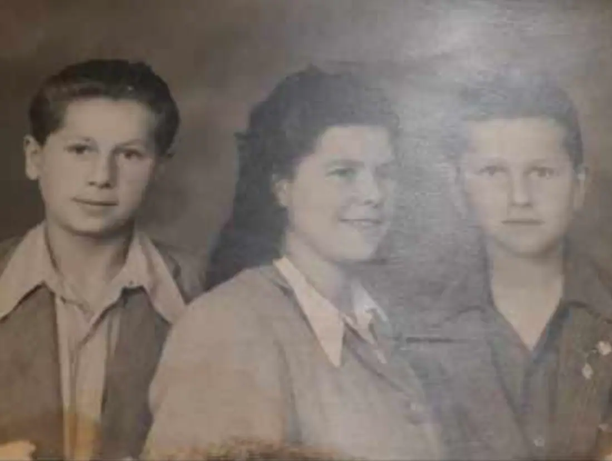

*Sante Forner e família, na Itália.*

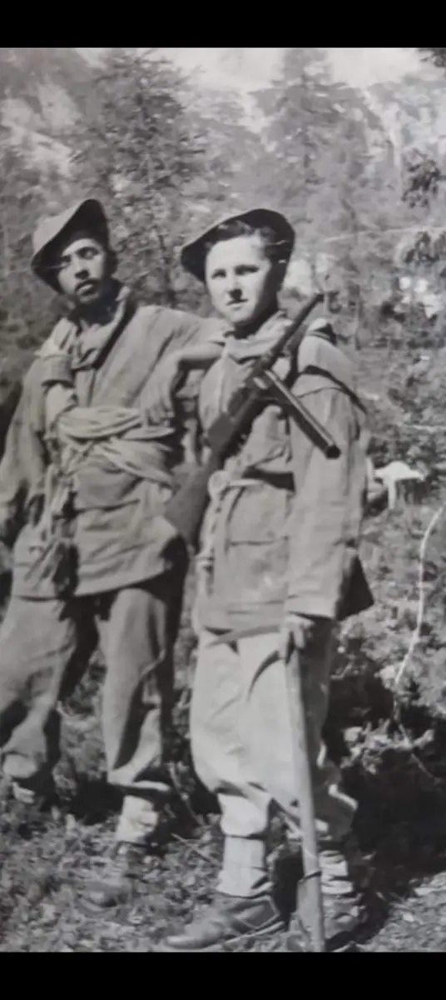

*Galliano Forner, filho de Sante, com as tropas alpinas em 1950.*

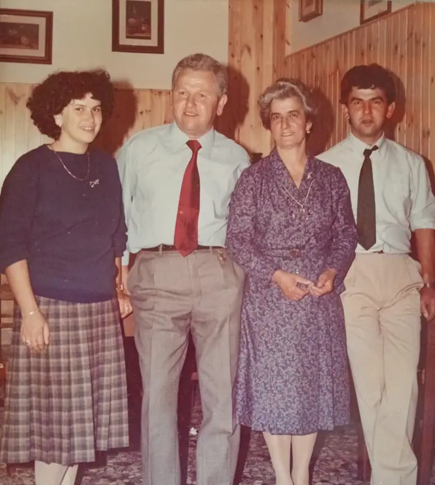

*Giorgio Forner e família, o ramo que permaneceu no Vêneto.*

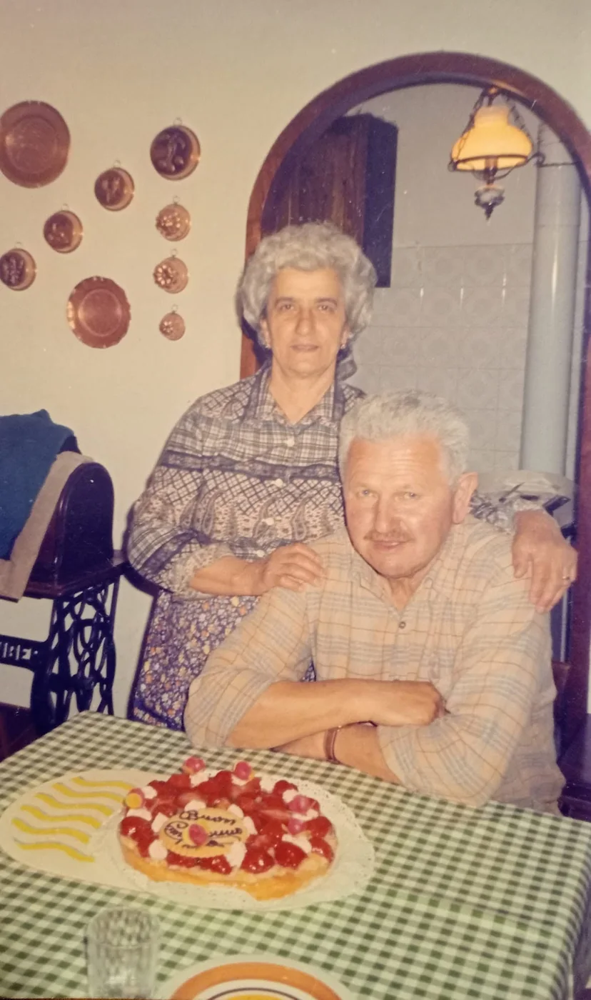

*Galliano Forner, filho de Sante, e a mulher.*

*Giorgio Forner e o pai, Galliano. Três gerações do ramo que ficou cabem em duas fotografias: Sante, Galliano, Giorgio.*

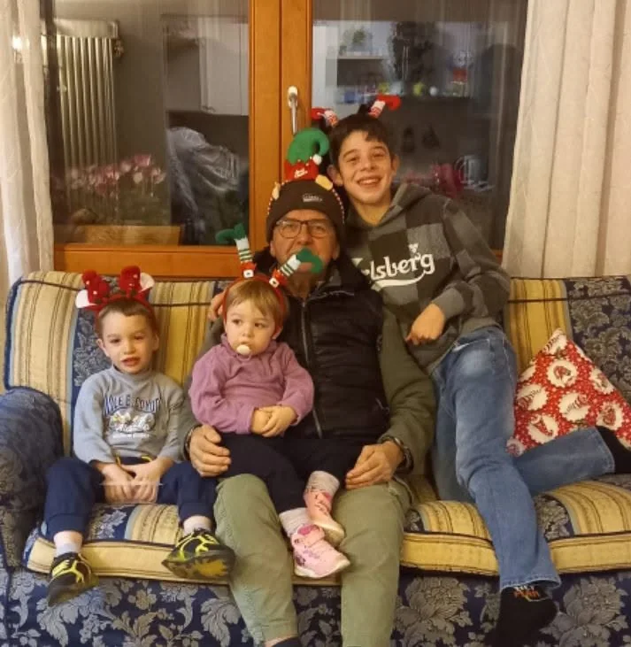

*Giorgio Forner e os netos, no Vêneto. A quinta geração da casa que não atravessou.*

## 26. A busca

> Como o papel mente, como a memória mente, e o que custa começar tarde.

Tudo o que existe neste livro e não é lembrança de família veio de papel.

E papel mente. Não do jeito que se imagina — quase nunca por má-fé. Mente porque foi escrito depressa, porque o escrivão ouviu errado, porque a pessoa que respondeu não sabia, porque o formulário não tinha campo para a verdade.

Este capítulo é sobre isso, e sobre uma coisa pior que descobri no caminho.

Comecemos por um quadro numa parede.

Existe, num livro sobre Castelcucco, uma árvore genealógica impressa da família Forner. Ela traz catorze nomes de filhos, distribuídos em duas fileiras.

Angela, 1886. Pietro, 1889. Martino, 1891. Sante, 1893. Bonfiglio, 1898. Giulio, 1900. Rosa. Maria M., 1907.

E depois: Angela, 1898. Onorato, 1900. Alessandro Domenico, 1903. Ausilio Fortunato e Roberto, gêmeos de 1908. Francesco, 1913.

Lida corrida, a lista diz o que não é: catorze filhos de um casal só.

Foi preciso ampliar a fotografia do quadro para enxergar por quê.

Descendo pela direita, a partir de Cadonà Maria Teresa, nascida em Monfumo em 1869 e casada com Abele Alessandro Forner — irmão de Vincenzo —, há uma linha vertical.

Ela passa ao lado da primeira fileira sem tocar em nada, e vai se ligar à barra horizontal da segunda.

**A segunda fileira não é de Vincenzo. É do irmão dele.**

Oito filhos de Vincenzo e Santa, seis de Abele e Maria Teresa. Um traço de dois centímetros, num quadro impresso, decidindo quem é irmão de quem.

O quadro ainda erra por omissão, de um jeito que só se enxerga cruzando com os índices do comune.

Ele traz oito filhos de Vincenzo e Santa. **Foram dez.**

Faltam Maria Elisabetta, de 1895, e Maria Luigia, de 1896.

Leia esse segundo nome outra vez. A genealogia impressa da família deixou de fora a mulher que atravessou o Atlântico com quatro filhos pequenos e sobreviveu ao naufrágio deste livro.

Não por malícia. Por ser um quadro, e quadro cabe o que cabe.

Aqui está a coisa mais difícil desta pesquisa inteira, e eu levei meses para entender.

**Aquele quadro não está errado.**

Ele está certo, e é ilegível no tamanho em que foi impresso. A linha existe, e faz exatamente o que devia fazer.

A diferença entre um documento errado e um documento mal lido não aparece sozinha. Ela só aparece quando alguém desconfia.

E quando finalmente li o quadro direito, ele tinha um único erro de verdade — e o erro era na minha bisavó. Ali Rosa aparece nascida em 1905. O ato de nascimento do comune de Monfumo diz 24 de junho de 1903.

Depois veio o nome da mãe dela, e esse quase derrubou um capítulo inteiro.

Nos índices de nascimento do comune, a mulher de Vincenzo aparece **seis vezes como Pandolfo Santa**.

No registro de 1893 — justamente o de Sante — aparece como **Pandolfo Domenica**.

E num outro documento, como **Santa Pandelfa**.

Três grafias. Ou é a mesma mulher escrita por três escrivães diferentes, ou são duas mulheres distintas com sobrenome parecido.

Isso não é preciosismo de genealogista. É a diferença entre este livro estar certo ou estar contando a história de outra família.

Se a mulher do registro de 1893 não fosse a mesma dos outros seis, então **Sante não seria irmão de Rosa**. Seria primo, ou meio-irmão, ou nada.

E o capítulo sobre as três medalhas da Grande Guerra seria sobre um homem que não tem parentesco nenhum com esta história.

O que resolveu isso estava dentro de casa o tempo todo.

Numa pasta, entre papéis de família, a *carta d’identità* que Sante Forner tirou no comune de Asolo em 8 de março de 1940.

No campo da filiação, com as duas fórmulas fixas do italiano burocrático:

*Padre: **di** Vincenzo. Madre: **fu** Pandolfo Domenica Santa.*

**Pandolfo Domenica Santa.** As três grafias eram pedaços do mesmo nome inteiro, e cada escrivão tinha escolhido um. E o *di* contra o *fu* dizia, de quebra, que em 1940 o pai estava vivo e a mãe não.

Eu passei semanas escrevendo para arquivos italianos atrás de uma informação que estava numa gaveta em São Paulo.

E aí a busca virou outra coisa, e virou por causa de um cemitério em Vancouver.

Luigi Miotto, pai de Fausto, também emigrou. Não para o Brasil.

Existe neste acervo uma *Registration of Death* da Província da Colúmbia Britânica, número 5509-008734. Ela registra a morte de Louie Miotto, em 15 de agosto de 1955, na chegada ao Vancouver General Hospital.

Setenta e cinco anos. Quarenta e oito anos no Canadá. Lenhador aposentado, vinte e cinco anos de profissão, última vez que trabalhou em 1951. Morava na Prior Street, 566.

Pai: Miotto Jack. Mãe: Fedato Anna.

Jack é como um oficial canadense escreve Giacomo. Fedato é como ele escreve Fidato. São Jacobus Miotto e Anna Fidato — o casal que abre o tronco Miotto deste livro.

Só que o documento tem duas linhas que não fecham.

Diz que ele nasceu em março de 1880. O certificado de casamento de Maser diz que Luigi Miotto tinha vinte e cinco anos em junho de 1900, o que o põe nascendo por volta de 1875.

E no campo do estado civil traz uma palavra só: **Single**.

Ou são dois irmãos diferentes, ambos filhos de Jacobus e Anna, e o Luigi de Vancouver não é o pai de Fausto.

Ou é o mesmo homem — que deixou mulher e um filho de três anos em Castelcucco por volta de 1907, refez a vida do outro lado do mundo, e morreu meio século depois registrado como solteiro por um irmão que ou não sabia, ou não quis dizer.

Fui olhar como essa hipótese tinha entrado na minha pesquisa, e achei a hora exata.

Numa árvore genealógica colaborativa da internet, o Luigi de Vancouver e o Luigi de Monfumo eram, até pouco tempo atrás, dois perfis separados.

Em 18 de novembro de 2024, às onze e vinte e um da manhã, um colaborador que eu não conheço unificou os dois. Preservou o canadense, eliminou o de Monfumo, e deu como motivo o texto padrão que o próprio sistema oferece: *a maioria das informações de dados vitais e de parentescos correspondem*.

**Um clique, num minuto de uma segunda-feira, e o meu bisavô passou a ter um pai que morreu sozinho no Canadá.**

Desfazer não deu.

O sistema desabilita o botão quando já existem edições posteriores à fusão. Foi preciso reconstruir o perfil à mão.

E quem reconstruiu foi um documento brasileiro que estava ali o tempo todo: a declaração de óbito do próprio Fausto, lavrada em 13 de agosto de 1979, em São João da Boa Vista.

Ela nomeia por extenso o pai e a mãe dele: Luigi Miotto e Domenica Ganeo.

Setenta e cinco anos depois de Fausto nascer, do outro lado do oceano, um escrivão paulista escreveu os dois nomes certos.

**Louie Miotto morreu solteiro em Vancouver e não é pai de ninguém desta linha.**

A sepultura no Mountain View Cemetery continua lá, e continua sem ter sido visitada por ninguém desta família. Só mudou de título: pode ser a de um tio-avô, não a de um bisavô.

O que continua aberto é outra coisa, e menor: quem foi o pai do Luigi. A árvore registra um Luigi Miotto nascido em 10 de abril de 1874, em Monfumo, filho de um Giovanni Miotto e de uma Luigia Forner — e *esses perfis não têm nenhum documento anexado*.

Não estou dizendo que aquele colaborador agiu de má-fé. Provavelmente fez o que eu faria.

O ponto é outro, e é sobre a época em que estamos pesquisando.

Um livro velho erra e continua parecendo um livro velho: o papel amarelo avisa o leitor para desconfiar. **Uma árvore colaborativa erra e continua parecendo verdade.** O erro entra com data, hora e justificativa, e no minuto seguinte já não se distingue do resto.

E quando outra pessoa copia aquele nó para a árvore dela, o erro deixa de ter autor.

Agora eu preciso dizer que a memória de família faz exatamente a mesma coisa.

Há uma versão desta história, contada nesta família há décadas, segundo a qual **Rosa embarcou grávida**, e foi por isso que tiraram as duas mulheres do navio: duas mulheres, cinco crianças e uma grávida.

Enrico tinha um ano e quinze dias e estava a bordo — está no Livro 100 da Hospedaria do Brás. E a filha seguinte, Erminda, nasceu em 10 de novembro de 1928, doze meses e meio depois do naufrágio.

Rosa não estava grávida naquele navio. Não há como estar.

Dá para localizar de onde a versão veio.

Quem contava essa história na família era João Betti, marido da Pulcheria, que não estava a bordo e ouviu de quem estava.

Repare no que aconteceu, porque é bonito e não é vergonhoso: uma mulher grávida com um bebê de colo é uma imagem mais forte do que uma mulher com um bebê de colo. **A memória escorrega sempre na direção da imagem que se sustenta melhor.**

E o resto do que ele contou está de pé. Que a terceira classe não tinha preferência. Que elas chegaram pretas de carvão. Que os maridos passaram os olhos por elas e não as reconheceram.

Uma testemunha que erra num detalhe não é uma testemunha ruim. É uma testemunha.

Há ainda uma coisa que só ficou visível quando os dois lados desta família voltaram a se falar.

Um galho guardou o cozinheiro de pele escura e a menina que acha o pai no meio da multidão.

O outro galho guardou o carvão, a hospedaria e os dois homens procurando sem achar.

**Nenhum dos dois está mentindo. Nenhum dos dois está inteiro.**

Foi preciso um site de genealogia, cem anos e duas pessoas digitando os próprios avós para que aquela noite voltasse a ter começo e fim ao mesmo tempo.

Aqui vem a parte que não tem conserto.

Pulcheria Pasqua Dei Agnoli morreu em 2013.

A menina de seis anos que estava na cozinha daquele navio, que viu tudo, que viveu noventa e dois anos — estava viva, no Brasil, quando eu já era um adulto feito.

Maria Luigia morreu em 1992, aos noventa e seis anos, sessenta e cinco anos depois de ter atravessado aquela noite com quatro filhos pequenos. Eu era menino.

As duas estavam vivas, neste país, e eu não sabia que existiam.

Então este capítulo não é sobre papel velho.

Eu sei ler *di* e *fu*. Sei que uma linha de dois centímetros muda uma família inteira. Sei que uma árvore da internet erra com hora marcada. Aprendi tudo isso, e aprender foi a parte fácil.

Nenhum arquivo do mundo me devolve vinte minutos de conversa com uma mulher de noventa e dois anos que estava lá.

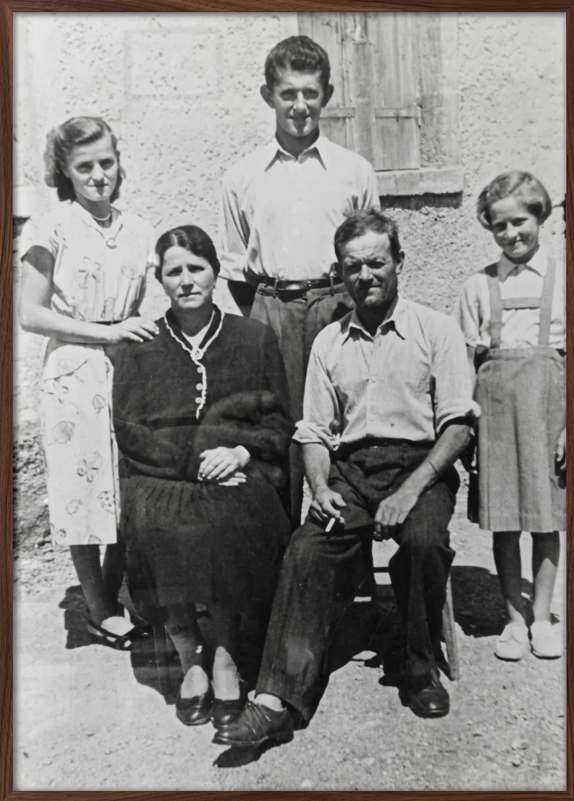

*Miotto Amabile Veronica, irmã de Fausto, com o marido Parisotto Lucindo e a família. Segundo Giorgio, uma das filhas, Valeria, **vive em Vancouver**.*

## 27. A casa

> Escrito por quem nunca esteve lá. A porta por onde Rosa saiu, vista de longe.

Eu nunca estive na Itália.

Este capítulo era para ser escrito lá — em Castelcucco, com a casa na frente. Está sendo escrito no Brasil, com fotografia, mapa e o que um primo me contou por telefone.

Vou dizer o que sei e como sei, e o que não sei fica em branco até eu ir.

A vila tem pouco mais de oito quilômetros quadrados e fica a cento e oitenta e nove metros acima do mar, no sopé do Monte Grappa.

Isso eu já escrevi no primeiro capítulo, e escrevi para descrever 1861.

Vale para hoje. Um lugar daquele tamanho, encostado numa montanha, não vira cidade. Ele continua sendo o que era, com carro na estrada e telhado novo.

A montanha é a única coisa desta história inteira que não mudou.

Mil setecentos e setenta e cinco metros. Estava lá quando Luigi Forner nasceu em 1817, quando Sante subiu para a guerra em 1915, e quando Rosa desceu a estrada pela última vez em 1927.

Quem chega hoje de carro vê exatamente o que eles viam da janela.

E ficaram coisas lá.

O quadro com as três medalhas de guerra do Sante, emoldurado pela família e pendurado numa parede há quase um século. O retrato do Galliano, filho dele, fardado com as tropas alpinas em 1950, também emoldurado.

Nenhum dos dois atravessou o oceano. Eu os conheço por fotografia de fotografia.

E existe a casa.

Giorgio Forner — neto do Sante, o ramo que ficou — mora na região e já esteve nela. Foi ele quem me mostrou.

Eu não sei o número da porta. Não sei se ainda é da família, se foi vendida, se alguém mora dentro. Sei que ela existe e que ele sabe onde fica.

E vale registrar como foi que eu a vi, porque a forma diz mais do que a casa.

Eu não cheguei nela. Ela chegou em mim, numa tela, segurada por um homem que eu nunca vi pessoalmente, do outro lado do oceano.

De um lado, um sujeito de pé num lugar onde a família dele está há duzentos anos. Do outro, um sujeito sentado numa mesa no Brasil, quatro gerações depois de alguém ter descido aquela estrada.

**É isso que sobrou de cem anos de separação: um telefone levantado na frente de uma porta.**

E é pouco, e é tudo.

Nenhuma das quatro pessoas que saíram dali entre 1925 e 1927 tornou a ver quem ficou. Rosa e Sante ainda viveram vinte anos depois daquela despedida, cada um no seu continente, e não sobrou uma carta.

A primeira vez que os dois lados desta família se olharam de novo, um deles estava apontando uma câmera para uma parede.

Foi por uma porta em Castelcucco que Rosa Forner saiu, num dia de outubro de 1927, com Enrico de um ano no colo.

Ela desceu a estrada até Asolo, pegou o trem para Treviso, e de Treviso foi a Gênova.

**Nunca mais voltou.**

E não foi só ela.

Maria Luigia não voltou. Fausto não voltou. Angelo não voltou.

Quatro adultos saíram daquele pedaço do Vêneto entre 1925 e 1927, e nenhum dos quatro pisou na Itália outra vez. Rosa morreu em São João da Boa Vista em 1986, cinquenta e nove anos depois.

Que eu saiba, ninguém desta linha voltou desde então. São quatro gerações.

Eu poderia ter ido antes. Não fui, e as razões são banais: dinheiro e tempo, que são as razões pelas quais quase ninguém faz quase nada.

Mas há uma que não é banal, e essa eu escolhi.

**Eu não queria chegar lá sem saber.**

Chegar em Castelcucco antes de ler os índices do comune, antes de aprender que *di* é pai vivo e *fu* é pai morto, antes de descobrir que a segunda fileira do quadro é do irmão do Vincenzo — isso não é voltar. É turismo.

A viagem tem data, e ela é anterior a este livro ficar pronto. De propósito.

**Abril de 2027.**

Podia ter sido 25 de outubro, cem anos exatos da noite em que aquele navio afundou, e por um tempo foi essa a ideia. Desisti dela por um motivo que este livro inteiro me ensinou: **data bonita não é método.**

Indo no centenário, eu chegaria em Castelcucco com o livro fechado, e a casa entraria nele como fotografia de capa. Indo em abril, eu chego com o capítulo aberto e volto com ele escrito.

O 25 de outubro fica sendo o que sempre foi para esta família: o dia. E passa a ser também o dia em que este livro chega à mão dela.

O que eu vou fazer lá cabe em cinco linhas.

A igreja, que caiu no terremoto de 1695 e foi levantada de novo. O cemitério, e os sobrenomes nas lápides. O comune, para pedir de uma vez os atos que eu venho pedindo por carta. A estrada que desce para Asolo, a pé, que é o caminho que eles fizeram.

E a casa.

E tem uma coisa que eu quero fazer lá, e ela é a razão de tudo isto.

Um dia eu vou estar de pé naquela porta com o telefone na mão, e do outro lado vai atender uma mulher chamada Mafalda, que vai ter noventa anos.

**Ela nunca viu essa porta. A mãe dela saiu por ela.**

Eu não sei o que vou dizer. Sei que é para isso que este livro está sendo escrito.

*Mafalda e o autor.*

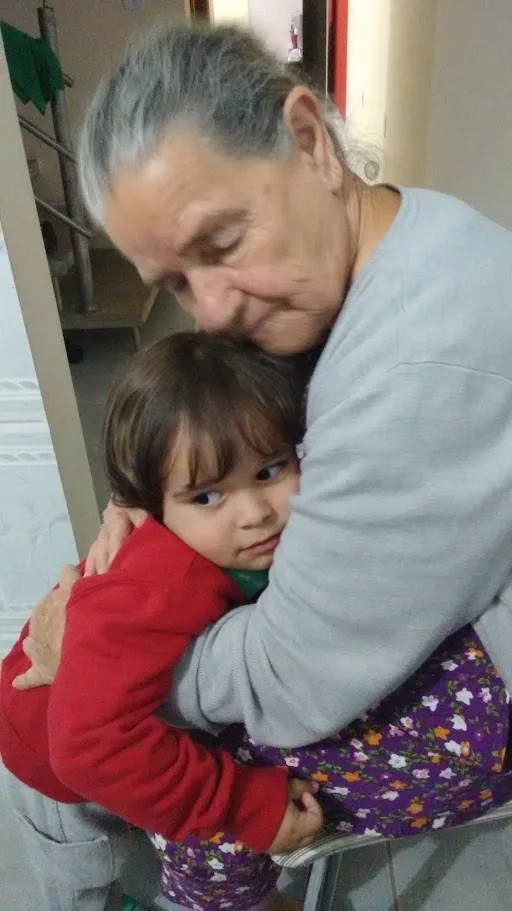

*Mafalda e o bisneto João Luca, a quem este livro é dedicado.*

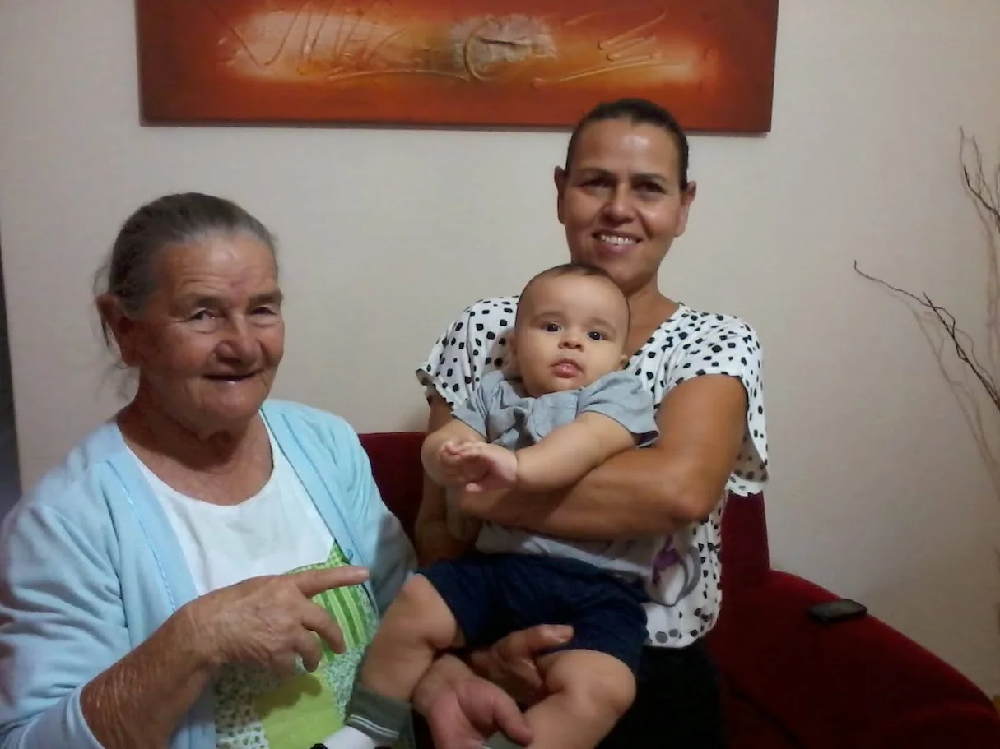

***Mafalda, Marta e João Luca.** A filha de Rosa, a neta de Rosa e o tataraneto de Rosa, na mesma fotografia. A mais velha nasceu dez anos depois do naufrágio; o mais novo, oitenta e cinco anos depois dela.*

# Caderno — Imagens

*O acervo da família*

---

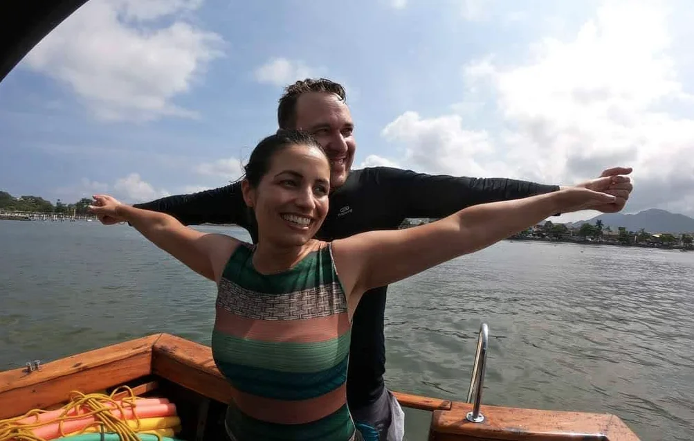

*Aline e João Andrade.*

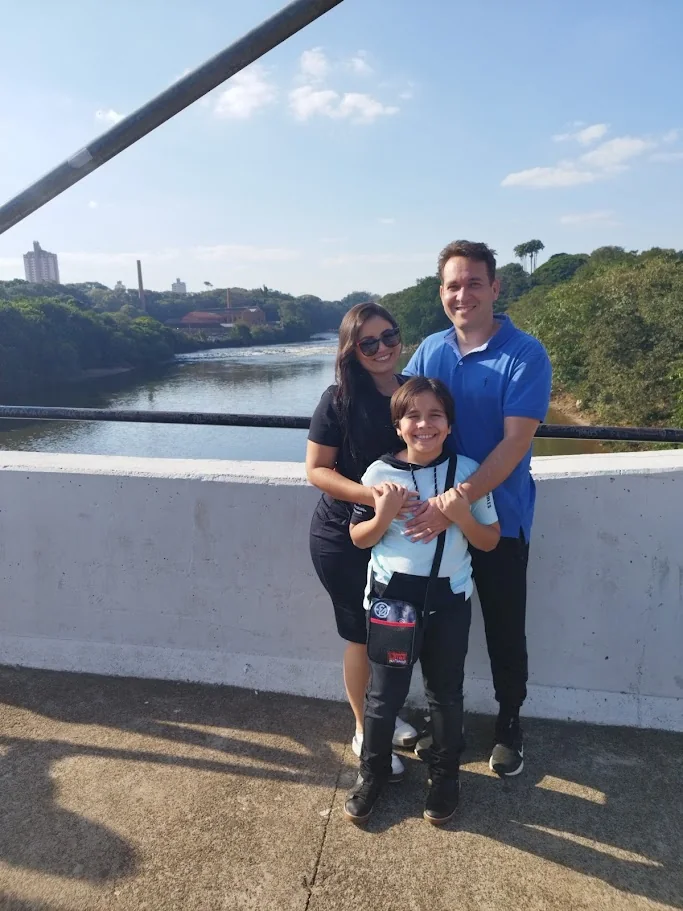

*Aline, o autor e João Luca.*

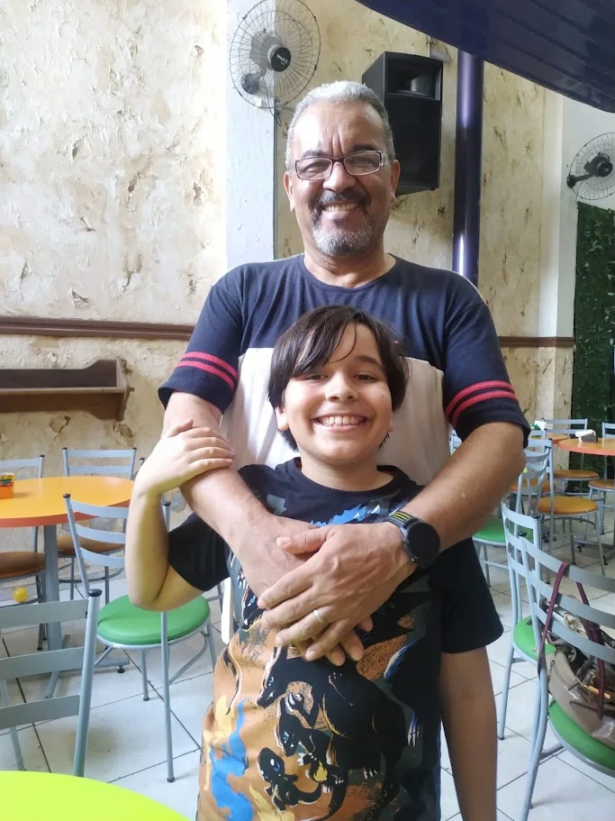

*Carlos Aparecido de Andrade e o neto João Luca.*

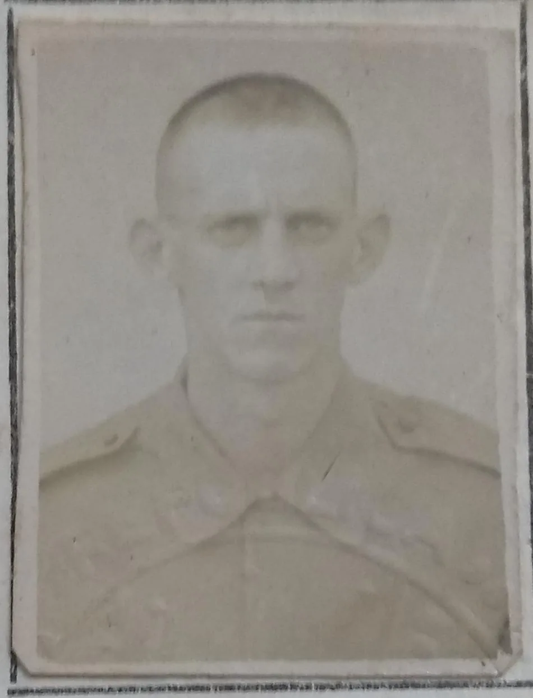

*Divino Aparecido Betti, 1948 a 1992, filho de Pulcheria e pai de Patrícia Betti.*

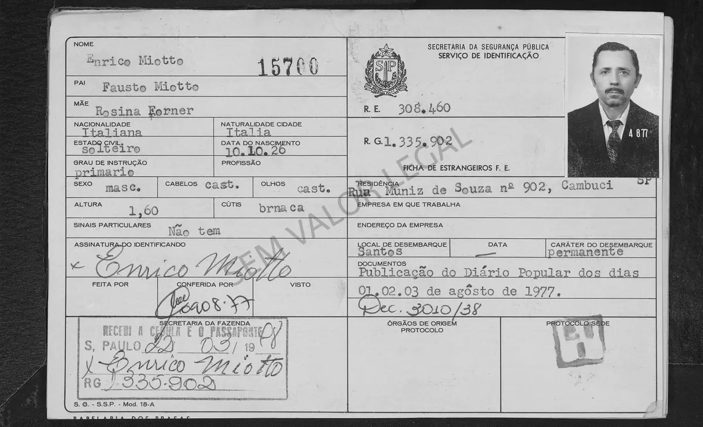

*Documento de identificação de Enrico Miotto.*

*A família do autor.*

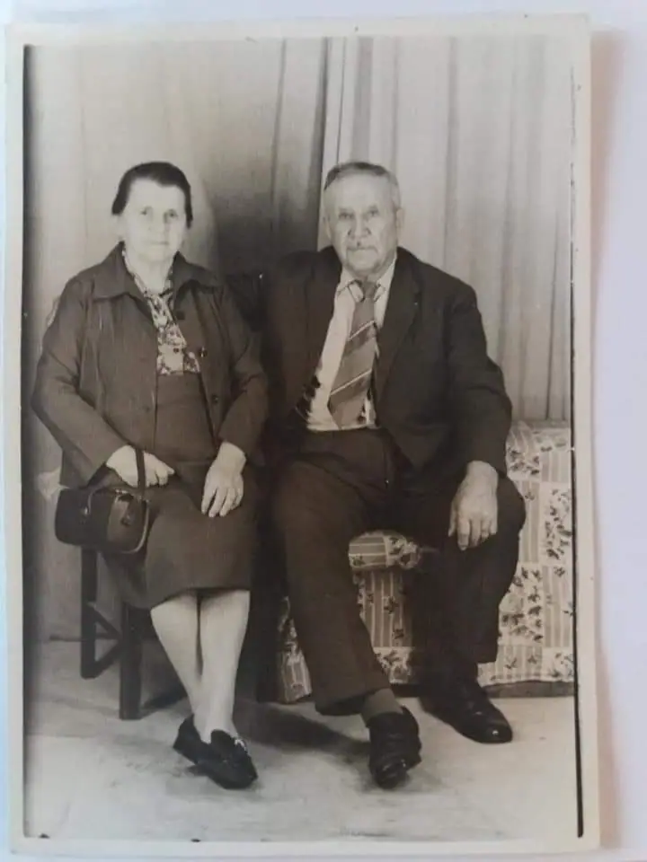

*Maria Luigia Forner e Angelo Dei Agnoli.*

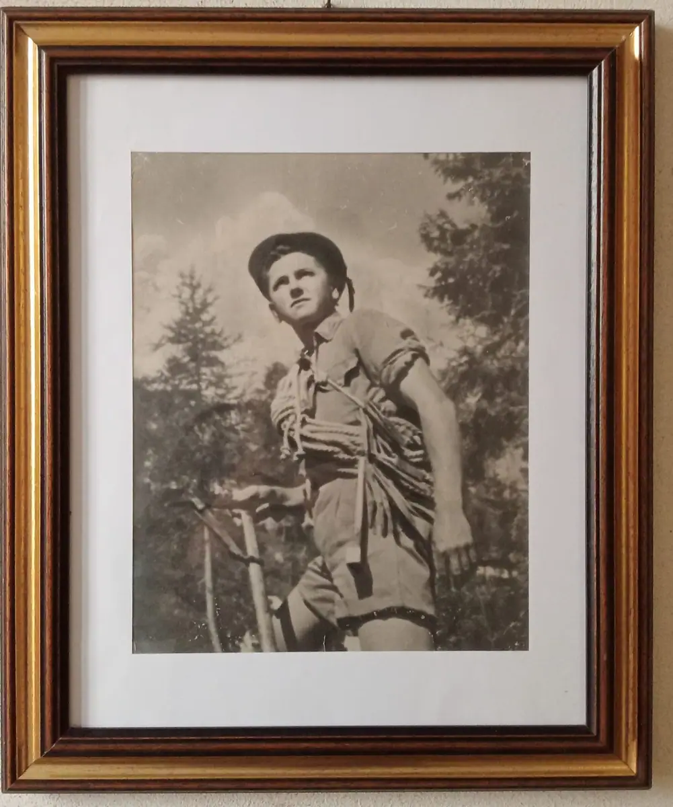

*Galliano Forner, retrato emoldurado conservado pela família na Itália.*

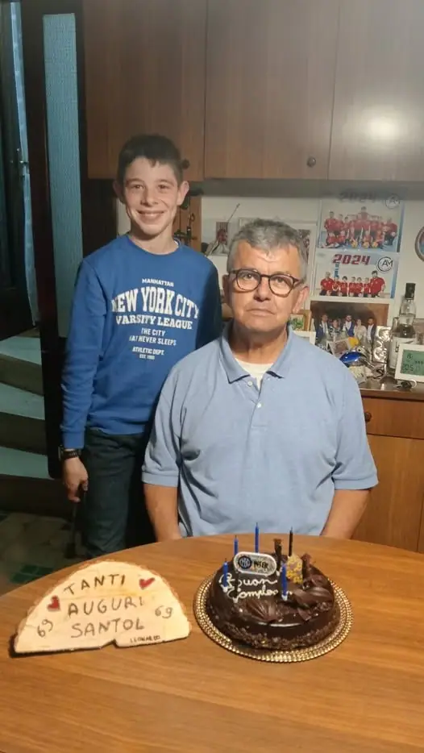

*Giorgio Forner, neto de Sante, reencontrado em pesquisa genealógica.*

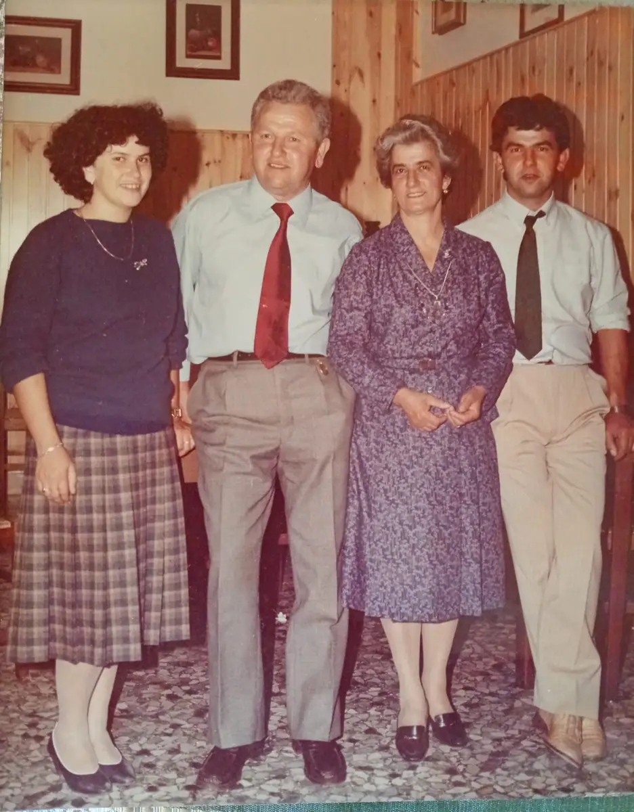

*Giorgio Forner e o pai.*


*Giorgio Forner e a esposa.*


*Giorgio Forner numa feira, no Vêneto.*


*Giorgio Forner.*

*Três gerações: o autor, o filho João Luca e, ao fundo, o pai, Carlos Andrade.*

*Marta Terra Andrade, filha de Mafalda, e os netos.*


*Marta Terra Andrade com os filhos e os netos.*

*Mattia, da família Forner na Itália.*


*Mauro Forner, filho de Giorgio.*


*Maria Luigia Miotto e Sante Forner.*


*Pandolfo Antonio, 1942 a 2025, primo de Mafalda, filho de Miotto Asia, irmã de Fausto.*


*Sante Forner, 1893 a 1947.*


*Sante Forner, retrato.*

# Epílogo — As três Mafaldas

*a escrever*

---

### A princesa, o navio e a menina

> **Capítulo pendente.** As três camadas deste livro amarradas num nome, e a única das três que chega viva ao fim. Este epílogo depende das gravações com Mafalda Miotto Terra, nascida em 2 de janeiro de 1937, que é ao mesmo tempo a pergunta central e a testemunha deste livro. Enquanto elas não existirem, esta página fica assim, e diz por quê.

---

## Agradecimentos

À minha avó **Mafalda**, por ter contado as histórias. Foi ela que despertou em mim, anos atrás, o interesse pela busca de um elo familiar que havia se perdido. Sem ela, este livro não teria começado.

Ao meu primo **Giorgio Forner**, que mora na Itália, por tudo o que contribuiu de informação e de fotografia. Apesar da dificuldade do idioma, sempre demos um jeito de conversar.

À minha prima **Patrícia Betti**, que eu encontrei nas pesquisas do FamilySearch e que também me ajudou com este livro.

Aos meus familiares, aos netos e aos sobrinhos, que vão ter nas mãos a história dos seus eternizada. Que este livro desperte no coração deles o mesmo interesse pela história que a minha avó Mafalda despertou em mim.

E ao principal amigo, aquele que me ajudou a concluir este livro: **Deus**. Que sempre me deu forças para continuar durante estes nove anos.

João José de Andrade Neto

# Aparato — Fontes e créditos

---

## Fontes

**Capítulo 01 · Uma casa em Castelcucco**

- Comune di Monfumo, *atto di nascita* 31 do ano de 1903 (Rosa Forner); Comune di Castelcucco, *atto di nascita* 33 do ano de 1904 (Fausto Miotto). Cópias autenticadas.
- Ministero per le Terre Liberate, *Censimento dei profughi di guerra*, distretto di Asolo. Roma, 1919.
- Prefettura di Treviso, documentação do *sgombero facoltativo e parziale*, 27 de fevereiro de 1918.
**Capítulo 02 · A Itália que não existia**

- FARRONATO, *Storia di Castelcucco*: genealogia impressa da família Forner e a anotação *emigrato in America dopo il 1891* ao lado de Luigi Forner.
- *Tassa sul macinato*, lei de 7 de julho de 1868, em vigor a partir de 1º de janeiro de 1869; confirmação pelo Senado em 26 de janeiro de 1869.
- Séries de emigração italiana por região, 1876 a 1900.
- *Inchiesta agraria e sulle condizioni della classe agricola* (Stefano Jacini, 1877–1885), consultada para o quadro geral do campo itálico.
**Capítulo 03 · Forner e Miotto**

- Portale Antenati: índices de nascimento, casamento e óbito dos comuni de Monfumo, Castelcucco, Cavaso del Tomba e Maser.
- Certificado de casamento de Luigi Miotto e Domenica Ganeo, Comune di Maser, 24 de junho de 1900.
- Declaração de óbito de Fausto Miotto, São João da Boa Vista, 13 de agosto de 1979.

- Tradição oral, ramo Forner do Vêneto: a morte de Pietro Luigi Forner num acidente de mina nos Estados Unidos, contada por **Giorgio Forner** em setembro de 2026. *Sem ano, sem lugar e sem documento — declarado no próprio capítulo.*
**Capítulo 04 · O cartaz**

- Panfleto *… In América. Terre in Brasile per gli Italiani*. Procedência não localizada — ver Créditos de imagem.
- Arquivo Público do Estado de São Paulo: *Relação dos immigrantes italianos agricoltores* anexa à lista de chegada do *Principessa Mafalda* de 23 de fevereiro de 1923, porto de Santos.
- Séries de imigração subvencionada em São Paulo, 1891 a 1895.
**Capítulo 05 · O Decreto Prinetti**

- Decreto de 26 de março de 1902, conhecido pelo nome do ministro Giulio Prinetti.
- Lei italiana de emigração de 31 de janeiro de 1901 e criação do *Commissariato Generale dell’Emigrazione*.
- Relatórios consulares italianos sobre as condições nas fazendas de café.
- Decreto brasileiro nº 2.400, de 13 de julho de 1918, citado no cabeçalho da Relação de 1923. *Até quando a proibição italiana de 1902 valeu na prática é lacuna declarada no próprio capítulo.*
**Capítulo 06 · Sante nos Alpes**

- *Albo d’Oro dei Caduti della Grande Guerra*: dezesseis Forner, dos quais nove de Monfumo; cinquenta e quatro Miotto, nenhum do sopé do Grappa.
- *Carta d’identità* de Sante Forner, Comune di Asolo, 8 de março de 1940. Acervo da família Forner, Vêneto.

- Decreto real de 29 de julho de 1920, que institui a *Medaglia commemorativa della guerra italo-austriaca 1915-1918* e determina que seja cunhada com bronze de canhões capturados.
- Tradição oral, ramo Forner do Vêneto: o acidente na mina de Monfumo e a morte de Sante Forner em 1947, contados por **Giorgio Forner**, neto dele, em setembro de 2026.
- Mina de linhito de Monfumo: histórias locais da Marca Trevigiana e o percurso das galerias remanescentes na forcella Mostaccin. *O atto di morte de 1947 e o documento do acidente ainda não foram vistos pelo autor.*
**Capítulo 07 · Rosa e Fausto**

- Anotação à margem do *atto di nascita* de Rosa Forner, Comune di Monfumo: *ha contratto matrimonio con Miotto Fausto in data 03/12/1926 a Castelcucco*.
- Comune di Castelcucco, ato nº 9, parte I, do ano de 1926.
- Registro de Estrangeiros de Enrico Miotto, São Paulo, 29 de dezembro de 1949 — data de nascimento: 10 de outubro de 1926.
- Decreto-lei de 28 de abril de 1927, que extingue o Commissariato Generale dell’Emigrazione.
**Capítulo 08 · Gênova**

- Intendência de Imigração, relação dos cinquenta náufragos desembarcados do vapor *Alhena*. Rio de Janeiro, 28 de outubro de 1927. Assinada pelo intérprete Thomas Filipovich.
**Capítulo 09 · A terceira classe**

- Arquivo Público do Estado de São Paulo: vinte e cinco manifestos de desembarque do *Principessa Mafalda*, 1919 a 1924 — colunas de bagagem, dinheiro declarado e endereço de destino.
- Corpus de depoimentos: Milhem Solk.

- Tradição oral: a cozinha e o cozinheiro, lembrança atribuída a Pulcheria Dei Agnoli e transmitida por uma prima do ramo Dei Agnoli. **Não é lembrança unânime** — ver capítulo 14.
**Capítulo 10 · Duas irmãs embarcam**

- Relação do *Alhena*, 28 de outubro de 1927: coluna de parentesco, *chefe* para as duas irmãs.
- Procedimento de embarque de terceira classe em porto italiano em 1927: inspeção sanitária e exame de tracoma. **A cena é reconstrução declarada no próprio capítulo.**
- *A lista de embarque de Gênova de outubro de 1927 não foi localizada.*
**Capítulo 11 · Os que já estavam lá**

- Comune di Cavaso del Tomba, *atto di nascita* de Danilo Angelo Dei Agnoli, 14 de fevereiro de 1925, declarado pela parteira Celli Maria *in luogo del marito, perché residente all’estero a scopo di lavoro*.
- Certidão do Serviço de Registro de Estrangeiros nº 61: Angelo Dei Agnoli, desembarcado em Santos em 30 de abril de 1927, do vapor *Principessa Mafalda*.
- Assento de casamento nº 660, cartório de Grama, 1947.
- *O mês e o navio da travessia de Fausto Miotto não foram localizados.*
**Capítulo 12 · 1908**

- Lançamento e naufrágio do *Principessa Jolanda*, estaleiro de Riva Trigoso, 22 de setembro de 1907.
- Lloyd Italiano: encomenda dos dois transatlânticos gêmeos; entrada em serviço do *Principessa Mafalda* em 1909.

- Leis de cota dos Estados Unidos, 1921 e 1924.
- *A estimativa de cem mil passageiros em dezoito anos é conta do autor, declarada como tal no texto.*
**Capítulo 13 · A última viagem**

- Corpus de depoimentos: Patricio de Rosas, Antonio Zanni, Antonio Fontana, Camilo Rivarola, Milhem Solk, Nicola Lynose, Pascual Pecci.
- Saída de São Vicente, Cabo Verde, em 18 de outubro de 1927, com novecentos e setenta e um passageiros e duzentos e oitenta e oito tripulantes.
- Museu da Imigração do Estado de São Paulo, artigo do acervo sobre os náufragos.
- Pôr do sol calculado para a posição aproximada do naufrágio, 17°54′ de latitude sul, em 25 de outubro de 1927: 18h21; fim do crepúsculo civil, 18h48.
- *A escala africana em que a máquina abriu — Dakar ou São Vicente — e a idade do comandante Simone Gulì seguem em aberto, declarados no texto.*
**Capítulo 14 · A noite**

- Corpus de depoimentos: Eugenio Gabassi, Pedro Volpi, Milhem Solk, Enrico Nazzeconi, Ali Hassen, Batista Beria, Nicola Lynose, família Vacelli, Mario Ottaviani.
- *A hora do pedido de socorro — 17h35 ou 19h15 — diverge entre as fontes, e o texto não arbitra.*
- Tradição oral: o porão, o cozinheiro e o bote dos cozinheiros. Lembrança de um só galho da família, atribuída no próprio capítulo.

**Capítulo 15 · Os botes**

- Corpus de depoimentos: Ali Hassen, Salvador Malone, Antonio Ponce, Valeriano Galli, Maria Spinelli, Vincenzo Mandolezzi, Alfio Sanfilippo, Domenico Leo, Juan Santororo, família Vacelli, Mario Ottaviani, Nicola Lynose, Pascual Pecci.
**Capítulo 16 · 22h10**

- Corpus de depoimentos: Mario Ottaviani, Enrico Nazzeconi, Andres Scavani del Vicario, Salvador Malone, Eugenio Gabassi, família Vacelli.
- *As duas versões da morte do comandante — a saudação na ponte e os tiros — vêm de duas testemunhas na água, no escuro. O texto não escolhe.*
**Capítulo 17 · Alhena, Mosella, Empire Star**

- Telegramas de socorro da noite de 25 de outubro de 1927, com os nomes de dez navios.
- Corpus de depoimentos: Nazzeconi, Beria, Solk, Ali Hassen, Domingo Milano, Maria Spinelli.
- Relação do *Alhena*, 28 de outubro de 1927, Ilha das Flores.
- *A soma dos resgatados não fecha em fonte nenhuma; a discrepância está exposta no capítulo.*
**Capítulo 18 · Os 314**

- Corpus de depoimentos: Valeriano Galli, Salvador Malone, Alfio Sanfilippo, Eugenio Gabassi, Ali Hassen, Mario Ottaviani.
- Relação do *Alhena*: passageiras nº 24 e 25, com a nota manuscrita do funcionário.

- *Não existe relação nominal dos trezentos e catorze mortos. O próprio número varia entre as fontes.*
**Capítulo 19 · 31 de outubro**

- Museu da Imigração do Estado de São Paulo: Livro de Registro de Matrícula nº 100 da Hospedaria de Imigrantes do Brás, página 290, 31 de outubro de 1927. Famílias 19270 e 19260.
- Procedimento interno da Hospedaria — banho, desinfecção, estufa, inspeção médica, registro. **A cena é reconstrução declarada no próprio capítulo.**
**Capítulo 20 · O reencontro**

- Tradição oral, ramo Betti: João Betti (1920–2008), marido de Pulcheria, transmitida por **Patrícia Betti**, que consentiu em ser nomeada e creditada. O carvão e o não-reconhecimento.
- Tradição oral, outro ramo Dei Agnoli: a menina que acha o pai.
- *Nada do que se passou entre Rosa e Fausto no reencontro chegou até aqui, e o capítulo deixa em branco.*
**Capítulo 21 · Terra vermelha**

- Relação do *Alhena*: a palavra *espontâneos*, na parte do intérprete e no resumo do desembarque.
- Relação dos subsidiados de 23 de fevereiro de 1923: a coluna *Patrão*, preenchida antes do embarque.
- Carimbo da Delegacia de Polícia de Grama no registro de estrangeiro de Angelo Dei Agnoli; assento de casamento nº 660 do cartório de Grama.

**Capítulo 22 · Enrico**

- Registro de Estrangeiros de Enrico Miotto, São Paulo, 29 de dezembro de 1949: RG 1.335.902, carteira 308.460.
- Declaração de Óbito nº 5501831, Sorocaba, 6 de outubro de 1998.
**Capítulo 23 · 1937**

- Certidão de casamento de Mafalda Miotto, de 1954, reemitida em 1981 na cidade de Nova Fátima.
- *Atto di nascita* de Rosa Forner, Comune di Monfumo, 24 de junho de 1903.
- *A razão do nome não está em documento nenhum. O capítulo apresenta um padrão, não uma prova.*
**Capítulo 24 · Virar brasileiro**

- Campanha de nacionalização do Estado Novo, a partir de novembro de 1937.
- Declaração de guerra do Brasil à Itália, agosto de 1942.
- Registro de estrangeiro de Angelo Dei Agnoli, com carimbo da Delegacia de Polícia de Grama.
- Relação do *Alhena*: coluna *Instrução*, *sim* para Rosa Forner.

**Capítulo 25 · Os que ficaram, cem anos depois**

- Correspondência, fotografias e identificações enviadas por **Giorgio Forner**, Vêneto.
- Árvore genealogica colaborativa: o cruzamento que reencontrou Patrícia Betti, a partir do casal Vincenzo Forner e Santa Pandolfo.
**Capítulo 26 · A busca**

- FARRONATO, *Storia di Castelcucco*: a genealogia impressa, a linha vertical que liga a segunda fileira ao irmão de Vincenzo, e o erro na data de nascimento de Rosa.
- Índices de nascimento do Comune di Monfumo: as três grafias do nome de Santa Pandolfo.
- *Carta d’identità* de Sante Forner, 8 de março de 1940: *Padre: di Vincenzo. Madre: fu Pandolfo Domenica Santa*.
- Province of British Columbia, *Registration of Death* nº 5509-008734: Louie Miotto, Vancouver General Hospital, 15 de agosto de 1955.
- Fusão de perfis em árvore colaborativa, 18 de novembro de 2024, às 11h21.
- Declaração de óbito de Fausto Miotto, 13 de agosto de 1979, que nomeia por extenso Luigi Miotto e Domenica Ganeo.
**Capítulo 27 · A casa**

- Fotografias e informações enviadas por Giorgio Forner, Vêneto.
- *Este capítulo foi escrito por quem nunca esteve em Castelcucco, e diz isso na primeira linha.*

**O corpus de depoimentos**

- Vinte relatos de sobreviventes publicados na imprensa argentina e brasileira nos dias seguintes ao naufrágio, recebidos em tradução, com nome, idade e procedência de cada depoente. São a espinha dorsal dos capítulos 13 a 18.
- **O jornal, a data e a página de cada relato ainda não foram localizados.** Enquanto a procedência não fecha, o livro identifica cada relato pelo nome do depoente e diz, toda vez, o que ele é: gente que tinha acabado de sair da água, falando com repórter, poucos dias depois.
- As pistas abertas, na ordem em que serão seguidas: o acervo reunido em histarmar.com.ar, citado pelo artigo do Museu da Imigração; e as duas obras que a pesquisa de Maurício Carvalho para o sítio *Naufrágios do Brasil* arrola — *Revista Mergulho*, ano XIII, nº 155, junho de 2009, e GARIBALDI, Luciano; GIORGERINI, Giorgio; MAGNANI BOSIO, Maria Enrica. *Principessa Mafalda: Titanic italiano*. Ed. R. Garosci, 2010.
**Acervos consultados**

- *Portale Antenati*, Ministero della Cultura — atos de nascimento, casamento e óbito dos comuni de Monfumo, Castelcucco, Cavaso del Tomba e Maser.
- *FamilySearch* — imagens de registro e árvore colaborativa.
- *Arquivo Público do Estado de São Paulo* — vinte e cinco manifestos de desembarque do *Principessa Mafalda*, 1919 a 1924.
- *Museu da Imigração do Estado de São Paulo* — Livro de Registro de Matrícula nº 100 da Hospedaria do Brás, e o artigo do acervo sobre os náufragos do *Principessa Mafalda*.
- *Hemeroteca Digital da Biblioteca Nacional*.
- CARVALHO, Maurício. *Principessa Mafalda*, em *Naufrágios do Brasil* — pesquisa secundária. É dela que vem a relação dos navios que ouviram o pedido de socorro, no capítulo 17, e o nome da estação radiotelegráfica de Amaralina, em Salvador.
- *Albo d’Oro dei Caduti della Grande Guerra*, Ministero della Difesa.
- FARRONATO, Gabriele. *Storia di Castelcucco: un comune veneto del Pedemonte del Grappa*. Castelcucco: Edizioni Acelum, 2008 — história local, com a genealogia impressa da família Forner.

- Acervo da família Miotto e Forner, no Brasil e no Vêneto.
**Epígrafe**

- DERENZI, Luiz Serafim. *Os italianos no Estado do Espírito Santo*. Rio de Janeiro: Artenova, 1974. Citada nos termos do art. 46, III, da Lei 9.610/1998.

## Créditos de imagem

**No miolo**

- Cap. 01 — Asolo vista do alto, na capa de um folheto turístico de época —…. Acervo da família Forner, Vêneto. Enviada por Giorgio Forner.
- Cap. 02 — Fotografia do acervo da família, sem data e sem identificação. Acervo da família Miotto e Forner.
- Cap. 03 — Três irmãos de Fausto Miotto: Maria Luigia ao centro, Veronica à…. Acervo da família Forner, Vêneto. Enviada por Giorgio Forner.
- Cap. 03 — Sante Forner e Maria Luigia Miotto. Acervo da família Forner, Vêneto. Enviada por Giorgio Forner.
- Cap. 03 — Martino Forner, irmão de Sante e de Rosa. Acervo da família Forner, Vêneto. Enviada por Giorgio Forner.
- Cap. 04 — Terre in Brasile per gli Italiani.” Reprodução de linha do cartaz:…. Reprodução de época, de uso público, sem autoria identificável; procedência não localizada.
- Cap. 06 — O quadro com as três medalhas de guerra de Sante Forner, na parede…. Acervo da família Forner, Vêneto. Enviada por Giorgio Forner.
- Cap. 06 — Sante Forner, 1893 a 1947, fardado.. Acervo da família Forner, Vêneto. Enviada por Giorgio Forner.
- Cap. 06 — Sante Forner ao centro, com a mulher Maria Luigia Miotto. Acervo da família Forner, Vêneto. Enviada por Giorgio Forner.
- Cap. 06 — A carta d’identità de Sante Forner aberta, com o brasão do Regno…. Acervo da família Forner, Vêneto. Enviada por Giorgio Forner.
- Cap. 06 — Carta d’identità de Sante Forner, Comune di Asolo, 8 de março de…. Acervo da família Forner, Vêneto. Enviada por Giorgio Forner.
- Cap. 07 — Fausto Miotto, nascido em Castelcucco em 1904. Acervo da família Miotto e Forner.

- Cap. 09 — Imigrantes italianos na Hospedaria dos Imigrantes, São Paulo, por…. Hospedaria dos Imigrantes, São Paulo, c. 1890. Acervo público; instituição não identificada.
- Cap. 09 — Pulcheria Pasqua Dei Agnoli, 1921 a 2013. Acervo da família Miotto e Forner.
- Cap. 11 — Passaporte italiano de Angelo Dei Agnoli, Regno d’Italia, com o…. Passaporte de Angelo Dei Agnoli, Regno d’Italia. Acervo da família.
- Cap. 11 — Certidão do Registro de Estrangeiros nº 61, Polícia do Estado de…. Certidão do Registro de Estrangeiros nº 61, Polícia do Estado de São Paulo. Acervo da família.
- Cap. 12 — Cartaz do Lloyd Italiano anunciando o Principessa Mafalda: servizio…. Cartaz do Lloyd Italiano. Peça de época, de uso público; procedência não localizada.
- Cap. 12 — Mafalda di Savoia, segunda filha de Vittorio Emanuele III. Retrato de Mafalda di Savoia. Peça de época, de uso público; procedência não localizada.
- Cap. 13 — Llegada del vapor Principessa Mafalda. Cartão-postal de época, série 128. Museu de la Targeta Postal de Catalunya, L’Ametlla del Vallès — Colección Jorge Venini, Barcelona, cat. CAT XXX 01 TP 1939.
- Cap. 17 — A família Agnoli na relação dos náufragos recolhidos pelo Alhena:…. Intendência de Imigração, relação do vapor *Alhena*, 28 de outubro de 1927. Reprodução parcial de documento de acervo público.
- Cap. 19 — Rosa Forner Miotto, 1903 a 1986. Acervo da família. *Restauração digital do autor.*
- Cap. 19 — A cédula de identidade dela, emitida no Brasil décadas depois.. Acervo da família Miotto e Forner.
- Cap. 20 — Maria Luigia Forner, 1896 a 1992, irmã de Rosa.. Acervo da família Miotto e Forner.
- Cap. 20 — Maria Luigia Forner e Angelo Dei Agnoli com os filhos.. Acervo da família Miotto e Forner.
- Cap. 20 — Gina Oliva Dei Agnoli, nascida em 28 de março de 1920. Acervo da família Miotto e Forner.

- Cap. 20 — Rino Dei Agnoli, nascido em 26 de janeiro de 1923. Acervo da família Miotto e Forner.
- Cap. 20 — Maria Luigia Forner e Angelo Dei Agnoli. Acervo da família Miotto e Forner.
- Cap. 22 — Enrico Miotto, 1926 a 1998. Acervo da família Miotto e Forner.
- Cap. 22 — Registro de Estrangeiros de Enrico Miotto, 29 de dezembro de 1949. Acervo da família Miotto e Forner.
- Cap. 22 — Declaração de Óbito nº 5501831. Declaração de Óbito nº 5501831, Sorocaba, 1998. Acervo da família. *Dados do médico tarjados nesta reprodução.*
- Cap. 23 — Mafalda Miotto Terra, nascida em 1937, dez anos depois do…. Acervo da família Miotto e Forner.
- Cap. 23 — Mafalda e os filhos: Dionísio, Edna, Mafalda, Inês, Kênia, Marta e…. Acervo da família Miotto e Forner.
- Cap. 23 — Mafalda e os bisnetos.. Acervo da família Miotto e Forner.
- Cap. 25 — Sante Forner e família, na Itália.. Acervo da família Forner, Vêneto. Enviada por Giorgio Forner.
- Cap. 25 — Galliano Forner, filho de Sante, com as tropas alpinas em 1950.. Acervo da família Forner, Vêneto. Enviada por Giorgio Forner.
- Cap. 25 — Giorgio Forner e família, o ramo que permaneceu no Vêneto.. Acervo da família Forner, Vêneto. Enviada por Giorgio Forner.
- Cap. 25 — Galliano Forner, filho de Sante, e a mulher.. Acervo da família Forner, Vêneto. Enviada por Giorgio Forner.
- Cap. 25 — Giorgio Forner e o pai, Galliano. Acervo da família Forner, Vêneto. Enviada por Giorgio Forner.

- Cap. 25 — Giorgio Forner e os netos, no Vêneto. Acervo da família Forner, Vêneto. Enviada por Giorgio Forner.
- Cap. 26 — Miotto Amabile Veronica, irmã de Fausto, com o marido Parisotto…. Acervo da família Forner, Vêneto. Enviada por Giorgio Forner.
- Cap. 27 — Mafalda e o autor.. Acervo da família Miotto e Forner.
- Cap. 27 — Mafalda e o bisneto João Luca, a quem este livro é dedicado.. Acervo da família Miotto e Forner.
- Cap. 27 — Mafalda, Marta e João Luca. Acervo da família Miotto e Forner.
**Caderno de imagens**

- Aline e João Andrade.. Acervo da família Miotto e Forner.
- Aline, o autor e João Luca.. Acervo da família Miotto e Forner.
- Carlos Aparecido de Andrade e o neto João Luca.. Acervo da família Miotto e Forner.
- Divino Aparecido Betti, 1948 a 1992, filho de Pulcheria e pai de…. Acervo da família Miotto e Forner.
- Documento de identificação de Enrico Miotto.. Acervo da família Miotto e Forner.
- A família do autor.. Acervo da família Miotto e Forner.
- Maria Luigia Forner e Angelo Dei Agnoli.. Acervo da família Miotto e Forner.

- Galliano Forner, retrato emoldurado conservado pela família na…. Acervo da família Miotto e Forner.
- Giorgio Forner, neto de Sante, reencontrado em pesquisa genealógica.. Acervo da família Miotto e Forner.
- Giorgio Forner e o pai.. Acervo da família Miotto e Forner.
- Giorgio Forner e a esposa.. Acervo da família Miotto e Forner.
- Giorgio Forner numa feira, no Vêneto.. Acervo da família Forner, Vêneto. Enviada por Giorgio Forner.
- Giorgio Forner.. Acervo da família Miotto e Forner.
- Três gerações: o autor, o filho João Luca e, ao fundo, o pai,…. Acervo da família Miotto e Forner.
- Marta Terra Andrade, filha de Mafalda, e os netos.. Acervo da família Miotto e Forner.
- Marta Terra Andrade com os filhos e os netos.. Acervo da família Miotto e Forner.
- Mattia, da família Forner na Itália.. Acervo da família Forner, Vêneto. Enviada por Giorgio Forner.
- Mauro Forner, filho de Giorgio.. Acervo da família Miotto e Forner.
- Maria Luigia Miotto e Sante Forner.. Acervo da família Miotto e Forner.
- Pandolfo Antonio, 1942 a 2025, primo de Mafalda, filho de Miotto…. Acervo da família Miotto e Forner.

- Sante Forner, 1893 a 1947.. Acervo da família Miotto e Forner.
- Sante Forner, retrato.. Acervo da família Miotto e Forner.

## Índice onomástico

- Alhena, vapor passim
- Andrade, Carlos Aparecido de 482, 551, 562
- Andrade, João Luca Soares de 53, 498, 547-548, 550-551, 562
- Asolo passim
- Beck Josef 175, 396
- Beria, Batista 312, 334-335, 354, 356
- Betti, João 318, 404, 411, 527
- Betti, Patrícia 318, 404, 408, 410, 500, 552
- Buenos Aires 195-196, 256, 265-266, 272, 336, 398
- Cadorna, Luigi 123
- Cadorna, Raffaele 32, 123
- Castelcucco passim
- Cavaso del Tomba 3, 14-15, 18, 69, 127, 159, 224, 242, 278, 391
- Dei Agnoli, Angelo passim
- Dei Agnoli, Danilo 159, 180, 205, 224, 228, 366, 391
- Dei Agnoli, Gina Oliva 159, 180, 205, 212, 228, 278, 366, 391, 411, 418
- Dei Agnoli, Pulcheria Pasqua 159, 180, 199, 202, 205, 212, 228, 317-318, 366, 391, 404, 411, 413, 485, 500, 527, 529, 552
- Dei Agnoli, Rino 159, 180, 205, 228, 391, 419
- De Rosi Emilia 177, 364, 374, 397
- *Empire Star* 290-291, 313, 326, 344, 351-353, 358
- Filipovich, Thomas 362, 382
- Fontana, Antonio 282-283
- Forner, Abele Alessandro 55, 514
- Forner, Domenico 53
- Forner, Galliano 136, 149, 497-498, 506, 508-509, 536, 556
- Forner, Giorgio passim
- Forner, Luigi (1817–1905) 24, 27-28, 30, 47-48, 51, 53, 60, 62, 124, 535
- Forner, Maria Luigia passim
- Forner, Pietro Luigi 57, 60, 124, 154
- Forner, Rosa passim

- Forner, Sante passim
- Forner, Vincenzo passim
- *Formosa* 345, 353, 358
- Gabassi, Eugenio 306, 335, 347, 356, 371
- Galli, Valeriano 136, 149, 322, 333, 335, 356, 371, 497-498, 506, 508-509, 536, 556
- Ganeo, Domenica 67, 523
- Gênova passim
- Grama (São Sebastião da Grama) 232, 242, 421-422, 431-432, 440, 464, 477
- Gulì, Simone 287, 290, 338, 346, 349
- Hassen, Ali 309, 322, 355-356, 372
- Hospedaria de Imigrantes do Brás 201, 229, 231, 381-382, 384-386, 389, 408, 439, 526
- Ilha das Flores 291, 362, 382, 396
- Leo, Domenico 326, 335
- Luchini Teresa 177, 364, 374
- Lynose, Nicola 286, 289-290, 314, 330, 334, 356
- Malone, Salvador 322, 335, 347, 371
- Mandolezzi, Vincenzo 324
- Manin, Daniele 27
- Maser 67-69, 521
- Milano, Domingo 356-357
- Miotto, Amabile Veronica 72, 76, 531
- Miotto, Enrico passim
- Miotto, Erminda 432, 434, 460, 473, 526
- Miotto, Fausto passim
- Miotto, Luigi 67-68, 70, 154, 520-521, 523-524
- Miotto, Maria Luigia 73-74, 77, 136, 149, 567
- Miotto, Vittorio 19, 72, 76, 125-126, 131, 250, 273, 455
- Monfumo passim
- Monte Grappa passim
- *Mosella* 351, 353, 358

- Mussolini, Benito 161
- Nazzeconi, Enrico 309, 319, 342, 344, 354
- Ottaviani, Mario 329, 341, 373
- Pandolfo, Santa 51, 55, 58, 64, 119-120, 140, 216, 253, 487, 501, 517, 519, 568
- Pecci, Pascual 287, 336
- Ponce, Antonio 322, 335
- Possagno 3, 14, 127
- *Principessa Jolanda* 245, 247-248, 253
- *Principessa Mafalda* passim
- Prinetti, Giulio 96, 101, 106, 108, 162
- Rio de Janeiro 174, 177, 183, 212, 256, 291, 303, 306, 315, 362, 372, 382, 388
- Riva Trigoso 245, 253-254
- Rivarola, Camilo 283-284
- Rosas, Patricio de 279, 282, 285
- *Rosetti* 353, 356, 358, 371
- Sanfilippo, Alfio 326, 335, 356, 371
- Santororo, Juan 333
- Santos, porto de 97, 116, 190, 194-195, 197, 206, 227, 235, 242, 266, 406
- Savoia, Mafalda di 250, 273, 455
- Scavani del Vicario, Andres 345, 356
- Solk, Milhem 197, 285, 308, 335, 354
- Sorocaba 141, 437, 446, 451
- São Paulo passim
- São Vicente (Cabo Verde) 281
- Spinelli, Maria 187, 323, 363
- Terra, Mafalda Miotto 97, 425, 460, 468, 482
- Terra, Marta 469, 482, 485, 498, 548, 563-564
- Treviso 12, 21, 166, 171, 207, 540
- Vacelli, família 313, 328, 332, 344
- Vancouver 520-522, 524, 531

- Vargas, Getúlio 474
- Vêneto passim
- Vial, Maria 53
- Vittorio Emanuele III 250, 273, 455
- Volpi, Pedro 307, 312, 332, 335
- Zanni, Antonio 279

---

### continua

Os vinte e sete capítulos estão escritos. Falta o epílogo, que depende das gravações com Mafalda Miotto Terra, e a reescrita do capítulo 27 depois da viagem a Castelcucco.

Centenário do naufrágio: 25 de outubro de 2027.
